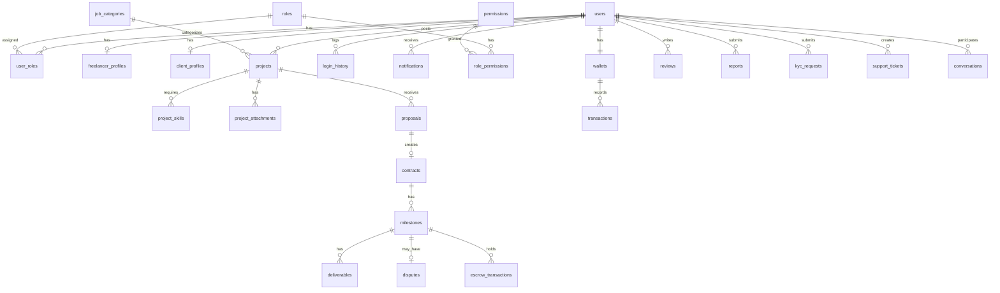

# Phần 4A: Thiết kế Database — CORE TABLES

> **DBMS:** Microsoft SQL Server (hoặc MySQL 8+)  
> **Naming Convention:** snake_case, singular table names  
> **Soft Delete:** cột `is_deleted` + `deleted_at`  
> **Audit Fields:** `created_at`, `updated_at` trên mọi bảng

---

## TỔNG QUAN ERD



---

## 1. USERS & AUTHENTICATION

### `users`
Bảng chính lưu tất cả tài khoản (Freelancer, Client, Admin, Staff).

```sql
CREATE TABLE users (
    user_id         INT PRIMARY KEY IDENTITY(1,1),
    email           NVARCHAR(255) NOT NULL UNIQUE,
    password_hash   NVARCHAR(255) NOT NULL,
    display_name    NVARCHAR(100) NOT NULL,
    full_name       NVARCHAR(150),
    phone           NVARCHAR(20),
    avatar_url      NVARCHAR(500),
    status          NVARCHAR(30) NOT NULL DEFAULT 'PENDING_VERIFICATION',
        -- PENDING_VERIFICATION | ACTIVE | LOCKED | BANNED | DEACTIVATED
    email_verified  BIT NOT NULL DEFAULT 0,
    google_id       NVARCHAR(100) UNIQUE,  -- OAuth
    language        NVARCHAR(10) DEFAULT 'vi',
    timezone        NVARCHAR(50) DEFAULT 'Asia/Ho_Chi_Minh',
    last_login_at   DATETIME2,
    created_at      DATETIME2 NOT NULL DEFAULT GETDATE(),
    updated_at      DATETIME2 NOT NULL DEFAULT GETDATE(),
    is_deleted      BIT NOT NULL DEFAULT 0,
    deleted_at      DATETIME2
);
CREATE INDEX idx_users_email ON users(email);
CREATE INDEX idx_users_status ON users(status);
```

### `roles`
Bảng định nghĩa các role trong hệ thống.

```sql
CREATE TABLE roles (
    role_id     INT PRIMARY KEY IDENTITY(1,1),
    role_name   NVARCHAR(50) NOT NULL UNIQUE,
        -- FREELANCER | CLIENT | ADMIN | SUPER_ADMIN | MODERATOR | FINANCE | SUPPORT | CONTENT
    description NVARCHAR(255),
    is_active   BIT NOT NULL DEFAULT 1,
    created_at  DATETIME2 NOT NULL DEFAULT GETDATE()
);
```

### `permissions`
Bảng định nghĩa các quyền cụ thể (fine-grained permissions).

```sql
CREATE TABLE permissions (
    permission_id   INT PRIMARY KEY IDENTITY(1,1),
    permission_key  NVARCHAR(100) NOT NULL UNIQUE,
        -- VD: 'user.view', 'user.lock', 'project.approve', 'finance.withdraw.approve'
    module          NVARCHAR(50) NOT NULL,
        -- VD: 'USER', 'PROJECT', 'FINANCE', 'DISPUTE', 'CMS', 'SYSTEM'
    description     NVARCHAR(255)
);
```

### `role_permissions`
Mapping N-N giữa roles và permissions.

```sql
CREATE TABLE role_permissions (
    role_id         INT NOT NULL REFERENCES roles(role_id),
    permission_id   INT NOT NULL REFERENCES permissions(permission_id),
    PRIMARY KEY (role_id, permission_id)
);
```

### `user_roles`
Mapping N-N giữa users và roles (1 user có thể có nhiều role).

```sql
CREATE TABLE user_roles (
    user_id     INT NOT NULL REFERENCES users(user_id),
    role_id     INT NOT NULL REFERENCES roles(role_id),
    assigned_by INT REFERENCES users(user_id),  -- Super Admin đã gán
    assigned_at DATETIME2 NOT NULL DEFAULT GETDATE(),
    PRIMARY KEY (user_id, role_id)
);
```

### `email_verifications`

```sql
CREATE TABLE email_verifications (
    id          INT PRIMARY KEY IDENTITY(1,1),
    user_id     INT NOT NULL REFERENCES users(user_id),
    token       NVARCHAR(255) NOT NULL UNIQUE,
    expires_at  DATETIME2 NOT NULL,
    used        BIT NOT NULL DEFAULT 0,
    created_at  DATETIME2 NOT NULL DEFAULT GETDATE()
);
```

### `password_reset_tokens`

```sql
CREATE TABLE password_reset_tokens (
    id          INT PRIMARY KEY IDENTITY(1,1),
    user_id     INT NOT NULL REFERENCES users(user_id),
    token       NVARCHAR(255) NOT NULL UNIQUE,
    expires_at  DATETIME2 NOT NULL,
    used        BIT NOT NULL DEFAULT 0,
    created_at  DATETIME2 NOT NULL DEFAULT GETDATE()
);
```

### `login_history`

```sql
CREATE TABLE login_history (
    id          INT PRIMARY KEY IDENTITY(1,1),
    user_id     INT NOT NULL REFERENCES users(user_id),
    ip_address  NVARCHAR(45),
    user_agent  NVARCHAR(500),
    login_at    DATETIME2 NOT NULL DEFAULT GETDATE(),
    success     BIT NOT NULL DEFAULT 1
);
CREATE INDEX idx_login_user ON login_history(user_id, login_at);
```

### `user_status_history`

```sql
CREATE TABLE user_status_history (
    id              INT PRIMARY KEY IDENTITY(1,1),
    user_id         INT NOT NULL REFERENCES users(user_id),
    old_status      NVARCHAR(30),
    new_status      NVARCHAR(30) NOT NULL,
    reason          NVARCHAR(1000),
    changed_by      INT REFERENCES users(user_id),  -- Admin ID
    changed_at      DATETIME2 NOT NULL DEFAULT GETDATE()
);
```

---

## 2. PROFILES

### `freelancer_profiles`

```sql
CREATE TABLE freelancer_profiles (
    profile_id          INT PRIMARY KEY IDENTITY(1,1),
    user_id             INT NOT NULL UNIQUE REFERENCES users(user_id),
    professional_title  NVARCHAR(200),
    bio                 NVARCHAR(MAX),
    hourly_rate         DECIMAL(12,2),
    address             NVARCHAR(500),
    city                NVARCHAR(100),
    country             NVARCHAR(100),
    profile_completeness INT DEFAULT 0,  -- percentage 0-100
    total_earnings      DECIMAL(15,2) DEFAULT 0,
    projects_completed  INT DEFAULT 0,
    average_rating      DECIMAL(3,2) DEFAULT 0,
    is_available        BIT DEFAULT 1,
    created_at          DATETIME2 NOT NULL DEFAULT GETDATE(),
    updated_at          DATETIME2 NOT NULL DEFAULT GETDATE()
);
```

### `client_profiles`

```sql
CREATE TABLE client_profiles (
    profile_id          INT PRIMARY KEY IDENTITY(1,1),
    user_id             INT NOT NULL UNIQUE REFERENCES users(user_id),
    company_name        NVARCHAR(200),
    company_logo_url    NVARCHAR(500),
    company_description NVARCHAR(MAX),
    website             NVARCHAR(500),
    address             NVARCHAR(500),
    city                NVARCHAR(100),
    country             NVARCHAR(100),
    company_size        NVARCHAR(50),   -- '1-10', '11-50', '51-200', '200+'
    industry            NVARCHAR(100),
    profile_completeness INT DEFAULT 0,
    total_spent         DECIMAL(15,2) DEFAULT 0,
    projects_posted     INT DEFAULT 0,
    average_rating      DECIMAL(3,2) DEFAULT 0,
    created_at          DATETIME2 NOT NULL DEFAULT GETDATE(),
    updated_at          DATETIME2 NOT NULL DEFAULT GETDATE()
);
```

### `skills`

```sql
CREATE TABLE skills (
    skill_id    INT PRIMARY KEY IDENTITY(1,1),
    skill_name  NVARCHAR(100) NOT NULL UNIQUE,
    category_id INT REFERENCES job_categories(category_id),
    is_active   BIT DEFAULT 1,
    created_at  DATETIME2 NOT NULL DEFAULT GETDATE()
);
```

### `user_skills`

```sql
CREATE TABLE user_skills (
    user_id     INT NOT NULL REFERENCES users(user_id),
    skill_id    INT NOT NULL REFERENCES skills(skill_id),
    proficiency NVARCHAR(20),  -- BEGINNER | INTERMEDIATE | EXPERT
    PRIMARY KEY (user_id, skill_id)
);
```

### `educations`

```sql
CREATE TABLE educations (
    education_id    INT PRIMARY KEY IDENTITY(1,1),
    user_id         INT NOT NULL REFERENCES users(user_id),
    school_name     NVARCHAR(200) NOT NULL,
    degree          NVARCHAR(100),
    field_of_study  NVARCHAR(200),
    start_year      INT,
    end_year        INT,
    description     NVARCHAR(1000),
    created_at      DATETIME2 NOT NULL DEFAULT GETDATE()
);
```

### `experiences`

```sql
CREATE TABLE experiences (
    experience_id   INT PRIMARY KEY IDENTITY(1,1),
    user_id         INT NOT NULL REFERENCES users(user_id),
    company_name    NVARCHAR(200) NOT NULL,
    position        NVARCHAR(200) NOT NULL,
    start_date      DATE,
    end_date        DATE,
    is_current      BIT DEFAULT 0,
    description     NVARCHAR(2000),
    created_at      DATETIME2 NOT NULL DEFAULT GETDATE()
);
```

### `portfolios`

```sql
CREATE TABLE portfolios (
    portfolio_id    INT PRIMARY KEY IDENTITY(1,1),
    user_id         INT NOT NULL REFERENCES users(user_id),
    title           NVARCHAR(200) NOT NULL,
    description     NVARCHAR(2000),
    project_url     NVARCHAR(500),
    created_at      DATETIME2 NOT NULL DEFAULT GETDATE()
);
```

### `portfolio_files`

```sql
CREATE TABLE portfolio_files (
    file_id         INT PRIMARY KEY IDENTITY(1,1),
    portfolio_id    INT NOT NULL REFERENCES portfolios(portfolio_id),
    file_url        NVARCHAR(500) NOT NULL,
    file_name       NVARCHAR(255),
    file_size       BIGINT,
    file_type       NVARCHAR(50),
    created_at      DATETIME2 NOT NULL DEFAULT GETDATE()
);
```

---

## 3. PROJECTS & PROPOSALS

### `job_categories`

```sql
CREATE TABLE job_categories (
    category_id     INT PRIMARY KEY IDENTITY(1,1),
    parent_id       INT REFERENCES job_categories(category_id),  -- 2-level hierarchy
    category_name   NVARCHAR(100) NOT NULL,
    description     NVARCHAR(500),
    icon_url        NVARCHAR(500),
    display_order   INT DEFAULT 0,
    is_active       BIT DEFAULT 1,
    created_at      DATETIME2 NOT NULL DEFAULT GETDATE(),
    updated_at      DATETIME2 NOT NULL DEFAULT GETDATE()
);
```

### `projects`

```sql
CREATE TABLE projects (
    project_id      INT PRIMARY KEY IDENTITY(1,1),
    client_id       INT NOT NULL REFERENCES users(user_id),
    category_id     INT NOT NULL REFERENCES job_categories(category_id),
    title           NVARCHAR(300) NOT NULL,
    description     NVARCHAR(MAX) NOT NULL,
    project_type    NVARCHAR(20) NOT NULL,  -- FIXED | HOURLY
    budget_min      DECIMAL(15,2),
    budget_max      DECIMAL(15,2),
    budget_fixed    DECIMAL(15,2),
    deadline        DATE,
    posting_expires DATE,
    status          NVARCHAR(30) NOT NULL DEFAULT 'DRAFT',
        -- DRAFT | PENDING_REVIEW | APPROVED | REJECTED | REVISION_NEEDED
        -- | OPEN | IN_PROGRESS | COMPLETED | CLOSED | CANCELLED
    reject_reason   NVARCHAR(1000),
    reviewed_by     INT REFERENCES users(user_id),
    reviewed_at     DATETIME2,
    proposal_count  INT DEFAULT 0,
    created_at      DATETIME2 NOT NULL DEFAULT GETDATE(),
    updated_at      DATETIME2 NOT NULL DEFAULT GETDATE(),
    is_deleted      BIT DEFAULT 0,
    deleted_at      DATETIME2
);
CREATE INDEX idx_projects_client ON projects(client_id);
CREATE INDEX idx_projects_status ON projects(status);
CREATE INDEX idx_projects_category ON projects(category_id);
```

### `project_skills`

```sql
CREATE TABLE project_skills (
    project_id  INT NOT NULL REFERENCES projects(project_id),
    skill_id    INT NOT NULL REFERENCES skills(skill_id),
    PRIMARY KEY (project_id, skill_id)
);
```

### `project_attachments`

```sql
CREATE TABLE project_attachments (
    attachment_id   INT PRIMARY KEY IDENTITY(1,1),
    project_id      INT NOT NULL REFERENCES projects(project_id),
    file_url        NVARCHAR(500) NOT NULL,
    file_name       NVARCHAR(255),
    file_size       BIGINT,
    file_type       NVARCHAR(50),
    created_at      DATETIME2 NOT NULL DEFAULT GETDATE()
);
```

### `saved_jobs`

```sql
CREATE TABLE saved_jobs (
    user_id     INT NOT NULL REFERENCES users(user_id),
    project_id  INT NOT NULL REFERENCES projects(project_id),
    saved_at    DATETIME2 NOT NULL DEFAULT GETDATE(),
    PRIMARY KEY (user_id, project_id)
);
```

### `proposals`

```sql
CREATE TABLE proposals (
    proposal_id     INT PRIMARY KEY IDENTITY(1,1),
    project_id      INT NOT NULL REFERENCES projects(project_id),
    freelancer_id   INT NOT NULL REFERENCES users(user_id),
    bid_amount      DECIMAL(15,2) NOT NULL,
    delivery_days   INT NOT NULL,
    cover_letter    NVARCHAR(MAX),
    status          NVARCHAR(20) NOT NULL DEFAULT 'PENDING',
        -- PENDING | ACCEPTED | REJECTED | WITHDRAWN
    submitted_at    DATETIME2 NOT NULL DEFAULT GETDATE(),
    updated_at      DATETIME2 NOT NULL DEFAULT GETDATE(),
    UNIQUE(project_id, freelancer_id)  -- 1 freelancer chỉ bid 1 lần/project
);
CREATE INDEX idx_proposals_project ON proposals(project_id);
CREATE INDEX idx_proposals_freelancer ON proposals(freelancer_id);
```

---

## 4. CONTRACTS & MILESTONES

### `contracts`

```sql
CREATE TABLE contracts (
    contract_id     INT PRIMARY KEY IDENTITY(1,1),
    project_id      INT NOT NULL REFERENCES projects(project_id),
    proposal_id     INT NOT NULL REFERENCES proposals(proposal_id),
    client_id       INT NOT NULL REFERENCES users(user_id),
    freelancer_id   INT NOT NULL REFERENCES users(user_id),
    agreed_amount   DECIMAL(15,2) NOT NULL,
    status          NVARCHAR(20) NOT NULL DEFAULT 'ACTIVE',
        -- ACTIVE | COMPLETED | CANCELLED | DISPUTED
    started_at      DATETIME2 NOT NULL DEFAULT GETDATE(),
    completed_at    DATETIME2,
    created_at      DATETIME2 NOT NULL DEFAULT GETDATE()
);
CREATE INDEX idx_contracts_client ON contracts(client_id);
CREATE INDEX idx_contracts_freelancer ON contracts(freelancer_id);
```

### `milestones`

```sql
CREATE TABLE milestones (
    milestone_id    INT PRIMARY KEY IDENTITY(1,1),
    contract_id     INT NOT NULL REFERENCES contracts(contract_id),
    title           NVARCHAR(200) NOT NULL,
    description     NVARCHAR(MAX),
    amount          DECIMAL(15,2) NOT NULL,
    deadline        DATE,
    status          NVARCHAR(30) NOT NULL DEFAULT 'CREATED',
        -- CREATED | ACCEPTED | REJECTED | FUNDED | IN_PROGRESS
        -- | SUBMITTED | REVISION_REQUESTED | APPROVED | RELEASED | DISPUTED | CANCELLED
    display_order   INT DEFAULT 0,
    created_at      DATETIME2 NOT NULL DEFAULT GETDATE(),
    updated_at      DATETIME2 NOT NULL DEFAULT GETDATE()
);
CREATE INDEX idx_milestones_contract ON milestones(contract_id);
```

### `deliverables`

```sql
CREATE TABLE deliverables (
    deliverable_id  INT PRIMARY KEY IDENTITY(1,1),
    milestone_id    INT NOT NULL REFERENCES milestones(milestone_id),
    freelancer_id   INT NOT NULL REFERENCES users(user_id),
    description     NVARCHAR(MAX),
    submitted_at    DATETIME2 NOT NULL DEFAULT GETDATE()
);
```

### `deliverable_files`

```sql
CREATE TABLE deliverable_files (
    file_id         INT PRIMARY KEY IDENTITY(1,1),
    deliverable_id  INT NOT NULL REFERENCES deliverables(deliverable_id),
    file_url        NVARCHAR(500) NOT NULL,
    file_name       NVARCHAR(255),
    file_size       BIGINT,
    file_type       NVARCHAR(50),
    created_at      DATETIME2 NOT NULL DEFAULT GETDATE()
);
```

---

## 5. WALLETS & TRANSACTIONS

### `wallets`

```sql
CREATE TABLE wallets (
    wallet_id       INT PRIMARY KEY IDENTITY(1,1),
    user_id         INT NOT NULL UNIQUE REFERENCES users(user_id),
    balance         DECIMAL(15,2) NOT NULL DEFAULT 0,
    pending_amount  DECIMAL(15,2) NOT NULL DEFAULT 0,  -- đang chờ xử lý rút
    escrow_amount   DECIMAL(15,2) NOT NULL DEFAULT 0,  -- đang giữ cho milestone
    currency        NVARCHAR(10) DEFAULT 'VND',
    created_at      DATETIME2 NOT NULL DEFAULT GETDATE(),
    updated_at      DATETIME2 NOT NULL DEFAULT GETDATE()
);
```

### `transactions`

```sql
CREATE TABLE transactions (
    transaction_id  INT PRIMARY KEY IDENTITY(1,1),
    wallet_id       INT NOT NULL REFERENCES wallets(wallet_id),
    user_id         INT NOT NULL REFERENCES users(user_id),
    type            NVARCHAR(30) NOT NULL,
        -- TOP_UP | WITHDRAWAL | ESCROW_LOCK | ESCROW_RELEASE | EARNING
        -- | PLATFORM_FEE | REFUND
    amount          DECIMAL(15,2) NOT NULL,
    balance_after   DECIMAL(15,2) NOT NULL,
    reference_code  NVARCHAR(50) UNIQUE,
    description     NVARCHAR(500),
    related_milestone_id INT REFERENCES milestones(milestone_id),
    status          NVARCHAR(20) NOT NULL DEFAULT 'COMPLETED',
        -- PENDING | COMPLETED | FAILED | CANCELLED
    created_at      DATETIME2 NOT NULL DEFAULT GETDATE()
);
CREATE INDEX idx_tx_user ON transactions(user_id, created_at);
CREATE INDEX idx_tx_type ON transactions(type);
```

### `escrow_transactions`

```sql
CREATE TABLE escrow_transactions (
    escrow_id       INT PRIMARY KEY IDENTITY(1,1),
    milestone_id    INT NOT NULL REFERENCES milestones(milestone_id),
    client_id       INT NOT NULL REFERENCES users(user_id),
    freelancer_id   INT NOT NULL REFERENCES users(user_id),
    amount          DECIMAL(15,2) NOT NULL,
    platform_fee    DECIMAL(15,2) NOT NULL DEFAULT 0,
    net_amount      DECIMAL(15,2) NOT NULL,  -- amount - platform_fee
    status          NVARCHAR(20) NOT NULL DEFAULT 'HELD',
        -- HELD | RELEASED | REFUNDED | SPLIT
    funded_at       DATETIME2,
    released_at     DATETIME2,
    created_at      DATETIME2 NOT NULL DEFAULT GETDATE()
);
```

### `withdrawal_requests`

```sql
CREATE TABLE withdrawal_requests (
    request_id      INT PRIMARY KEY IDENTITY(1,1),
    user_id         INT NOT NULL REFERENCES users(user_id),
    amount          DECIMAL(15,2) NOT NULL,
    bank_account_id INT NOT NULL REFERENCES bank_accounts(bank_account_id),
    status          NVARCHAR(20) NOT NULL DEFAULT 'PENDING',
        -- PENDING | APPROVED | COMPLETED | REJECTED
    reject_reason   NVARCHAR(500),
    processed_by    INT REFERENCES users(user_id),  -- Admin
    processed_at    DATETIME2,
    created_at      DATETIME2 NOT NULL DEFAULT GETDATE()
);
```

### `bank_accounts`

```sql
CREATE TABLE bank_accounts (
    bank_account_id INT PRIMARY KEY IDENTITY(1,1),
    user_id         INT NOT NULL REFERENCES users(user_id),
    bank_name       NVARCHAR(200) NOT NULL,
    account_number  NVARCHAR(50) NOT NULL,
    account_holder  NVARCHAR(200) NOT NULL,
    branch          NVARCHAR(200),
    is_default      BIT DEFAULT 0,
    created_at      DATETIME2 NOT NULL DEFAULT GETDATE()
);
```

### `payment_gateway_logs`

```sql
CREATE TABLE payment_gateway_logs (
    log_id          INT PRIMARY KEY IDENTITY(1,1),
    transaction_id  INT REFERENCES transactions(transaction_id),
    gateway         NVARCHAR(50) NOT NULL,  -- VNPAY | MOMO | BANK_TRANSFER
    gateway_tx_id   NVARCHAR(100),
    request_data    NVARCHAR(MAX),
    response_data   NVARCHAR(MAX),
    status          NVARCHAR(20),
    created_at      DATETIME2 NOT NULL DEFAULT GETDATE()
);
```

### `platform_fee_configs`

```sql
CREATE TABLE platform_fee_configs (
    config_id       INT PRIMARY KEY IDENTITY(1,1),
    fee_percentage  DECIMAL(5,2) NOT NULL,  -- VD: 10.00 = 10%
    effective_from  DATE NOT NULL,
    effective_to    DATE,
    created_by      INT NOT NULL REFERENCES users(user_id),
    created_at      DATETIME2 NOT NULL DEFAULT GETDATE()
);
```
