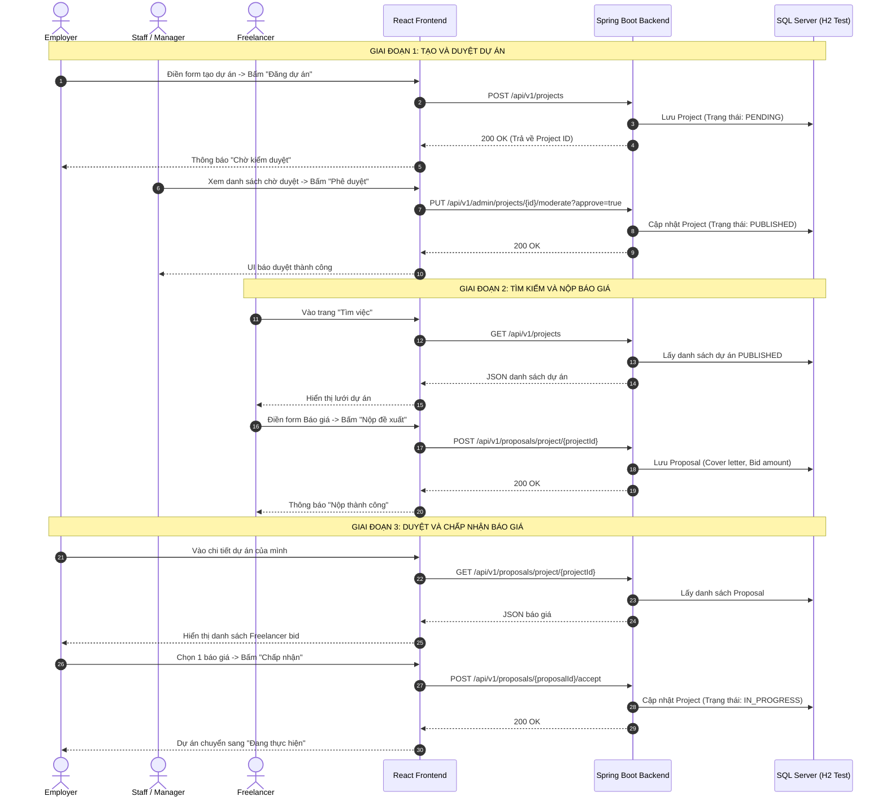

# TÀI LIỆU KẾ HOẠCH VÀ KỊCH BẢN SYSTEM TEST
**Dự án:** vLance Freelance Marketplace (LancerPro / CNY)
**Luồng nghiệp vụ:** Đăng tuyển việc, Tìm & Nhận việc (Job Posting & Bidding Flow)

---

## Bước 1: Phân tích yêu cầu (Requirement Analysis)

Dựa trên mã nguồn của `ProjectController` và `ProposalController`, luồng nghiệp vụ này xoay quanh 2 Actor chính là **Employer** (Nhà tuyển dụng) và **Freelancer** (Người làm tự do).

**Các nghiệp vụ cốt lõi (End-to-End Core Flows):**
1. **Employer Đăng dự án:** Employer nhập thông tin dự án và đăng lên hệ thống. Dự án ở trạng thái `PENDING` (Chờ duyệt).
2. **Staff/Manager Duyệt dự án:** Nhân viên (Staff) hoặc Quản lý (Manager) kiểm tra nội dung và nhấn Phê duyệt (Approve). Trạng thái dự án chuyển sang `PUBLISHED` (Đã đăng).
3. **Freelancer Tìm dự án:** Freelancer tìm kiếm các dự án đang mở (chỉ thấy các dự án `PUBLISHED`).
4. **Freelancer Nộp báo giá (Bid):** Freelancer gửi đề xuất.
5. **Employer Duyệt báo giá:** Employer xem danh sách báo giá và "Chấp nhận". Trạng thái dự án chuyển sang Đang thực hiện (`IN_PROGRESS`).

**Sơ đồ quy trình luồng (Sequence Diagram):**

---

## Bước 2: Lập kế hoạch System Test (Test Planning)

*   **Phạm vi kiểm thử (In-Scope):**
    *   API Backend tích hợp (`/projects`, `/proposals`).
    *   Kiểm tra tính vẹn toàn dữ liệu trong cơ sở dữ liệu.
    *   Kiểm tra quyền truy cập (Authorization) - Đảm bảo Freelancer không thể đóng dự án của Employer.
*   **Ngoài phạm vi (Out-of-Scope):**
    *   UI/UX hiển thị trên Frontend (Sẽ test riêng ở phần Frontend Integration/E2E).
    *   Luồng thanh toán Escrow sau khi duyệt (Tách thành System Test Plan riêng).
*   **Công cụ áp dụng (Tech Stack):** Dựa trên bộ công cụ chuẩn của dự án:
    *   **Automation Framework:** `JUnit 5` làm core framework.
    *   **Mocking & API Call:** `Mockito` (Mock dependency), `MockMvc` (Kiểm thử API nội bộ Spring), `REST Assured` (Dùng cho API Testing/E2E bên ngoài).
    *   **Quality & Security:** Tích hợp `SonarQube` (quét Code Smell/Bug tiềm ẩn) và `OWASP Dependency Check` (Quét lỗ hổng thư viện).

---

## Bước 3: Thiết kế Kịch bản Kiểm thử (Test Design)

Dưới đây là các Test Case chi tiết áp dụng các kỹ thuật thiết kế (Happy path & Edge cases).

### Test Scenario 1: Luồng hoàn hảo (Happy Path) - Đăng việc, Duyệt việc và Nhận việc
| Test Case ID | Tên Test Case | Điều kiện tiền quyết (Pre-condition) | Các bước thực hiện (Test Steps) | Dữ liệu Test (Test Data) | Kết quả mong đợi (Expected Result) |
| :--- | :--- | :--- | :--- | :--- | :--- |
| **TC-01** | Employer tạo dự án | Đã đăng nhập tài khoản Employer | 1. Gọi API `POST /projects` | JSON hợp lệ | Mã `200 OK`. DB sinh ra Project với trạng thái `PENDING`. |
| **TC-02** | Staff/Manager duyệt dự án | Đã đăng nhập tài khoản Staff hoặc Manager | 1. Gọi API `PUT /api/v1/admin/projects/{id}/moderate?approve=true` | `projectId` từ TC-01 | Mã `200 OK`. Trạng thái Project chuyển thành `PUBLISHED`. |
| **TC-03** | Freelancer nộp báo giá | Dự án đã `PUBLISHED`, đăng nhập Freelancer | 1. Gọi API `POST /proposals/project/{projectId}` | JSON chứa Bid Amount. | Mã `200 OK`. Báo giá được lưu vào DB. |
| **TC-04** | Employer chấp nhận báo giá | Đã đăng nhập bằng chính Employer tạo dự án | 1. Gọi API `POST /proposals/{proposalId}/accept` | `proposalId` từ TC-03 | Mã `200 OK`. Trạng thái Project chuyển thành `IN_PROGRESS`. |

### Test Scenario 2: Kiểm tra các luồng ngoại lệ (Unhappy Paths)
| Test Case ID | Tên Test Case | Điều kiện tiền quyết (Pre-condition) | Các bước thực hiện (Test Steps) | Dữ liệu Test (Test Data) | Kết quả mong đợi (Expected Result) |
| :--- | :--- | :--- | :--- | :--- | :--- |
| **TC-05** | Staff/Manager từ chối dự án | Employer vừa tạo dự án (`PENDING`) | 1. Staff gọi API `moderate?approve=false` | `projectId` mới tạo | Trạng thái chuyển thành `REJECTED`. Freelancer không thể tìm thấy. |
| **TC-06** | Spam: Nộp báo giá 2 lần | Freelancer đã nộp báo giá (như TC-03) | 1. Gọi API nộp báo giá lần 2 | Dữ liệu báo giá mới | API từ chối, trả về lỗi `400 Bad Request`. |
| **TC-07** | Phân quyền: Cố tình duyệt trộm | Đăng nhập bằng Employer/Freelancer | 1. Gọi API duyệt dự án `moderate?approve=true` | `projectId` đang `PENDING` | API từ chối, trả về lỗi Quyền truy cập (`403 Forbidden`). |
| **TC-08** | Phân quyền: Sai người duyệt báo giá | Đăng nhập bằng Employer **B** | 1. Gọi API chấp nhận báo giá của Employer A | `proposalId` của Employer A | API từ chối, trả về lỗi Quyền truy cập (`403 Forbidden`). |

---

## Bước 4: Review và Chốt Test Case (Review & Sign-off)

*   **Người thực hiện Review:** BA, Tech Lead hoặc PM (Ở đây là chính bạn).
*   **Tiêu chí Sign-off:** Đảm bảo các TC-01 đến TC-06 đã cover đủ các trường hợp thực tế chưa. Nếu dự án có thêm logic "Yêu cầu Freelancer phải có kỹ năng X mới được nộp báo giá", chúng ta sẽ thêm TC-07.
*   *(Giai đoạn này cần bạn đọc và duyệt tài liệu này).*

---

## Bước 5: Chuẩn bị Môi trường và Dữ liệu Test (Environment & Data Setup)

Để chạy được 8 Test Case trên, chúng ta cần chuẩn bị mồi (Seeding Data) trên Database Test:
1.  **Tài khoản Test:**
    *   Tạo 1 tài khoản có Role `STAFF` hoặc `MANAGER` (Để thực hiện thao tác duyệt).
    *   Tạo 2 tài khoản có Role `EMPLOYER` (Employer A, Employer B).
    *   Tạo 2 tài khoản có Role `FREELANCER` (Freelancer X, Freelancer Y).
2.  **Dữ liệu danh mục:**
    *   Tạo sẵn 1 `JobCategory` (Ví dụ: IT & Programming).
3.  **Cấu hình hệ thống & Công cụ:**
    *   Khởi chạy Backend (Port 8080) với `Spring Boot Actuator` để có endpoint monitor (health/metrics).
    *   **Database Setup:** Thay vì dùng H2 giả lập (có thể khác biệt behavior), khuyến nghị sử dụng **`Testcontainers`** kết hợp **`Flyway`** để spin-up một môi trường SQL Server/Postgres y hệt Production trong Docker container. Flyway sẽ tự động chạy các script migration (`V1_...`, `V2_...`) trước khi test.

---

## Bước 6: Thực thi, Log Bug và Báo cáo (Execution & Reporting)

*   **Thực thi:** Lần lượt gửi request theo các Test Case từ TC-01 đến TC-06 (Bằng Automation Code hoặc Postman).
*   **Log Bug:** Nếu TC-04 (Nộp báo giá 2 lần) mà API vẫn trả về `200 OK`, tester sẽ log một Bug lên hệ thống quản lý với nội dung: *"Lỗi logic: Cho phép Freelancer nộp nhiều báo giá trên cùng 1 dự án"*.
*   **Báo cáo (Test Report):** Lập bảng thống kê. Ví dụ: *Tổng 6 Test Cases. Pass: 5. Fail: 1. Tỷ lệ Pass: 83.3%.* Đính kèm log API của ca bị Fail để Dev sửa.
