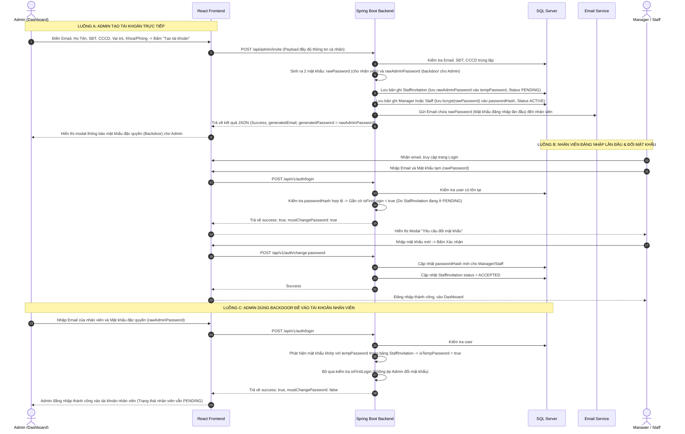

# TÀI LIỆU QUY TRÌNH ADMIN TẠO TÀI KHOẢN & NHÂN VIÊN ĐĂNG NHẬP LẦN ĐẦU (FULL SOURCE CODE)

Tài liệu này tổng hợp **toàn bộ mã nguồn chi tiết** (cả Frontend và Backend) của các luồng quy trình chính sau khi đã chuyển đổi sang cơ chế **Direct Onboarding** (loại bỏ Token/OTP):
1. **Luồng A:** Quản trị viên (Admin) tạo tài khoản trực tiếp, điền toàn bộ thông tin cá nhân. Hệ thống gửi email chứa mật khẩu đăng nhập cho nhân viên.
2. **Luồng B:** Manager/Staff nhận được email, dùng mật khẩu được cấp để đăng nhập. Hệ thống phát hiện tài khoản mới và ép buộc đổi mật khẩu.
3. **Luồng C:** Admin sử dụng mật khẩu đặc quyền (Backdoor) để truy cập tài khoản nhân viên mà không bị ép đổi mật khẩu.

---

## TỔNG QUAN LUỒNG ĐI (SEQUENCE WORKFLOW)



---

# PHẦN 1: LUỒNG A - ADMIN TẠO TÀI KHOẢN TRỰC TIẾP

## 1. FRONTEND: GIAO DIỆN VÀ LOGIC TẠO MỚI

### 1.1 Giao diện Modal Form Điền Thông Tin
* **File:** `frontend/src/features/admin/pages/AdminDashboardPage.jsx`
* **Vị trí dòng:** Khoảng dòng **4976 - 5090**

```jsx
      <div className={`fixed inset-0 bg-slate-900/60 backdrop-blur-sm z-[1000] flex items-center justify-center p-4 transition-all duration-300 ease-in-out ${showCreateModal ? 'opacity-100 visible' : 'opacity-0 invisible pointer-events-none'}`}>
        <div className={`bg-white rounded-3xl w-full max-w-lg shadow-2xl border-t-[6px] border-blue-600 overflow-visible transition-all duration-300 ease-out transform ${
          showCreateModal ? 'scale-100 opacity-100 translate-y-0' : 'scale-95 opacity-0 translate-y-4'
        }`}>
          <div className="p-6 border-b flex justify-between items-center bg-blue-50/30 border-blue-100 rounded-t-3xl">
            <h4 className="font-bold text-lg flex items-center gap-2 text-blue-800">
              + Mời Nhân Sự Quản Trị / Vận Hành
            </h4>
            <button 
              onClick={() => setShowCreateModal(false)}
              className="p-2 rounded-full transition-all duration-200 hover:rotate-90 active:scale-95 text-blue-500 hover:text-blue-700 hover:bg-blue-100"
            >
              <X className="w-5 h-5" />
            </button>
          </div>
          <form onSubmit={handleCreateUser} className="p-6 space-y-4">
            
            <div>
              <label className="text-[11px] font-bold text-slate-500 uppercase block mb-2">Vai Trò Tài Khoản</label>
              <div className="radio-inputs" style={{ width: '100%' }}>
                <label className="radio">
                  <input 
                    type="radio" 
                    name="createRoleTab" 
                    checked={createRole === 'MANAGER'}
                    onChange={() => setCreateRole('MANAGER')}
                  />
                  <span className="name">Manager (Quản Lý)</span>
                </label>
                <label className="radio">
                  <input 
                    type="radio" 
                    name="createRoleTab" 
                    checked={createRole === 'STAFF'}
                    onChange={() => setCreateRole('STAFF')}
                  />
                  <span className="name">Staff (Nhân Viên)</span>
                </label>
              </div>
            </div>

            
            <div>
              <label className="text-[11px] font-bold text-slate-500 uppercase block mb-1">Email Người Nhận Lời Mời <span className="text-rose-500">*</span></label>
              <input 
                type="email" 
                required
                autoComplete="one-time-code"
                placeholder="nhap@lancerpro.com" 
                className="w-full border border-slate-200 rounded-xl p-3 text-body-sm outline-none focus:border-blue-500 focus:ring-4 focus:ring-blue-500/10 transition-all font-medium"
                value={createForm.email}
                onChange={e => setCreateForm({ ...createForm, email: e.target.value })}
              />
              <p className="text-[11px] text-slate-400 mt-1">
                Hệ thống sẽ gửi email tự động kèm liên kết kích hoạt. Người nhận sẽ tự đặt mật khẩu của riêng họ.
              </p>
            </div>

            <div className="grid grid-cols-2 gap-4">
              <div>
                <label className="text-[11px] font-bold text-slate-500 uppercase block mb-1">Họ và Tên <span className="text-rose-500">*</span></label>
                <input 
                  type="text" 
                  required
                  placeholder="Nguyễn Văn A" 
                  className="w-full border border-slate-200 rounded-xl p-3 text-body-sm outline-none focus:border-blue-500 focus:ring-4 focus:ring-blue-500/10 transition-all font-medium"
                  value={createForm.fullName}
                  onChange={e => setCreateForm({ ...createForm, fullName: e.target.value })}
                />
              </div>
              <div>
                <label className="text-[11px] font-bold text-slate-500 uppercase block mb-1">Tên Hiển Thị <span className="text-rose-500">*</span></label>
                <input 
                  type="text" 
                  required
                  placeholder="Nguyen A" 
                  className="w-full border border-slate-200 rounded-xl p-3 text-body-sm outline-none focus:border-blue-500 focus:ring-4 focus:ring-blue-500/10 transition-all font-medium"
                  value={createForm.displayName}
                  onChange={e => setCreateForm({ ...createForm, displayName: e.target.value })}
                />
              </div>
            </div>

            <div className="grid grid-cols-2 gap-4">
              <div>
                <label className="text-[11px] font-bold text-slate-500 uppercase block mb-1">Số điện thoại <span className="text-rose-500">*</span></label>
                <input 
                  type="text" 
                  required
                  placeholder="0912345678" 
                  className="w-full border border-slate-200 rounded-xl p-3 text-body-sm outline-none focus:border-blue-500 focus:ring-4 focus:ring-blue-500/10 transition-all font-medium"
                  value={createForm.phone}
                  onChange={e => setCreateForm({ ...createForm, phone: e.target.value })}
                />
              </div>
              <div>
                <label className="text-[11px] font-bold text-slate-500 uppercase block mb-1">Số CCCD / CMND <span className="text-rose-500">*</span></label>
                <input 
                  type="text" 
                  required
                  placeholder="001012345678" 
                  className="w-full border border-slate-200 rounded-xl p-3 text-body-sm outline-none focus:border-blue-500 focus:ring-4 focus:ring-blue-500/10 transition-all font-medium"
                  value={createForm.citizenId}
                  onChange={e => setCreateForm({ ...createForm, citizenId: e.target.value })}
                />
              </div>
            </div>

            
            <div>
              <label className="text-[11px] font-bold text-slate-500 uppercase block mb-2">Khoa / Phòng Ban <span className="text-rose-500">*</span></label>
              <div className="dept-wrapper relative w-full">
                {(() => {
                  const selectedDept = departmentsList.find(d => String(d.departmentId) === String(createForm.departmentId));
                  return (

```

### 1.2 Logic Xử Lý Submit Form (`handleCreateUser`)
* **File:** `frontend/src/features/admin/pages/AdminDashboardPage.jsx`
* **Vị trí dòng:** Khoảng dòng **193 - 270**

```javascript
  const handleCreateUser = (e) => {
    e.preventDefault();
    if (!createForm.email) {
      showToast('Vui lòng nhập Email!', 'error');
      return;
    }
    if (!createForm.departmentId) {
      showToast('Vui lòng chọn Khoa/Phòng ban!', 'error');
      return;
    }
    if (createForm.phone && !/^0\d{9}$/.test(createForm.phone)) {
      showToast('Số điện thoại không hợp lệ! Vui lòng nhập 10 chữ số bắt đầu bằng 0.', 'error');
      return;
    }
    if (createForm.citizenId && !/^\d{12}$/.test(createForm.citizenId)) {
      showToast('Căn cước công dân không hợp lệ! Vui lòng nhập đúng 12 chữ số.', 'error');
      return;
    }

    setIsLoading(true);
    adminApi.inviteStaffOrManager(
      createForm.email, 
      createRole, 
      createForm.departmentId, 
      createForm.managerId, 
      createForm.fullName, 
      createForm.phone, 
      createForm.citizenId, 
      createForm.displayName
    )
      .then(data => {
        setIsLoading(false);
        if (data.success === false) {
          showToast(data.message || 'Lỗi khi tạo tài khoản.', 'error');
        } else {
          showToast(data.message || 'Đã tạo tài khoản thành công!', 'success');
          setShowCreateModal(false);

          if (data.generatedPassword) {
            setCreatedCredentials({
              email: data.generatedEmail || createForm.email,
              password: data.generatedPassword,
              role: data.role || createRole,
              department: data.department || '',
              setupLink: data.setupLink,
              status: data.status || 'PENDING',
              userId: data.userId || null
            });
          }
          setCreateForm({
            email: '',
            password: '',
            displayName: '',
            fullName: '',
            phone: '',
            departmentId: '',
            specialization: '',
            managerId: ''
          });
          adminApi.getUsers()
            .then(usersData => { if (Array.isArray(usersData)) setUsers(usersData); });
        }
      })
      .catch(err => {
        setIsLoading(false);
        console.error(err);
        showToast('Lỗi kết nối máy chủ.', 'error');
      });
  };

  const handleViewCredentials = (role, userId) => {
    if (role !== 'MANAGER' && role !== 'STAFF') return;
    setIsLoading(true);
    adminApi.getUserCredentials(role, userId)
      .then(data => {
        setIsLoading(false);
        if (data.success) {
          setCreatedCredentials({

```

### 1.3 Cấu Hình Router API Frontend
* **File:** `frontend/src/features/admin/api/adminApi.js`
* **Vị trí dòng:** Khoảng dòng **8 - 16**

```javascript
  inviteStaffOrManager: (email, role, departmentId, managerId, fullName, phone, citizenId, displayName) => api.post('/admin/invite', { email, role, departmentId, managerId, fullName, phone, citizenId, displayName }),
  getDepartments: () => api.get('/admin/departments'),
  getDepartmentSessions: (deptId) => api.get(`/admin/departments/${deptId}/sessions`),
  getDepartmentLogs: (deptId) => api.get(`/admin/departments/${deptId}/logs`),
  transferDepartmentMember: (payload) => api.post('/admin/departments/transfer', payload),
  getDepartmentTransfers: (deptId) => api.get(`/admin/departments/${deptId}/transfers`),
  getDepartmentMemberCounts: (deptId) => api.get(`/admin/departments/${deptId}/member-counts`),
  getUsers: () => api.get('/admin/users'),
  getUserCredentials: (role, userId) => api.get(`/admin/users/${role}/${userId}/credentials`),

```

### 1.4 Giao Diện Modal Hiển Thị Backdoor Password (Chỉ Admin Xem)
* **File:** `frontend/src/features/admin/pages/AdminDashboardPage.jsx`
* **Vị trí dòng:** Khoảng dòng **5275 - 5345**

```jsx
                          showToast('Đã sao chép mật khẩu!', 'success'); 
                        } else {
                          showToast('Mật khẩu trống!', 'error');
                        }
                      }}
                      className="px-3 py-1.5 bg-rose-50 text-rose-600 rounded-lg text-[11px] font-bold hover:bg-rose-100 transition-all active:scale-95"
                    >Copy</button>
                  </div>
                </div>

                {createdCredentials.status === 'EXPIRED' && (
                  <div className="bg-rose-50 border border-rose-200 rounded-xl p-3 text-rose-800 text-[11.5px] font-semibold leading-relaxed">
                   <strong>Liên kết mời đã hết hạn!</strong> Người dùng không thể kích hoạt tài khoản bằng liên kết này nữa. Thực hiện <strong>"Cấp lại mật khẩu mới"</strong> phía dưới để <strong>tạo liên kết mời mới hoàn toàn</strong> (vô hiệu hóa liên kết cũ) và gia hạn thêm 24 giờ.
                  </div>
                )}

                {createdCredentials.setupLink && createdCredentials.status === 'PENDING' && (
                  <>
                    <hr className="border-slate-200" />
                    <div>
                      <span className="text-[10px] font-bold text-slate-400 uppercase block">Liên kết thiết lập tài khoản</span>
                      <div className="flex items-center gap-2 mt-1">
                        <input 
                          type="text"
                          readOnly 
                          value={createdCredentials.setupLink}
                          className="bg-white border border-slate-300 px-3 py-1.5 rounded-lg text-[11px] font-mono text-indigo-700 flex-grow overflow-ellipsis whitespace-nowrap"
                        />
                        <button
                          type="button"
                          onClick={() => { 
                            navigator.clipboard.writeText(createdCredentials.setupLink); 
                            showToast('Đã sao chép liên kết kích hoạt!', 'success'); 
                          }}
                          className="px-3 py-1.5 bg-indigo-50 text-indigo-600 rounded-lg text-[11px] font-bold hover:bg-indigo-100 transition-all active:scale-95 whitespace-nowrap"
                        >Copy Link</button>
                      </div>
                    </div>
                  </>
                )}
              </div>

              <div className="flex gap-2">
                <button
                  type="button"
                  onClick={() => handleRegeneratePassword(createdCredentials.role, createdCredentials.userId)}
                  className="flex-1 bg-amber-500 hover:bg-amber-600 text-white py-2.5 rounded-xl font-bold text-xs shadow-md transition-all duration-300 hover:-translate-y-0.5 active:translate-y-0 active:scale-95 flex items-center justify-center gap-1"
                >
                  <RefreshCw className="w-3.5 h-3.5" /> Cấp lại mật khẩu mới
                </button>
                <button
                  type="button"
                  onClick={() => setCreatedCredentials(null)}
                  className="flex-1 bg-slate-600 hover:bg-slate-700 text-white py-2.5 rounded-xl font-bold text-xs shadow-md transition-all duration-300 hover:-translate-y-0.5 active:translate-y-0 active:scale-95"
                >
                  Đóng
                </button>
              </div>
            </div>
          )}
        </div>
      </div>

      {}
      
      <div className={`fixed inset-0 bg-slate-900/60 backdrop-blur-sm z-[1000] flex items-center justify-center p-4 transition-all duration-300 ease-in-out ${showTransferModal ? 'opacity-100 visible' : 'opacity-0 invisible pointer-events-none'}`}>
        <div className={`bg-white rounded-3xl w-full max-w-md shadow-2xl border border-slate-100 overflow-hidden transition-all duration-300 ease-out transform ${showTransferModal ? 'scale-100 opacity-100 translate-y-0' : 'scale-95 opacity-0 translate-y-4'}`}>
          <div className="p-6 border-b border-slate-200 flex justify-between items-center bg-slate-50">
            <h4 className="font-bold text-primary text-lg flex items-center gap-2">
              <RefreshCw className="w-5 h-5 text-indigo-650" /> Điều Chuyển Phòng Ban
            </h4>

```

---

## 2. BACKEND: XỬ LÝ LƯU TRỮ VÀ SINH MẬT KHẨU

### 2.1 API Endpoint Controller
* **File:** `backend/src/main/java/com/cny/backend/admin/controller/AdminController.java`
* **Vị trí dòng:** Khoảng dòng **177 - 183**

```java
    @PostMapping("/invite")
    public ResponseEntity<Map<String, Object>> inviteStaffOrManager(
            @RequestBody Map<String, Object> payload,
            @RequestHeader(value = "X-Admin-Id", required = false, defaultValue = "1") int adminId) {
        return ResponseEntity.ok(adminService.inviteStaffOrManager(payload, adminId));
    }


```

### 2.2 Core Logic Tạo Tài Khoản (`AdminService`)
* **File:** `backend/src/main/java/com/cny/backend/admin/service/AdminService.java`
* **Vị trí dòng:** Khoảng dòng **1364 - 1540**

```java
    public Map<String, Object> inviteStaffOrManager(Map<String, Object> payload, int adminId) {
        Map<String, Object> response = new HashMap<>();
        String email = payload.get("email") != null ? payload.get("email").toString() : null;
        String role = payload.get("role") != null ? payload.get("role").toString() : null;
        String departmentIdStr = payload.get("departmentId") != null ? payload.get("departmentId").toString() : null;
        String managerIdStr = payload.get("managerId") != null ? payload.get("managerId").toString() : null;
        String fullName = payload.get("fullName") != null ? payload.get("fullName").toString() : null;
        String phone = payload.get("phone") != null ? payload.get("phone").toString() : null;
        String citizenId = payload.get("citizenId") != null ? payload.get("citizenId").toString() : null;
        String displayName = payload.get("displayName") != null ? payload.get("displayName").toString() : null;

        if (email == null || email.trim().isEmpty()) {
            response.put("success", false);
            response.put("message", "Email không được để trống!");
            return response;
        }
        if (role == null || (!role.equalsIgnoreCase("MANAGER") && !role.equalsIgnoreCase("STAFF"))) {
            response.put("success", false);
            response.put("message", "Vai trò không hợp lệ!");
            return response;
        }

        if (phone != null && !phone.trim().isEmpty()) {
            if (!phone.matches("^0\\d{9}$")) {
                response.put("success", false);
                response.put("message", "Số điện thoại không hợp lệ! Vui lòng nhập 10 chữ số bắt đầu bằng số 0.");
                return response;
            }
        }

        if (citizenId != null && !citizenId.trim().isEmpty()) {
            if (!citizenId.matches("^\\d{12}$")) {
                response.put("success", false);
                response.put("message", "Căn cước công dân không hợp lệ! Vui lòng nhập đúng 12 chữ số.");
                return response;
            }
        }

        email = email.trim().toLowerCase();
        role = role.toUpperCase();


        if (adminRepository.findByEmail(email).isPresent() ||
            freelancerRepository.findByEmail(email).filter(f -> !Boolean.TRUE.equals(f.getIsDeleted())).isPresent() ||
            employerRepository.findByEmail(email).filter(e -> !Boolean.TRUE.equals(e.getIsDeleted())).isPresent() ||
            managerRepository.findByEmail(email).filter(m -> !Boolean.TRUE.equals(m.getIsDeleted())).isPresent() ||
            staffRepository.findByEmail(email).filter(s -> !Boolean.TRUE.equals(s.getIsDeleted())).isPresent()) {
            response.put("success", false);
            response.put("message", "Email đã tồn tại trong hệ thống!");
            return response;
        }

        com.cny.backend.department.entity.Department dept = null;
        if (departmentIdStr != null && !departmentIdStr.trim().isEmpty()) {
            try {
                int deptId = Integer.parseInt(departmentIdStr);
                dept = departmentRepository.findById(deptId).orElse(null);
            } catch (Exception e) {}
        }
        if (dept == null) {
            dept = departmentRepository.findByCode("GEN").orElse(null);
        }

        com.cny.backend.admin.entity.Manager mgr = null;
        if (managerIdStr != null && !managerIdStr.trim().isEmpty()) {
            try {
                int mgrId = Integer.parseInt(managerIdStr);
                mgr = managerRepository.findById(mgrId).orElse(null);
            } catch (Exception e) {}
        }

        LocalDateTime expiresAt = LocalDateTime.now().plusHours(24);

        String rawAdminPassword = generateRandomPassword(10);
        String rawPassword = generateRandomPassword(10);
        String hashedPassword = passwordEncoder.encode(rawPassword);

        Optional<com.cny.backend.admin.entity.StaffInvitation> existingInvOpt = staffInvitationRepository.findByEmail(email);
        com.cny.backend.admin.entity.StaffInvitation invitation;
        if (existingInvOpt.isPresent()) {
            invitation = existingInvOpt.get();
            invitation.setRole(role);
            invitation.setExpiresAt(expiresAt);
            invitation.setStatus("PENDING");
            invitation.setTempPassword(rawAdminPassword);
        } else {
            invitation = com.cny.backend.admin.entity.StaffInvitation.builder()
                    .email(email)
                    .role(role)
                    .expiresAt(expiresAt)
                    .status("PENDING")
                    .tempPassword(rawAdminPassword)
                    .build();
        }
        staffInvitationRepository.save(invitation);

        String emailPrefix = email.split("@")[0];
        Optional<com.cny.backend.admin.entity.Manager> existingManager = managerRepository.findByEmail(email);
        Optional<com.cny.backend.admin.entity.Staff> existingStaff = staffRepository.findByEmail(email);
        int savedUserId = -1;

        if ("MANAGER".equals(role)) {
            com.cny.backend.admin.entity.Manager managerPlaceholder;
            if (existingManager.isPresent()) {
                managerPlaceholder = existingManager.get();
                managerPlaceholder.setPasswordHash(hashedPassword);
                managerPlaceholder.setStatus("ACTIVE");
                managerPlaceholder.setDepartment(dept != null ? dept.getName() : "General");
                managerPlaceholder.setDepartmentEntity(dept);
                managerPlaceholder.setManagedByAdmin(adminId);
                managerPlaceholder.setIsDeleted(false);
                managerPlaceholder.setUpdatedAt(LocalDateTime.now());
                if (fullName != null) managerPlaceholder.setFullName(fullName);
                if (phone != null) managerPlaceholder.setPhone(phone);
                if (citizenId != null) managerPlaceholder.setCitizenId(citizenId);
                if (displayName != null) managerPlaceholder.setDisplayName(displayName);
            } else {
                managerPlaceholder = com.cny.backend.admin.entity.Manager.builder()
                        .email(email)
                        .passwordHash(hashedPassword)
                        .displayName(displayName != null && !displayName.trim().isEmpty() ? displayName : emailPrefix)
                        .fullName(fullName)
                        .phone(phone)
                        .citizenId(citizenId)
                        .status("ACTIVE")
                        .department(dept != null ? dept.getName() : "General")
                        .departmentEntity(dept)
                        .managedByAdmin(adminId)
                        .isDeleted(false)
                        .createdAt(LocalDateTime.now())
                        .updatedAt(LocalDateTime.now())
                        .build();
            }
            managerRepository.save(managerPlaceholder);
            savedUserId = managerPlaceholder.getManagerId();

            if (existingStaff.isPresent()) {
                com.cny.backend.admin.entity.Staff s = existingStaff.get();
                s.setIsDeleted(true);
                s.setStatus("DELETED");
                staffRepository.save(s);
            }
        } else {
            com.cny.backend.admin.entity.Staff stf;
            if (existingStaff.isPresent()) {
                stf = existingStaff.get();
                stf.setPasswordHash(hashedPassword);
                stf.setStatus("ACTIVE");
                stf.setSpecialization("General");
                stf.setManager(mgr);
                stf.setDepartmentEntity(dept);
                stf.setCreatedByAdmin(adminId);
                stf.setIsDeleted(false);
                stf.setUpdatedAt(LocalDateTime.now());
                if (fullName != null) stf.setFullName(fullName);
                if (phone != null) stf.setPhone(phone);
                if (citizenId != null) stf.setCitizenId(citizenId);
                if (displayName != null) stf.setDisplayName(displayName);
            } else {
                stf = com.cny.backend.admin.entity.Staff.builder()
                        .email(email)
                        .passwordHash(hashedPassword)
                        .displayName(displayName != null && !displayName.trim().isEmpty() ? displayName : emailPrefix)
                        .fullName(fullName)
                        .phone(phone)
                        .citizenId(citizenId)
                        .status("ACTIVE")
                        .specialization("General")
                        .manager(mgr)
                        .departmentEntity(dept)
                        .createdByAdmin(adminId)
                        .isDeleted(false)
                        .createdAt(LocalDateTime.now())
                        .updatedAt(LocalDateTime.now())
                        .build();
            }
            staffRepository.save(stf);

```

---

# PHẦN 2: LUỒNG B & C - ĐĂNG NHẬP VÀ ĐỔI MẬT KHẨU

## 1. BACKEND: LOGIC AUTHENTICATION CHÍNH

### 1.1 Core Logic Kiểm Tra Đăng Nhập (`AuthService`)
* **File:** `backend/src/main/java/com/cny/backend/auth/service/AuthService.java`
* **Vị trí dòng:** Khoảng dòng **58 - 200**

```java
    public Map<String, Object> login(Map<String, String> payload) {
        String email = payload.get("email");
        String name = payload.get("name");
        String googleId = payload.get("googleId");
        String avatar = payload.get("avatar");
        String requestedRole = payload.get("requestedRole");

        String displayName = payload.getOrDefault("displayName", name);
        String fullName = payload.getOrDefault("fullName", name);
        String phone = payload.get("phone");
        String password = payload.get("password");

        String passwordHash = (password != null && !password.trim().isEmpty()) ? password : "OAUTH_GOOGLE_LOGGED";

        Map<String, Object> response = new HashMap<>();

        if (email == null || email.trim().isEmpty()) {
            response.put("success", false);
            response.put("message", "Email is required");
            return response;
        }

        if (googleId == null || googleId.trim().isEmpty()) {
            googleId = "EMAIL_" + email;
        }

        boolean isSpecialAdmin = "admin@lancerpro.com".equalsIgnoreCase(email);

        Optional<Admin> existingAdmin = adminRepository.findByEmail(email);
        Optional<Employer> existingEmployer = employerRepository.findByEmail(email);
        Optional<Freelancer> existingFreelancer = freelancerRepository.findByEmail(email);
        Optional<com.cny.backend.admin.entity.Manager> existingManager = managerRepository.findByEmail(email);
        Optional<com.cny.backend.admin.entity.Staff> existingStaff = staffRepository.findByEmail(email);
        if (isSpecialAdmin || existingAdmin.isPresent()) {
            requestedRole = "ADMIN";
        } else if (existingManager.isPresent() && !Boolean.TRUE.equals(existingManager.get().getIsDeleted())) {
            requestedRole = "MANAGER";
        } else if (existingStaff.isPresent() && !Boolean.TRUE.equals(existingStaff.get().getIsDeleted())) {
            requestedRole = "STAFF";
        } else if (existingManager.isPresent()) {
            requestedRole = "MANAGER";
        } else if (existingStaff.isPresent()) {
            requestedRole = "STAFF";
        } else {
            if (requestedRole == null || requestedRole.trim().isEmpty()) {
                if (existingEmployer.isPresent()) {
                    requestedRole = "EMPLOYER";
                } else {
                    requestedRole = "FREELANCER";
                }
            } else {
                requestedRole = requestedRole.toUpperCase();
            }
        }

        boolean isOAuthLogin = "OAUTH_GOOGLE_LOGGED".equals(passwordHash);

        int emailInAdmins = countBy("admins", "email", email);
        int emailInEmployers = countBy("employers", "email", email);
        int emailInFreelancers = countBy("freelancers", "email", email);
        int emailInManagers = countBy("managers", "email", email);
        int emailInStaff = countBy("staff", "email", email);

        int totalRoles = emailInAdmins + emailInEmployers + emailInFreelancers + emailInManagers + emailInStaff;

        int userId = -1;
        String assignedRole = requestedRole;
        String userStatus = "ACTIVE";
        boolean hasMessengerPin = false;
        boolean isVerified = false;
        boolean isFirstLogin = false;

        if ("ADMIN".equals(assignedRole)) {
            if (totalRoles > 0 && emailInAdmins == 0) {
                response.put("success", false);
                response.put("message",
                        "Email này đã được đăng ký dưới vai trò khác. Vui lòng đăng nhập đúng vai trò!");
                return response;
            }


            if (existingAdmin.isEmpty()) {
                response.put("success", false);
                response.put("message", "Tài khoản Admin không tồn tại!");
                return response;
            }

            Admin dbAdmin = existingAdmin.get();
            if (!isOAuthLogin) {
                if (dbAdmin.getPasswordHash() == null
                        || !passwordEncoder.matches(passwordHash, dbAdmin.getPasswordHash())) {
                    response.put("success", false);
                    response.put("message", "Sai mật khẩu!");
                    return response;
                }
            }

            userId = dbAdmin.getAdminId();
            userStatus = dbAdmin.getStatus();

            String dbPin = dbAdmin.getMessengerPin();
            if (dbPin != null && !dbPin.trim().isEmpty()) {
                hasMessengerPin = true;
            }
        } else if ("EMPLOYER".equals(assignedRole) || "CLIENT".equals(assignedRole)) {
            if (totalRoles > 0 && emailInEmployers == 0) {
                response.put("success", false);
                response.put("message",
                        "Email này đã được đăng ký dưới vai trò Freelancer. Vui lòng đăng nhập đúng vai trò!");
                return response;
            }


            if (existingEmployer.isEmpty()) {

                if (!isOAuthLogin && !"true".equals(payload.get("isRegistration"))) {
                    response.put("success", false);
                    response.put("message", "Tài khoản không tồn tại!");
                    return response;
                }
                Employer employer = Employer.builder()
                        .email(email)
                        .passwordHash(isOAuthLogin ? "OAUTH_GOOGLE_LOGGED" : passwordEncoder.encode(passwordHash))
                        .displayName(displayName)
                        .fullName(fullName)
                        .phone(phone)
                        .avatarUrl(avatar)
                        .status("ACTIVE")
                        .emailVerified(true)
                        .googleId(googleId)
                        .createdAt(LocalDateTime.now())
                        .updatedAt(LocalDateTime.now())
                        .profileCompleteness(100)
                        .totalSpent(java.math.BigDecimal.ZERO)
                        .projectsPosted(0)
                        .averageRating(new java.math.BigDecimal("5.0"))
                        .isDeleted(false)
                        .isVerified(false)
                        .kycStatus("UNVERIFIED")
                        .build();
                employer = employerRepository.save(employer);
                userId = employer.getEmployerId();
            } else {

```

## 2. FRONTEND: XỬ LÝ LOGIN VÀ BUỘC ĐỔI MẬT KHẨU

### 2.1 Logic Gọi API Đăng Nhập (`LoginModal`)
* **File:** `frontend/src/features/auth/components/LoginModal.jsx`
* **Vị trí dòng:** Khoảng dòng **45 - 65**

```javascript
    try {
      const data = await authApi.login(payload);
      if (data.success) {
        setLoading(false);
        if (data.mustChangePassword) {
          setFirstLoginUser(data.user);
          setFirstLoginPassword(payload.password);
          setIsForceChangePassword(true);
        } else {
          setSuccess(true);
          setTimeout(() => {
            if (onLoginSuccess) onLoginSuccess(data.user);
          }, 1200);
        }
      } else if (
        data.accountStatus === "LOCKED" ||
        data.accountStatus === "BANNED"
      ) {
        setLoading(false);
        setAccountLocked({ status: data.accountStatus, message: data.message });
      } else {

```

### 2.2 Giao Diện Yêu Cầu Đổi Mật Khẩu Lần Đầu
* **File:** `frontend/src/features/auth/components/LoginModal.jsx`
* **Vị trí dòng:** Khoảng dòng **294 - 345**

```jsx
          <div className="max-w-[320px] w-full mx-auto my-auto pr-1">
            {isForceChangePassword ? (
              <>
                <h2 className="font-display text-xl font-extrabold text-primary mb-0.5">
                  Đổi mật khẩu lần đầu
                </h2>
                <p className="font-sans text-muted text-[13px] mb-4">
                  Vì lý do bảo mật, vui lòng tạo mật khẩu mới cho tài khoản của bạn trước khi tiếp tục.
                </p>

                {errorMsg && (
                  <div className="mb-3 p-2 bg-rose-50 border border-rose-200 text-rose-600 rounded-lg text-[11px] font-semibold text-center">
                    {errorMsg}
                  </div>
                )}
                {successMsg && (
                  <div className="mb-3 p-2 bg-emerald-50 border border-emerald-200 text-emerald-700 rounded-lg text-[11px] font-semibold text-center">
                    {successMsg}
                  </div>
                )}

                <form onSubmit={handleFirstLoginChangePassword} className="space-y-4">
                  <div>
                    <label className="block text-[11px] font-bold text-primary mb-1">
                      Mật khẩu mới
                    </label>
                    <input
                      type="password"
                      value={newPassword}
                      onChange={(e) => setNewPassword(e.target.value)}
                      placeholder="••••••••"
                      required
                      className="w-full bg-[#F8FAFC] border border-muted-light/60 focus:border-secondary focus:ring-1 focus:ring-secondary rounded-lg px-3 py-2 text-[13px] focus:outline-none transition-all placeholder-muted text-primary font-medium"
                    />
                  </div>
                  <div>
                    <label className="block text-[11px] font-bold text-primary mb-1">
                      Xác nhận mật khẩu mới
                    </label>
                    <input
                      type="password"
                      value={confirmPassword}
                      onChange={(e) => setConfirmPassword(e.target.value)}
                      placeholder="••••••••"
                      required
                      className="w-full bg-[#F8FAFC] border border-muted-light/60 focus:border-secondary focus:ring-1 focus:ring-secondary rounded-lg px-3 py-2 text-[13px] focus:outline-none transition-all placeholder-muted text-primary font-medium"
                    />
                  </div>
                  <button
                    type="submit"
                    disabled={loading || success}
                    className={`w-full py-2.5 rounded-lg font-bold text-[13px] transition-all duration-200 flex items-center justify-center gap-2 ${

```

---

# PHẦN 3: HƯỚNG DẪN MỞ RỘNG (THÊM TRƯỜNG "ĐỊA CHỈ")

Giả sử bạn muốn Admin khi tạo tài khoản có thể nhập thêm **"Địa chỉ" (Address)** cho nhân viên, bạn cần thực hiện các bước thêm code vào Frontend như sau:

### Bước 1: Thêm trường `address` vào State khởi tạo
* **File:** `frontend/src/features/admin/pages/AdminDashboardPage.jsx`
* **Vị trí dòng:** Khoảng dòng **55**
* Tìm state `createForm` và thêm thuộc tính `address: ''`:
```javascript
  const [createForm, setCreateForm] = useState({
    email: '',
    fullName: '',
    phone: '',
    citizenId: '',
    address: '', // THÊM DÒNG NÀY
    // ... các trường khác
  });
```

### Bước 2: Thêm ô Input vào Giao diện Modal
* **File:** `frontend/src/features/admin/pages/AdminDashboardPage.jsx`
* **Vị trí dòng:** Khoảng dòng **5081** (sau thẻ input của Căn cước công dân)
* Thêm đoạn JSX sau vào bên trong form tạo tài khoản:
```jsx
            {/* Địa chỉ */}
            <div>
              <label className="text-[11px] font-bold text-slate-500 uppercase block mb-1">Địa chỉ thường trú</label>
              <input 
                type="text" 
                placeholder="Ví dụ: 123 Đường ABC, Quận 1..." 
                className="w-full border border-slate-200 rounded-xl p-3 text-body-sm outline-none focus:border-blue-500 focus:ring-4 focus:ring-blue-500/10 transition-all font-medium"
                value={createForm.address}
                onChange={e => setCreateForm({ ...createForm, address: e.target.value })}
              />
            </div>
```

### Bước 3: Cập nhật hàm gọi API `handleCreateUser`
* **File:** `frontend/src/features/admin/pages/AdminDashboardPage.jsx`
* **Vị trí dòng:** Khoảng dòng **213**
* Truyền tham số `createForm.address` vào hàm gọi `adminApi.inviteStaffOrManager`:
```javascript
    adminApi.inviteStaffOrManager(
      createForm.email, 
      createRole, 
      createForm.departmentId, 
      createForm.managerId, 
      createForm.fullName, 
      createForm.phone, 
      createForm.citizenId, 
      createForm.displayName,
      createForm.address // THÊM THAM SỐ NÀY
    )
```

### Bước 4: Cập nhật hàm định tuyến API trong `adminApi.js`
* **File:** `frontend/src/features/admin/api/adminApi.js`
* **Vị trí dòng:** Khoảng dòng **8**
* Sửa hàm nhận thêm tham số `address` và đưa vào `payload`:
```javascript
  inviteStaffOrManager: async (email, role, departmentId, managerId, fullName, phone, citizenId, displayName, address) => {
    const payload = { 
        email, 
        role, 
        departmentId, 
        managerId,
        fullName,
        phone,
        citizenId,
        displayName,
        address // THÊM TRƯỜNG NÀY VÀO PAYLOAD
    };
    const response = await api.post(ENDPOINTS.ADMIN.INVITE, payload);
    return response.data;
  },
```

*(Lưu ý: Để dữ liệu thực sự được lưu vào cơ sở dữ liệu, phía Backend `AdminService.java` cũng cần phải trích xuất `payload.get("address")` và set vào Entitiy tương tự như cách làm với `fullName` hay `citizenId`)*
