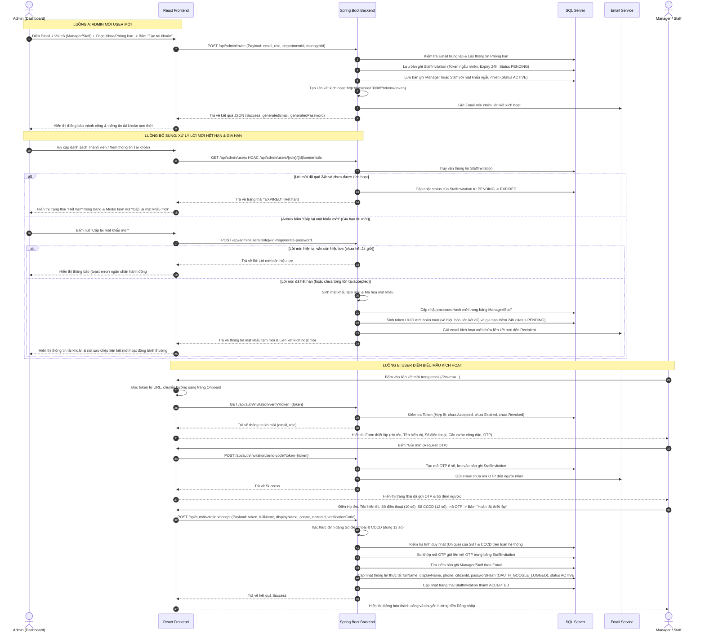
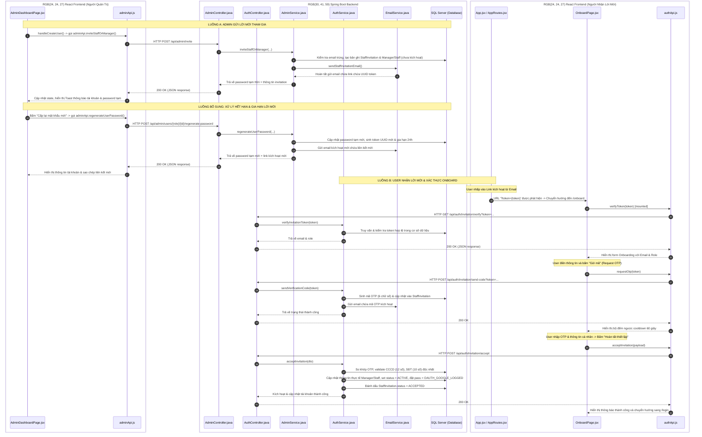

# TÀI LIỆU QUY TRÌNH ADMIN MỜI & XÁC THỰC TÀI KHOẢN (MANAGER + STAFF)

Tài liệu này tổng hợp toàn bộ mã nguồn chi tiết (cả Frontend và Backend) của hai luồng quy trình chính:
1. **Luồng A:** Quản trị viên (Admin) tạo tài khoản, hệ thống gửi email mời chứa liên kết kích hoạt đến Manager/Staff.
2. **Luồng B:** Manager/Staff nhận được email mời, nhấp vào liên kết để truy cập biểu mẫu, gửi mã OTP xác nhận danh tính và thiết lập thông tin cá nhân hoàn tất đăng ký.

---

## TỔNG QUAN LUỒNG ĐI (SEQUENCE WORKFLOW)



---

### SƠ ĐỒ TRÌNH TỰ CÁC FILE (FILE-LEVEL SEQUENCE FLOW)

Dưới đây là sơ đồ chi tiết biểu diễn trình tự tương tác trực tiếp giữa các tệp mã nguồn (Frontend và Backend) trong toàn bộ quy trình:



---


# PHẦN 1: LUỒNG A - ADMIN GỬI LỜI MỜI THAM GIA

## 1. FRONTEND: THỰC HIỆN GỬI YÊU CẦU MỜI

### 1.1 Logic Gửi Lời Mời
* **File:** `frontend/src/features/admin/pages/AdminDashboardPage.jsx`
* **Vị trí dòng:** `152 - 200` (Hàm xử lý sự kiện submit Form thêm thành viên)

```javascript
  const handleCreateUser = (e) => {
    e.preventDefault();
    if (!createForm.email) {
      showToast('Vui lòng nhập Email!', 'error');
      return;
    }
    if (!createForm.departmentId) {
      showToast('Vui lòng chọn Khoa/Phòng ban!', 'error');
      return;
    }

    setIsLoading(true);
    // Gọi hàm API gửi email mời qua backend
    adminApi.inviteStaffOrManager(createForm.email, createRole, createForm.departmentId, createForm.managerId)
      .then(data => {
        setIsLoading(false);
        if (data.success === false) {
          showToast(data.message || 'Lỗi khi tạo tài khoản.', 'error');
        } else {
          showToast(data.message || 'Đã tạo tài khoản thành công!', 'success');
          setShowCreateModal(false);
          // Hiển thị thông tin tài khoản tạm thời vừa tạo cho Admin xem trực tiếp
          if (data.generatedPassword) {
            setCreatedCredentials({
              email: data.generatedEmail || createForm.email,
              password: data.generatedPassword,
              role: data.role || createRole,
              department: data.department || ''
            });
          }
          setCreateForm({
            email: '',
            password: '',
            displayName: '',
            fullName: '',
            phone: '',
            departmentId: '',
            specialization: '',
            managerId: ''
          });
          adminApi.getUsers()
            .then(usersData => { if (Array.isArray(usersData)) setUsers(usersData); });
        }
      })
      .catch(err => {
        setIsLoading(false);
        console.error(err);
        showToast('Lỗi kết nối máy chủ.', 'error');
      });
  };
```

---

### 1.2 Giao diện Modal Admin Điền Thông Tin Mời (Đầy đủ JSX)
* **File:** `frontend/src/features/admin/pages/AdminDashboardPage.jsx`
* **Vị trí dòng:** `4130 - 4304`

```jsx
      {/* MODAL MỜI NHÂN SỰ MANAGER / STAFF (INVITATION FLOW) */}
      <div className={`fixed inset-0 bg-slate-900/60 backdrop-blur-sm z-[1000] flex items-center justify-center p-4 transition-all duration-300 ease-in-out ${showCreateModal ? 'opacity-100 visible' : 'opacity-0 invisible pointer-events-none'}`}>
        <div className={`bg-white rounded-3xl w-full max-w-lg shadow-2xl border-t-[6px] border-blue-600 overflow-visible transition-all duration-300 ease-out transform ${
          showCreateModal ? 'scale-100 opacity-100 translate-y-0' : 'scale-95 opacity-0 translate-y-4'
        }`}>
          <div className="p-6 border-b flex justify-between items-center bg-blue-50/30 border-blue-100 rounded-t-3xl">
            <h4 className="font-bold text-lg flex items-center gap-2 text-blue-800">
              + Mời Nhân Sự Quản Trị / Vận Hành
            </h4>
            <button 
              onClick={() => setShowCreateModal(false)}
              className="p-2 rounded-full transition-all duration-200 hover:rotate-90 active:scale-95 text-blue-500 hover:text-blue-700 hover:bg-blue-100"
            >
              <X className="w-5 h-5" />
            </button>
          </div>
          <form onSubmit={handleCreateUser} className="p-6 space-y-4">
            {/* Vai trò */}
            <div>
              <label className="text-[11px] font-bold text-slate-500 uppercase block mb-2">Vai Trò Tài Khoản</label>
              <div className="radio-inputs" style={{ width: '100%' }}>
                <label className="radio">
                  <input 
                    type="radio" 
                    name="createRoleTab" 
                    checked={createRole === 'MANAGER'}
                    onChange={() => setCreateRole('MANAGER')}
                  />
                  <span className="name">Manager (Quản Lý)</span>
                </label>
                <label className="radio">
                  <input 
                    type="radio" 
                    name="createRoleTab" 
                    checked={createRole === 'STAFF'}
                    onChange={() => setCreateRole('STAFF')}
                  />
                  <span className="name">Staff (Nhân Viên)</span>
                </label>
              </div>
            </div>

            {/* Email */}
            <div>
              <label className="text-[11px] font-bold text-slate-500 uppercase block mb-1">Email Người Nhận Lời Mời <span className="text-rose-500">*</span></label>
              <input 
                type="email" 
                required
                autoComplete="one-time-code"
                placeholder="nhap@lancerpro.com" 
                className="w-full border border-slate-200 rounded-xl p-3 text-body-sm outline-none focus:border-blue-500 focus:ring-4 focus:ring-blue-500/10 transition-all font-medium"
                value={createForm.email}
                onChange={e => setCreateForm({ ...createForm, email: e.target.value })}
              />
              <p className="text-[11px] text-slate-400 mt-1">
                Hệ thống sẽ gửi email tự động kèm liên kết kích hoạt. Người nhận sẽ tự điền Họ và tên, SĐT và đặt mật khẩu.
              </p>
            </div>

            {/* Khoa/Phòng ban Selection */}
            <div>
              <label className="text-[11px] font-bold text-slate-500 uppercase block mb-2">Khoa / Phòng Ban <span className="text-rose-500">*</span></label>
              <div className="dept-wrapper relative w-full">
                {(() => {
                  const selectedDept = departmentsList.find(d => String(d.departmentId) === String(createForm.departmentId));
                  return (
                    <>
                      <div className={`dept-main ${selectedDept ? 'selected-active' : ''}`}>
                        <span className="text-body-sm font-semibold truncate">
                          {selectedDept ? `${selectedDept.name} (${selectedDept.code})` : '-- Chọn Khoa/Phòng Ban --'}
                        </span>
                        <div className="dept-bar">
                          <span className="top dept-bar-list dept-top" />
                          <span className="middle dept-bar-list dept-middle" />
                          <span className="bottom dept-bar-list dept-bottom" />
                        </div>
                      </div>

                      <div className="dept-menu-container">
                        <div className="dept-scroll-wrapper">
                          {/* Top scroll indicator */}
                          {departmentsList.length > 4 && (
                            <div className="dept-scroll-fade-top" id="deptScrollTop">
                              <svg className="dept-scroll-chevron" viewBox="0 0 24 24" fill="none" stroke="currentColor" strokeWidth="2.5" strokeLinecap="round" strokeLinejoin="round"><polyline points="18 15 12 9 6 15"></polyline></svg>
                            </div>
                          )}
                          <div
                            className="max-h-[240px] overflow-y-auto pr-1 space-y-2 no-scrollbar"
                            id="deptScrollList"
                            onScroll={(e) => {
                              const el = e.target;
                              const topIndicator = document.getElementById('deptScrollTop');
                              const bottomIndicator = document.getElementById('deptScrollBottom');
                              if (topIndicator) {
                                topIndicator.classList.toggle('visible', el.scrollTop > 8);
                              }
                              if (bottomIndicator) {
                                bottomIndicator.classList.toggle('visible', el.scrollTop + el.clientHeight < el.scrollHeight - 8);
                              }
                            }}
                            ref={(el) => {
                              if (el) {
                                requestAnimationFrame(() => {
                                  const bottomIndicator = document.getElementById('deptScrollBottom');
                                  if (bottomIndicator && el.scrollHeight > el.clientHeight) {
                                    bottomIndicator.classList.add('visible');
                                  }
                                });
                              }
                            }}
                          >
                            {departmentsList.map((d, index) => {
                              const isSelected = String(createForm.departmentId) === String(d.departmentId);
                              return (
                                <div key={d.departmentId} className="dept-item-list">
                                  <label
                                    className={`dept-radio-label ${isSelected ? 'dept-selected' : ''}`}
                                    onClick={() => setCreateForm({ ...createForm, departmentId: d.departmentId })}
                                  >
                                    <input type="radio" name="deptPick" className="dept-radio-input" checked={isSelected} readOnly />
                                    <span className="dept-radio-custom" />
                                    <span className="dept-radio-text">{d.name}</span>
                                    <span className="dept-radio-code">{d.code}</span>
                                  </label>
                                </div>
                              );
                            })}
                          </div>
                          {/* Bottom scroll indicator */}
                          {departmentsList.length > 4 && (
                            <div className="dept-scroll-fade-bottom" id="deptScrollBottom">
                              <svg className="dept-scroll-chevron" viewBox="0 0 24 24" fill="none" stroke="currentColor" strokeWidth="2.5" strokeLinecap="round" strokeLinejoin="round"><polyline points="6 9 12 15 18 9"></polyline></svg>
                            </div>
                          )}
                        </div>
                      </div>
                    </>
                  );
                })()}
              </div>
            </div>

            {/* Nút xác nhận */}
            <div className="flex gap-3 justify-end pt-3">
              <button 
                type="button"
                onClick={() => setShowCreateModal(false)}
                className="border border-slate-200 text-slate-650 px-5 py-2.5 rounded-xl font-bold text-body-sm hover:bg-slate-100 transition-all duration-200 active:scale-95"
              >
                Hủy
              </button>
              <button 
                type="submit"
                disabled={isLoading}
                className={`bg-blue-600 hover:bg-blue-700 text-white px-6 py-2.5 rounded-xl font-bold text-body-sm shadow-md transition-all duration-300 flex items-center justify-center gap-2 ${
                  isLoading 
                    ? 'opacity-60 cursor-not-allowed' 
                    : 'shadow-blue-600/10 hover:shadow-blue-600/30 hover:-translate-y-0.5 active:translate-y-0 active:scale-95'
                }`}
              >
                {isLoading ? (
                  <>
                    <RefreshCw className="w-4 h-4 animate-spin" />
                    Đang gửi...
                  </>
                ) : (
                  'Gửi lời mời'
                )}
              </button>
            </div>
          </form>
        </div>
      </div>
```

---

### 1.3 Giao diện Modal Hiển Thị Tài Khoản Tạm Thời Đã Tạo (Đầy đủ JSX)
* **File:** `frontend/src/features/admin/pages/AdminDashboardPage.jsx`
* **Vị trí dòng:** `4307 - 4377`

```jsx
      {/* MODAL HIỂN THỊ THÔNG TIN TÀI KHOẢN ĐÃ TẠO (CHỈ ADMIN XEM) */}
      <div className={`fixed inset-0 bg-slate-900/60 backdrop-blur-sm z-[1001] flex items-center justify-center p-4 transition-all duration-300 ease-in-out ${createdCredentials ? 'opacity-100 visible' : 'opacity-0 invisible pointer-events-none'}`}>
        <div className={`bg-white rounded-3xl w-full max-w-md shadow-2xl border-t-[6px] border-emerald-500 overflow-hidden transition-all duration-300 ease-out transform ${
          createdCredentials ? 'scale-100 opacity-100 translate-y-0' : 'scale-95 opacity-0 translate-y-4'
        }`}>
          <div className="p-6 border-b flex justify-between items-center bg-emerald-50/30 border-emerald-100 rounded-t-3xl">
            <h4 className="font-bold text-lg flex items-center gap-2 text-emerald-800">
              <CheckCircle2 className="w-5 h-5" /> Tài Khoản Đã Được Tạo
            </h4>
            <button 
              onClick={() => setCreatedCredentials(null)}
              className="p-2 rounded-full transition-all duration-200 hover:rotate-90 active:scale-95 text-emerald-500 hover:text-emerald-700 hover:bg-emerald-100"
            >
              <X className="w-5 h-5" />
            </button>
          </div>
          {createdCredentials && (
            <div className="p-6 space-y-4">
              <div className="bg-amber-50 border border-amber-200 rounded-2xl p-4">
                <div className="flex items-center gap-2 mb-2">
                  <AlertTriangle className="w-4 h-4 text-amber-600" />
                  <span className="text-[11px] font-extrabold text-amber-700 uppercase">Chỉ dành cho Admin</span>
                </div>
                <p className="text-[12px] text-amber-700 leading-relaxed">
                  Mật khẩu này <strong>không được gửi</strong> cho người được mời. Admin sử dụng thông tin này để quản lý và kiểm soát hoạt động tài khoản.
                </p>
              </div>

              <div className="bg-slate-50 rounded-2xl p-4 space-y-3 border border-slate-200">
                <div>
                  <span className="text-[10px] font-bold text-slate-400 uppercase block">Vai trò</span>
                  <span className="font-bold text-slate-800 text-body-sm">{createdCredentials.role === 'MANAGER' ? 'Manager (Quản Lý)' : 'Staff (Nhân Viên)'}</span>
                </div>
                <div>
                  <span className="text-[10px] font-bold text-slate-400 uppercase block">Phòng ban</span>
                  <span className="font-bold text-slate-800 text-body-sm">{createdCredentials.department}</span>
                </div>
                <hr className="border-slate-200" />
                <div>
                  <span className="text-[10px] font-bold text-slate-400 uppercase block">Tài khoản (Email)</span>
                  <div className="flex items-center gap-2 mt-1">
                    <code className="bg-white border border-slate-300 px-3 py-1.5 rounded-lg text-body-sm font-mono font-bold text-blue-700 flex-grow">{createdCredentials.email}</code>
                    <button
                      type="button"
                      onClick={() => { navigator.clipboard.writeText(createdCredentials.email); showToast('Đã sao chép email!', 'success'); }}
                      className="px-3 py-1.5 bg-blue-50 text-blue-600 rounded-lg text-[11px] font-bold hover:bg-blue-100 transition-all active:scale-95"
                    >Copy</button>
                  </div>
                </div>
                <div>
                  <span className="text-[10px] font-bold text-slate-400 uppercase block">Mật khẩu</span>
                  <div className="flex items-center gap-2 mt-1">
                    <code className="bg-white border border-slate-300 px-3 py-1.5 rounded-lg text-body-sm font-mono font-bold text-rose-600 flex-grow tracking-wider">{createdCredentials.password}</code>
                    <button
                      type="button"
                      onClick={() => { navigator.clipboard.writeText(createdCredentials.password); showToast('Đã sao chép mật khẩu!', 'success'); }}
                      className="px-3 py-1.5 bg-rose-50 text-rose-600 rounded-lg text-[11px] font-bold hover:bg-rose-100 transition-all active:scale-95"
                    >Copy</button>
                  </div>
                </div>
              </div>

              <button
                onClick={() => setCreatedCredentials(null)}
                className="w-full bg-emerald-600 hover:bg-emerald-700 text-white py-3 rounded-xl font-bold text-body-sm shadow-md transition-all duration-300 hover:-translate-y-0.5 active:translate-y-0 active:scale-95"
              >
                Đã ghi nhận, đóng
              </button>
            </div>
          )}
        </div>
      </div>
```

---

### 1.4 Các Lớp Style CSS Tùy Biến Cho Biểu Mẫu Custom Radio & Dropdown
Các hiệu ứng mượt mà (chuyển động của dropdown, xoay tròn orbit khi chọn Phòng ban, hiển thị che khuất cuộn...) đều được khai báo trực tiếp thông qua khối `<style>` trong Component.
* **File:** `frontend/src/features/admin/pages/AdminDashboardPage.jsx`
* **Vị trí dòng:** `1887 - 2223` (Trích xuất các quy tắc css cho luồng phòng ban)

```css
                  /* DEPARTMENT CUSTOM HOVER DROPDOWN STYLE */
                  .dept-main {
                    font-weight: 600;
                    color: #334155;
                    background-color: white;
                    border: 1px solid #cbd5e1;
                    padding: 8px 16px;
                    border-radius: 12px;
                    display: flex;
                    align-items: center;
                    height: 44px;
                    width: 100%;
                    position: relative;
                    cursor: pointer;
                    justify-content: space-between;
                    box-shadow: 0 1px 2px rgba(0,0,0,0.05);
                    transition: all 0.3s ease;
                  }

                  .dept-main:hover {
                    border-color: #3b82f6;
                    box-shadow: 0 4px 12px rgba(59, 130, 246, 0.08);
                  }

                  .dept-main.selected-active {
                    background-color: #eff6ff;
                    border-color: #3b82f6;
                    color: #1d4ed8;
                  }

                  .dept-bar {
                    display: flex;
                    height: 12px;
                    width: 16px;
                    flex-direction: column;
                    gap: 3px;
                    justify-content: center;
                  }

                  .dept-bar-list {
                    display: block;
                    width: 100%;
                    height: 2px;
                    border-radius: 50px;
                    background-color: #64748b;
                    transition: all 0.4s ease;
                    position: relative;
                  }

                  .dept-main.selected-active .dept-bar-list {
                    background-color: #3b82f6;
                  }

                  .dept-wrapper:hover .dept-top {
                    transform-origin: top right;
                    transform: translateY(-0.5px) rotate(-45deg) scaleX(0.9);
                  }

                  .dept-wrapper:hover .dept-middle {
                    transform: translateX(-50%);
                    opacity: 0;
                  }

                  .dept-wrapper:hover .dept-bottom {
                    transform-origin: bottom right;
                    transform: translateY(0.5px) rotate(45deg) scaleX(0.9);
                  }

                  /* Invisible bridge to prevent mouse leaving gap */
                  .dept-wrapper::after {
                    content: '';
                    position: absolute;
                    bottom: 100%;
                    left: 0;
                    right: 0;
                    height: 15px;
                    z-index: 98;
                  }

                  .dept-menu-container {
                    background-color: white;
                    color: #1e293b;
                    font-weight: 400;
                    border: 1px solid #e2e8f0;
                    border-radius: 16px;
                    position: absolute;
                    width: 100%;
                    left: 0;
                    bottom: calc(100% + 6px);
                    overflow: hidden;
                    box-shadow: 0 -20px 25px -5px rgba(0, 0, 0, 0.1), 0 -8px 10px -6px rgba(0, 0, 0, 0.1);
                    z-index: 999 !important;
                    padding: 12px;
                    cursor: default;
                    clip-path: inset(90% 50% 10% 50% round 16px);
                    opacity: 0;
                    pointer-events: none;
                    transition: all 0.4s cubic-bezier(0.4, 0, 0.2, 1);
                  }

                  .dept-wrapper:hover .dept-menu-container {
                    clip-path: inset(0% 0% 0% 0% round 16px);
                    opacity: 1;
                    pointer-events: auto;
                  }

                  .dept-item-list {
                    --delay: 0.15s;
                    --trdelay: 0.08s;
                    transform: translateY(30px);
                    opacity: 0;
                    transition: transform 0.4s ease, opacity 0.4s ease;
                  }

                  .dept-wrapper:hover .dept-item-list {
                    transform: translateY(0);
                    opacity: 1;
                  }

                  .dept-wrapper:hover .dept-item-list:nth-child(1) { transition-delay: var(--delay); }
                  .dept-wrapper:hover .dept-item-list:nth-child(2) { transition-delay: calc(var(--delay) + var(--trdelay)); }
                  .dept-wrapper:hover .dept-item-list:nth-child(3) { transition-delay: calc(var(--delay) + (var(--trdelay) * 2)); }
                  .dept-wrapper:hover .dept-item-list:nth-child(4) { transition-delay: calc(var(--delay) + (var(--trdelay) * 3)); }
                  .dept-wrapper:hover .dept-item-list:nth-child(5) { transition-delay: calc(var(--delay) + (var(--trdelay) * 4)); }
                  .dept-wrapper:hover .dept-item-list:nth-child(6) { transition-delay: calc(var(--delay) + (var(--trdelay) * 5)); }
                  .dept-wrapper:hover .dept-item-list:nth-child(7) { transition-delay: calc(var(--delay) + (var(--trdelay) * 6)); }
                  .dept-wrapper:hover .dept-item-list:nth-child(8) { transition-delay: calc(var(--delay) + (var(--trdelay) * 7)); }
                  .dept-wrapper:hover .dept-item-list:nth-child(9) { transition-delay: calc(var(--delay) + (var(--trdelay) * 8)); }
                  .dept-wrapper:hover .dept-item-list:nth-child(10) { transition-delay: calc(var(--delay) + (var(--trdelay) * 9)); }

                  /* ORBITAL RADIO PICK FOR DEPARTMENT ITEMS */
                  .dept-radio-label {
                    display: flex;
                    align-items: center;
                    cursor: pointer;
                    position: relative;
                    user-select: none;
                    width: 100%;
                    padding: 10px 14px;
                    border-radius: 12px;
                    border: 1px solid #e2e8f0;
                    background: white;
                    transition: all 0.3s ease;
                  }

                  .dept-radio-label:hover {
                    background: #f8fafc;
                    border-color: #cbd5e1;
                  }

                  .dept-radio-label.dept-selected {
                    background: linear-gradient(135deg, #eff6ff, #dbeafe);
                    border-color: #3b82f6;
                    box-shadow: 0 0 0 3px rgba(59, 130, 246, 0.08);
                  }

                  .dept-radio-input {
                    display: none;
                  }

                  .dept-radio-custom {
                    width: 20px;
                    height: 20px;
                    background-color: transparent;
                    border: 2px solid #94a3b8;
                    border-radius: 50%;
                    margin-right: 14px;
                    position: relative;
                    transition: all 0.4s cubic-bezier(0.175, 0.885, 0.32, 1.275);
                    display: flex;
                    align-items: center;
                    justify-content: center;
                    flex-shrink: 0;
                  }

                  .dept-radio-custom::before {
                    content: "";
                    position: absolute;
                    width: 8px;
                    height: 8px;
                    background: #94a3b8;
                    border-radius: 50%;
                    transform: scale(0);
                    transition: all 0.3s cubic-bezier(0.23, 1, 0.32, 1);
                  }

                  .dept-radio-custom::after {
                    content: "";
                    position: absolute;
                    width: 30px;
                    height: 30px;
                    border: 2px solid transparent;
                    border-radius: 50%;
                    border-top-color: #3b82f6;
                    opacity: 0;
                    transform: scale(0.8);
                    transition: all 0.4s ease;
                  }

                  .dept-radio-label:hover .dept-radio-custom {
                    transform: scale(1.1);
                    border-color: #64748b;
                  }

                  .dept-radio-label.dept-selected .dept-radio-custom {
                    border-color: #3b82f6;
                    transform: scale(0.9);
                  }

                  .dept-radio-label.dept-selected .dept-radio-custom::before {
                    transform: scale(1);
                    background-color: #3b82f6;
                  }

                  .dept-radio-label.dept-selected .dept-radio-custom::after {
                    opacity: 1;
                    transform: scale(1.3);
                    animation: dept-orbit 2.5s infinite linear;
                    box-shadow: 0 0 20px rgba(59, 130, 246, 0.4), 0 0 50px rgba(59, 130, 246, 0.1);
                  }

                  .dept-radio-text {
                    font-size: 13px;
                    font-weight: 600;
                    color: #475569;
                    transition: all 0.3s ease;
                    flex: 1;
                    min-width: 0;
                    overflow: hidden;
                    text-overflow: ellipsis;
                    white-space: nowrap;
                  }

                  .dept-radio-label:hover .dept-radio-text {
                    color: #1e293b;
                  }

                  .dept-radio-label.dept-selected .dept-radio-text {
                    color: #1d4ed8;
                    font-weight: 700;
                  }

                  .dept-radio-code {
                    font-size: 10px;
                    font-family: ui-monospace, monospace;
                    font-weight: 700;
                    padding: 2px 8px;
                    border-radius: 6px;
                    background: #f1f5f9;
                    color: #64748b;
                    flex-shrink: 0;
                    margin-left: 8px;
                    transition: all 0.3s ease;
                  }

                  .dept-radio-label.dept-selected .dept-radio-code {
                    background: #dbeafe;
                    color: #1d4ed8;
                  }

                  @keyframes dept-orbit {
                    from { transform: rotate(0deg); }
                    to { transform: rotate(360deg); }
                  }

                  /* SCROLL INDICATORS FOR DEPT LIST */
                  .dept-scroll-wrapper {
                    position: relative;
                  }

                  .dept-scroll-fade-top,
                  .dept-scroll-fade-bottom {
                    position: absolute;
                    left: 0;
                    right: 6px;
                    height: 44px;
                    pointer-events: none;
                    z-index: 2;
                    display: flex;
                    flex-direction: column;
                    align-items: center;
                    justify-content: center;
                    gap: 2px;
                    opacity: 0;
                    transition: opacity 0.3s ease;
                  }

                  .dept-scroll-fade-top {
                    top: -2px;
                    background: linear-gradient(to bottom, rgba(255,255,255,1) 40%, rgba(255,255,255,0.6) 70%, transparent);
                    border-radius: 12px 12px 0 0;
                  }

                  .dept-scroll-fade-bottom {
                    bottom: -2px;
                    background: linear-gradient(to top, rgba(255,255,255,1) 40%, rgba(255,255,255,0.6) 70%, transparent);
                    border-radius: 0 0 12px 12px;
                  }

                  .dept-scroll-fade-top.visible,
                  .dept-scroll-fade-bottom.visible {
                    opacity: 1;
                  }

                  .dept-scroll-chevron {
                    width: 22px;
                    height: 22px;
                    color: #3b82f6;
                    filter: drop-shadow(0 1px 3px rgba(59,130,246,0.4));
                  }

                  .dept-scroll-hint {
                    font-size: 9px;
                    font-weight: 700;
                    color: #93c5fd;
                    text-transform: uppercase;
                    letter-spacing: 0.5px;
                  }

                  .dept-scroll-fade-top .dept-scroll-chevron {
                    animation: dept-bounce-up 1s ease-in-out infinite;
                  }

                  .dept-scroll-fade-bottom .dept-scroll-chevron {
                    animation: dept-bounce-down 1s ease-in-out infinite;
                  }

                  @keyframes dept-bounce-up {
                    0%, 100% { transform: translateY(6px); opacity: 0.3; }
                    50% { transform: translateY(-8px); opacity: 1; }
                  }

                  @keyframes dept-bounce-down {
                    0%, 100% { transform: translateY(-6px); opacity: 0.3; }
                    50% { transform: translateY(8px); opacity: 1; }
                  }
```

---

### 1.5 Hàm API Gọi Từ Client
* **File:** `frontend/src/features/admin/api/adminApi.js`
* **Vị trí dòng:** `8`

```javascript
  inviteStaffOrManager: (email, role, departmentId, managerId) => api.post('/admin/invite', { email, role, departmentId, managerId }),
```

---

### 1.6 Định Nghĩa Các Endpoint
* **File:** `frontend/src/api/endpoints.js`
* **Vị trí dòng:** `18`

```javascript
    INVITE: '/admin/invite',
```

---

## 2. BACKEND: TIẾP NHẬN YÊU CẦU & GỬI MAIL MỜI

### 2.1 API Controller tiếp nhận request
* **File:** `backend/src/main/java/com/cny/backend/admin/controller/AdminController.java`
* **Vị trí dòng:** `177 - 182`

```java
    @PostMapping("/invite")
    public ResponseEntity<Map<String, Object>> inviteStaffOrManager(
            @RequestBody Map<String, Object> payload,
            @RequestHeader(value = "X-Admin-Id", required = false, defaultValue = "1") int adminId) {
        // Chuyển quyền xử lý logic nghiệp vụ sang AdminService
        return ResponseEntity.ok(adminService.inviteStaffOrManager(payload, adminId));
    }
```

---

### 2.2 Logic xử lý mời & Tạo tài khoản chờ kích hoạt
* **File:** `backend/src/main/java/com/cny/backend/admin/service/AdminService.java`
* **Vị trí dòng:** `1035 - 1213` (Hàm `inviteStaffOrManager` chính)

```java
    @Transactional
    public Map<String, Object> inviteStaffOrManager(Map<String, Object> payload, int adminId) {
        Map<String, Object> response = new HashMap<>();
        String email = payload.get("email") != null ? payload.get("email").toString() : null;
        String role = payload.get("role") != null ? payload.get("role").toString() : null;
        String departmentIdStr = payload.get("departmentId") != null ? payload.get("departmentId").toString() : null;
        String managerIdStr = payload.get("managerId") != null ? payload.get("managerId").toString() : null;

        // 1. Kiểm tra đầu vào bắt buộc
        if (email == null || email.trim().isEmpty()) {
            response.put("success", false);
            response.put("message", "Email không được để trống!");
            return response;
        }
        if (role == null || (!role.equalsIgnoreCase("MANAGER") && !role.equalsIgnoreCase("STAFF"))) {
            response.put("success", false);
            response.put("message", "Vai trò không hợp lệ!");
            return response;
        }

        email = email.trim().toLowerCase();
        role = role.toUpperCase();

        // 2. Đảm bảo Email chưa từng tồn tại ở bất kỳ vai trò nào khác trong DB
        if (adminRepository.findByEmail(email).isPresent() ||
            freelancerRepository.findByEmail(email).filter(f -> !Boolean.TRUE.equals(f.getIsDeleted())).isPresent() ||
            employerRepository.findByEmail(email).filter(e -> !Boolean.TRUE.equals(e.getIsDeleted())).isPresent() ||
            managerRepository.findByEmail(email).filter(m -> !Boolean.TRUE.equals(m.getIsDeleted())).isPresent() ||
            staffRepository.findByEmail(email).filter(s -> !Boolean.TRUE.equals(s.getIsDeleted())).isPresent()) {
            response.put("success", false);
            response.put("message", "Email đã tồn tại trong hệ thống!");
            return response;
        }

        // 3. Phân phòng ban
        com.cny.backend.department.entity.Department dept = null;
        if (departmentIdStr != null && !departmentIdStr.trim().isEmpty()) {
            try {
                int deptId = Integer.parseInt(departmentIdStr);
                dept = departmentRepository.findById(deptId).orElse(null);
            } catch (Exception e) {}
        }
        if (dept == null) {
            dept = departmentRepository.findByCode("GEN").orElse(null); // Phòng ban mặc định
        }

        com.cny.backend.admin.entity.Manager mgr = null;
        if (managerIdStr != null && !managerIdStr.trim().isEmpty()) {
            try {
                int mgrId = Integer.parseInt(managerIdStr);
                mgr = managerRepository.findById(mgrId).orElse(null);
            } catch (Exception e) {}
        }

        // 4. Tạo token UUID ngẫu nhiên và đặt hạn sử dụng 24 giờ
        String token = java.util.UUID.randomUUID().toString();
        LocalDateTime expiresAt = LocalDateTime.now().plusHours(24);

        // 5. Sinh mật khẩu ngẫu nhiên tạm thời (chỉ dùng cho tài khoản placeholder)
        String rawPassword = generateRandomPassword(10);
        String hashedPassword = passwordEncoder.encode(rawPassword);

        // 6. Lưu hoặc cập nhật thông tin thư mời (StaffInvitation) vào cơ sở dữ liệu
        Optional<com.cny.backend.admin.entity.StaffInvitation> existingInvOpt = staffInvitationRepository.findByEmail(email);
        com.cny.backend.admin.entity.StaffInvitation invitation;
        if (existingInvOpt.isPresent()) {
            invitation = existingInvOpt.get();
            invitation.setRole(role);
            invitation.setToken(token);
            invitation.setExpiresAt(expiresAt);
            invitation.setStatus("PENDING");
        } else {
            invitation = com.cny.backend.admin.entity.StaffInvitation.builder()
                    .email(email)
                    .role(role)
                    .token(token)
                    .expiresAt(expiresAt)
                    .status("PENDING")
                    .build();
        }
        staffInvitationRepository.save(invitation);

        String emailPrefix = email.split("@")[0];
        Optional<com.cny.backend.admin.entity.Manager> existingManager = managerRepository.findByEmail(email);
        Optional<com.cny.backend.admin.entity.Staff> existingStaff = staffRepository.findByEmail(email);

        // 7. Tạo bản ghi tương ứng trong bảng Managers hoặc Staff tùy theo role
        if ("MANAGER".equals(role)) {
            com.cny.backend.admin.entity.Manager managerPlaceholder;
            if (existingManager.isPresent()) {
                managerPlaceholder = existingManager.get();
                managerPlaceholder.setPasswordHash(hashedPassword);
                managerPlaceholder.setStatus("ACTIVE");
                managerPlaceholder.setDepartment(dept != null ? dept.getName() : "General");
                managerPlaceholder.setDepartmentEntity(dept);
                managerPlaceholder.setManagedByAdmin(adminId);
                managerPlaceholder.setIsDeleted(false);
                managerPlaceholder.setUpdatedAt(LocalDateTime.now());
            } else {
                managerPlaceholder = com.cny.backend.admin.entity.Manager.builder()
                        .email(email)
                        .passwordHash(hashedPassword)
                        .displayName(emailPrefix)
                        .status("ACTIVE")
                        .department(dept != null ? dept.getName() : "General")
                        .departmentEntity(dept)
                        .managedByAdmin(adminId)
                        .isDeleted(false)
                        .createdAt(LocalDateTime.now())
                        .updatedAt(LocalDateTime.now())
                        .build();
            }
            managerRepository.save(managerPlaceholder);

            // Vô hiệu hóa vai trò cũ nếu có sự chuyển đổi giữa Staff và Manager
            if (existingStaff.isPresent()) {
                com.cny.backend.admin.entity.Staff s = existingStaff.get();
                s.setIsDeleted(true);
                s.setStatus("DELETED");
                staffRepository.save(s);
            }
        } else {
            com.cny.backend.admin.entity.Staff stf;
            if (existingStaff.isPresent()) {
                stf = existingStaff.get();
                stf.setPasswordHash(hashedPassword);
                stf.setStatus("ACTIVE");
                stf.setSpecialization("General");
                stf.setManager(mgr);
                stf.setDepartmentEntity(dept);
                stf.setCreatedByAdmin(adminId);
                stf.setIsDeleted(false);
                stf.setUpdatedAt(LocalDateTime.now());
            } else {
                stf = com.cny.backend.admin.entity.Staff.builder()
                        .email(email)
                        .passwordHash(hashedPassword)
                        .displayName(emailPrefix)
                        .status("ACTIVE")
                        .specialization("General")
                        .manager(mgr)
                        .departmentEntity(dept)
                        .createdByAdmin(adminId)
                        .isDeleted(false)
                        .createdAt(LocalDateTime.now())
                        .updatedAt(LocalDateTime.now())
                        .build();
            }
            staffRepository.save(stf);

            if (existingManager.isPresent()) {
                com.cny.backend.admin.entity.Manager m = existingManager.get();
                m.setIsDeleted(true);
                m.setStatus("DELETED");
                managerRepository.save(m);
            }
        }

        // 8. Soạn thư mời kèm liên kết chứa Token
        String roleLabel = "MANAGER".equals(role) ? "Manager (Quản Lý)" : "Staff (Nhân Viên)";
        String deptName = dept != null ? dept.getName() + " (" + dept.getCode() + ")" : "Chưa phân bổ";
        String setupLink = "http://localhost:3000/?token=" + token;
        String emailContent = "Chào bạn,\n\n"
                + "Quản trị viên hệ thống LancerPro đã thêm bạn vào đội ngũ quản trị / vận hành.\n\n"
                + "══════════════════════════════════\n"
                + "  THÔNG TIN VAI TRÒ\n"
                + "══════════════════════════════════\n"
                + "  Vai trò  : " + roleLabel + "\n"
                + "  Phòng ban: " + deptName + "\n"
                + "══════════════════════════════════\n\n"
                + "Vui lòng bấm vào liên kết dưới đây để tiến hành thiết lập thông tin cá nhân và hoàn tất kích hoạt tài khoản của bạn:\n"
                + setupLink + "\n\n"
                + "Lưu ý: Liên kết có hiệu lực trong vòng 24 giờ.\n"
                + "Nếu bạn có thắc mắc, vui lòng liên hệ quản trị viên để được hỗ trợ.\n\n"
                + "Trân trọng,\n"
                + "Đội ngũ LancerPro";

        // Gửi email bất đồng bộ
        emailService.sendEmailAsync(email, "[LancerPro] Thư mời tham gia đội ngũ quản trị hệ thống", emailContent);

        // Lưu vết lịch sử Admin thao tác
        writeAuditLog(adminId, "INVITE_USER", "USER_MANAGEMENT", "Đã tạo tài khoản " + role + " cho " + email + " tại phòng ban " + deptName);
        
        response.put("success", true);
        response.put("message", "Đã tạo tài khoản thành công!");
        response.put("generatedEmail", email);
        response.put("generatedPassword", rawPassword);
        response.put("role", role);
        response.put("department", deptName);
        return response;
    }
```

---

# PHẦN 2: LUỒNG B - USER XÁC THỰC LỜI MỜI & THIẾT LẬP TÀI KHOẢN

## 1. FRONTEND: LẮNG NGHE ĐƯỜNG DẪN & KÍCH HOẠT BIỂU MẪU

### 1.1 Khởi chạy luồng Onboarding từ URL
* **File:** `frontend/src/App.jsx`
* **Vị trí dòng:** `129 - 135` (useEffect khi ứng dụng React vừa mount)

```javascript
  React.useEffect(() => {
    const params = new URLSearchParams(window.location.search);
    const token = params.get('token');
    if (token) {
      // Nếu phát hiện '?token=...' trên URL, chuyển ngay giao diện hiện tại về 'onboard'
      setCurrentPage('onboard');
    }
  }, []);
```

---

### 1.2 Cấu hình định tuyến hiển thị trang Onboarding
* **File:** `frontend/src/routes/AppRoutes.jsx`
* **Vị trí dòng:** `85 - 95`

```javascript
  if (currentPage === 'onboard') {
    return (
      <OnboardPage 
        onBackToHome={() => handleNavigate('home')} 
        onOpenLogin={() => {
          handleNavigate('home');
          handleNavigate('login');
        }} 
      />
    );
  }
```

---

### 1.3 Trang thiết lập thông tin Onboard (Mã nguồn 100% ĐẦY ĐỦ, KHÔNG CẮT BỚT)
* **File:** `frontend/src/features/auth/pages/OnboardPage.jsx`
* **Vị trí dòng:** `1 - 561` (Toàn bộ component xử lý giao diện xác nhận)

```jsx
import React, { useState, useEffect } from 'react';
import { Mail, User, Key, CheckCircle, AlertTriangle, Lock, ArrowRight, Phone, CreditCard } from 'lucide-react';
import { authApi } from '../api/authApi.js';
import { Client } from '@stomp/stompjs';
import SockJS from 'sockjs-client';

export default function Onboard({ onBackToHome, onOpenLogin }) {
  const [token, setToken] = useState('');
  const [loading, setLoading] = useState(true);
  const [inviteInfo, setInviteInfo] = useState(null);
  const [errorMsg, setErrorMsg] = useState('');
  const [revoked, setRevoked] = useState(false);
  const [revokedMsg, setRevokedMsg] = useState('');

  const [fullName, setFullName] = useState('');
  const [displayName, setDisplayName] = useState('');
  const [phone, setPhone] = useState('');
  const [citizenId, setCitizenId] = useState('');
  const [otp, setOtp] = useState(Array(6).fill(''));
  const [sendingCode, setSendingCode] = useState(false);
  const [countdown, setCountdown] = useState(0);
  const [submitting, setSubmitting] = useState(false);
  const [success, setSuccess] = useState(false);

  useEffect(() => {
    const params = new URLSearchParams(window.location.search);
    const tokenVal = params.get('token');
    if (!tokenVal) {
      setErrorMsg('Thiếu mã xác minh lời mời (Token)!');
      setLoading(false);
      return;
    }
    setToken(tokenVal);

    authApi.verifyInvitation(tokenVal)
      .then(data => {
        setLoading(false);
        if (data.success) {
          setInviteInfo(data);
        } else {
          setErrorMsg(data.message || 'Mã xác minh không hợp lệ hoặc đã hết hạn.');
        }
      })
      .catch(err => {
        setLoading(false);
        setErrorMsg('Không thể kết nối tới máy chủ để xác thực lời mời.');
      });
  }, []);

  useEffect(() => {
    if (!token) return;

    const topic = `/topic/invitation-status/${token}`;
    const client = new Client({
      webSocketFactory: () => new SockJS('http://localhost:8080/api/ws'),
      reconnectDelay: 5000,
    });

    client.onConnect = () => {
      client.subscribe(topic, (message) => {
        try {
          const event = JSON.parse(message.body);
          if (event.status === 'REVOKED') {
            setRevoked(true);
            setRevokedMsg(event.message || 'Thao tác thiết lập tài khoản đã bị hủy bỏ bởi Quản trị viên.');
          }
        } catch (_) {}
      });
    };

    client.onStompError = (frame) => {
      console.warn('[STOMP] error:', frame);
    };

    client.activate();

    return () => {
      try { client.deactivate(); } catch (_) {}
    };
  }, [token]);

  useEffect(() => {
    if (countdown > 0) {
      const timer = setTimeout(() => setCountdown(countdown - 1), 1000);
      return () => clearTimeout(timer);
    }
  }, [countdown]);

  const handleSendCode = () => {
    if (sendingCode || countdown > 0) return;
    setSendingCode(true);
    authApi.sendInvitationCode(token)
      .then(data => {
        setSendingCode(false);
        if (data.success) {
          alert('Mã xác nhận đã được gửi về email của bạn!');
          setCountdown(60); // 60 seconds cooldown
        } else {
          alert(data.message || 'Lỗi khi gửi mã xác nhận.');
        }
      })
      .catch(err => {
        setSendingCode(false);
        alert('Không thể kết nối máy chủ để gửi mã xác nhận.');
      });
  };

  const handleOtpChange = (e, index) => {
    const val = e.target.value;
    const digitsOnly = val.replace(/\D/g, '');
    const lastDigit = digitsOnly.substring(digitsOnly.length - 1);
    
    e.target.value = lastDigit;
    
    const newOtp = [...otp];
    newOtp[index] = lastDigit;
    setOtp(newOtp);

    // Auto focus next input
    if (lastDigit !== '' && index < 5) {
      const nextInput = document.getElementById(`otp-${index + 1}`);
      if (nextInput) nextInput.focus();
    }
  };

  const handleOtpKeyDown = (e, index) => {
    const allowedKeys = [
      'Backspace', 'Delete', 'ArrowLeft', 'ArrowRight', 'Tab', 'Enter', 'Home', 'End'
    ];
    if (allowedKeys.includes(e.key) || (e.ctrlKey || e.metaKey)) {
      if (e.key === 'Backspace') {
        if (!otp[index] && index > 0) {
          const prevInput = document.getElementById(`otp-${index - 1}`);
          if (prevInput) {
            prevInput.focus();
            const newOtp = [...otp];
            newOtp[index - 1] = '';
            setOtp(newOtp);
          }
        }
      }
      return;
    }
    if (/^\d$/.test(e.key)) {
      return;
    }
    e.preventDefault();
  };

  const handlePhoneKeyDown = (e) => {
    const allowedKeys = [
      'Backspace', 'Delete', 'ArrowLeft', 'ArrowRight', 'Tab', 'Enter', 'Home', 'End'
    ];
    if (allowedKeys.includes(e.key) || (e.ctrlKey || e.metaKey)) {
      return;
    }
    const maxLength = (phone.startsWith('+') || phone.startsWith('+84')) ? 12 : 10;
    if (phone.length >= maxLength && e.target.selectionStart === e.target.selectionEnd) {
      e.preventDefault();
      return;
    }
    if (/^\d$/.test(e.key) || e.key === '+') {
      if (e.key === '+' && e.target.selectionStart !== 0) {
        e.preventDefault();
      }
      return;
    }
    e.preventDefault();
  };

  const handleCitizenIdKeyDown = (e) => {
    const allowedKeys = [
      'Backspace', 'Delete', 'ArrowLeft', 'ArrowRight', 'Tab', 'Enter', 'Home', 'End'
    ];
    if (allowedKeys.includes(e.key) || (e.ctrlKey || e.metaKey)) {
      return;
    }
    if (citizenId.length >= 12 && e.target.selectionStart === e.target.selectionEnd) {
      e.preventDefault();
      return;
    }
    if (/^\d$/.test(e.key)) {
      return;
    }
    e.preventDefault();
  };

  const handlePhoneChange = (e) => {
    let val = e.target.value;
    if (val.startsWith('+')) {
      val = '+' + val.substring(1).replace(/\D/g, '');
    } else {
      val = val.replace(/\D/g, '');
    }
    const maxLength = val.startsWith('+84') ? 12 : 10;
    const truncated = val.substring(0, maxLength);
    setPhone(truncated);
    e.target.value = truncated;
  };

  const handleCitizenIdChange = (e) => {
    const val = e.target.value.replace(/\D/g, '');
    const truncated = val.substring(0, 12);
    setCitizenId(truncated);
    e.target.value = truncated;
  };

  const handleKeyDown = (e) => {
    if (e.key === 'Enter') {
      handleSubmit(e);
    }
  };

  const handleSubmit = (e) => {
    if (e && e.preventDefault) e.preventDefault();
    if (!fullName.trim()) {
      alert('Vui lòng nhập Họ tên!');
      return;
    }
    if (!phone.trim()) {
      alert('Vui lòng nhập Số điện thoại!');
      return;
    }
    if (!/^(0[35789]\d{8}|\+84[35789]\d{8})$/.test(phone.trim())) {
      alert('Số điện thoại không đúng định dạng (ví dụ: 0987654321 hoặc +84987654321)!');
      return;
    }
    if (!citizenId.trim()) {
      alert('Vui lòng nhập Số Căn cước công dân!');
      return;
    }
    if (!/^\d{12}$/.test(citizenId.trim())) {
      alert('Số Căn cước công dân phải bao gồm đúng 12 chữ số!');
      return;
    }
    const verificationCode = otp.join('');
    if (verificationCode.length !== 6) {
      alert('Vui lòng nhập đủ mã xác nhận gồm 6 chữ số!');
      return;
    }

    setSubmitting(true);
    authApi.acceptInvitation({
      token,
      fullName,
      displayName,
      phone: phone.trim(),
      citizenId: citizenId.trim(),
      verificationCode
    })
      .then(data => {
        setSubmitting(false);
        if (data.success) {
          setSuccess(true);
          // Clear query params
          window.history.replaceState({}, document.title, "/");
        } else {
          alert(data.message || 'Đã xảy ra lỗi khi hoàn tất thiết lập tài khoản.');
        }
      })
      .catch(err => {
        setSubmitting(false);
        alert('Lỗi kết nối máy chủ.');
      });
  };

  if (revoked) {
    return (
      <div className="min-h-screen bg-[#faf8f5] flex items-center justify-center p-4 font-mono">
        <div className="bg-white border-4 border-slate-900 p-8 max-w-md w-full shadow-[8px_8px_0px_0px_#1c1917] text-center">
          <div className="w-16 h-16 border-2 border-slate-900 bg-rose-100 text-rose-800 rounded-none flex items-center justify-center mx-auto mb-6 shadow-[3px_3px_0px_0px_#1c1917]">
            <AlertTriangle className="w-8 h-8" />
          </div>
          <h2 className="text-xl font-black text-slate-900 mb-3 uppercase tracking-wider">Thao tác bị hủy bỏ</h2>
          <p className="text-slate-700 mb-6 font-semibold text-sm leading-relaxed">
            {revokedMsg || 'Yêu cầu thiết lập tài khoản này đã bị thu hồi hoặc tài khoản đã bị vô hiệu hóa bởi Quản trị viên.'}
          </p>
          <button
            onClick={() => {
              window.history.replaceState({}, document.title, "/");
              onBackToHome();
            }}
            className="w-full py-3 border-2 border-slate-900 bg-amber-450 hover:bg-amber-300 text-slate-900 font-extrabold text-xs tracking-widest uppercase shadow-[4px_4px_0px_0px_#1c1917] hover:shadow-none hover:translate-x-[4px] hover:translate-y-[4px] transition-all cursor-pointer"
          >
            Quay lại Trang chủ
          </button>
        </div>
      </div>
    );
  }

  if (loading) {
    return (
      <div className="min-h-screen bg-[#faf8f5] flex items-center justify-center p-4 font-mono">
        <div className="text-center flex flex-col items-center">
          <div className="w-12 h-12 border-4 border-slate-900 border-t-transparent rounded-full animate-spin mb-4"></div>
          <p className="text-slate-800 font-bold text-sm tracking-wider uppercase">Đang xác thực thông tin lời mời...</p>
        </div>
      </div>
    );
  }

  if (errorMsg) {
    return (
      <div className="min-h-screen bg-[#faf8f5] flex items-center justify-center p-4 font-mono">
        <div className="bg-white border-4 border-slate-900 p-8 max-w-md w-full shadow-[8px_8px_0px_0px_#1c1917] text-center">
          <div className="w-16 h-16 border-2 border-slate-900 bg-rose-100 text-rose-800 rounded-none flex items-center justify-center mx-auto mb-6 shadow-[3px_3px_0px_0px_#1c1917]">
            <AlertTriangle className="w-8 h-8" />
          </div>
          <h2 className="text-xl font-black text-slate-900 mb-3 uppercase tracking-wider">Xác thực không thành công</h2>
          <p className="text-slate-700 mb-6 font-semibold text-sm leading-relaxed">{errorMsg}</p>
          <button
            onClick={onBackToHome}
            className="w-full py-3 border-2 border-slate-900 bg-amber-450 hover:bg-amber-300 text-slate-900 font-extrabold text-xs tracking-widest uppercase shadow-[4px_4px_0px_0px_#1c1917] hover:shadow-none hover:translate-x-[4px] hover:translate-y-[4px] transition-all cursor-pointer"
          >
            Quay lại Trang chủ
          </button>
        </div>
      </div>
    );
  }

  if (success) {
    return (
      <div className="min-h-screen bg-[#faf8f5] flex items-center justify-center p-4 font-mono">
        <div className="bg-white border-4 border-slate-900 p-8 max-w-md w-full shadow-[8px_8px_0px_0px_#1c1917] text-center">
          <div className="w-16 h-16 border-2 border-slate-900 bg-emerald-105 text-emerald-800 rounded-none flex items-center justify-center mx-auto mb-6 shadow-[3px_3px_0px_0px_#1c1917] animate-bounce">
            <CheckCircle className="w-8 h-8" />
          </div>
          <h2 className="text-xl font-black text-slate-900 mb-3 uppercase tracking-wider">Thiết lập thành công!</h2>
          <p className="text-slate-700 mb-6 font-semibold text-sm leading-relaxed">
            Tài khoản của bạn đã được kích hoạt thành công. Bây giờ bạn có thể đăng nhập vào hệ thống.
          </p>
          <div className="space-y-3">
            <button
              onClick={onOpenLogin}
              className="w-full py-3 border-2 border-slate-900 bg-amber-450 hover:bg-amber-300 text-slate-900 font-extrabold text-xs tracking-widest uppercase shadow-[4px_4px_0px_0px_#1c1917] hover:shadow-none hover:translate-x-[4px] hover:translate-y-[4px] transition-all cursor-pointer"
            >
              Đăng nhập ngay
            </button>
            <button
              onClick={onBackToHome}
              className="w-full py-3 border-2 border-slate-900 bg-slate-100 hover:bg-slate-200 text-slate-700 font-extrabold text-xs tracking-widest uppercase shadow-[4px_4px_0px_0px_#1c1917] hover:shadow-none hover:translate-x-[4px] hover:translate-y-[4px] transition-all cursor-pointer"
            >
              Quay về trang chủ
            </button>
          </div>
        </div>
      </div>
    );
  }

  return (
    <div className="min-h-screen bg-[#faf8f5] flex items-center justify-center p-2 md:p-4 font-mono">
      {/* Main Container Card (Retro Brutalist style) */}
      <main className="w-full max-w-4xl mx-auto my-auto z-10 py-2">
        <div className="bg-white border-4 border-slate-900 rounded-none shadow-[8px_8px_0px_0px_#1c1917] grid grid-cols-1 md:grid-cols-12 overflow-hidden">
          
          {/* Left Column */}
          <div className="md:col-span-5 p-6 md:p-8 flex flex-col justify-between border-b-2 md:border-b-0 md:border-r-2 border-slate-900 bg-[#fefcf8]">
            <div>
              {/* Badge */}
              <div className="inline-flex items-center gap-2 px-3 py-1 border-2 border-slate-900 bg-[#ffedd5] text-slate-900 text-[10px] font-black uppercase tracking-widest shadow-[2px_2px_0px_0px_#1c1917]">
                <span className="w-2.5 h-2.5 rounded-none bg-orange-600 border border-slate-900"></span>
                {inviteInfo?.role === 'MANAGER' ? 'Manager Portal' : 'Staff Portal'}
              </div>

              {/* Title */}
              <h1 className="text-2xl md:text-3xl font-black text-slate-900 tracking-tight leading-tight mt-6 mb-4 font-serif">
                Chào mừng<br />thành viên mới!
              </h1>

              {/* Subtitle */}
              <p className="text-slate-650 text-[11px] leading-relaxed max-w-xs mb-6 font-sans font-semibold">
                Hệ thống LancerPro yêu cầu danh tính số hóa để cấp quyền truy cập. Khởi tạo LancerPro ID của bạn.
              </p>
            </div>

            {/* Lock Footer */}
            <div className="flex items-center gap-4 mt-auto border-t-2 border-dashed border-slate-200 pt-6">
              <div className="w-10 h-10 border-2 border-slate-900 flex items-center justify-center bg-amber-100 shadow-[2px_2px_0px_0px_#1c1917]">
                <Lock className="w-4 h-4 text-slate-900" />
              </div>
            </div>
          </div>

          {/* Right Column */}
          <div className="md:col-span-7 p-6 md:py-5 md:px-8 flex flex-col justify-center bg-white">
            <div onKeyDown={handleKeyDown} className="space-y-3.5">
              
              {/* Email (Readonly) */}
              <div>
                <label className="text-[10px] font-black text-slate-900 uppercase tracking-widest block mb-1">
                  Địa chỉ Email
                </label>
                <div className="relative">
                  <Mail className="absolute left-4 top-1/2 -translate-y-1/2 w-4 h-4 text-slate-400" />
                  <input
                    type="email"
                    disabled
                    value={inviteInfo?.email || ''}
                    className="w-full pl-11 pr-4 py-2 bg-slate-100 border-2 border-slate-900 text-xs text-slate-500 cursor-not-allowed font-bold"
                  />
                </div>
              </div>

              {/* Full Name */}
              <div>
                <label className="text-[10px] font-black text-slate-900 uppercase tracking-widest block mb-1">
                  Họ và Tên
                </label>
                <div className="relative">
                  <User className="absolute left-4 top-1/2 -translate-y-1/2 w-4 h-4 text-slate-900" />
                  <input
                    type="text"
                    required
                    placeholder="Nhập họ và tên của bạn"
                    value={fullName}
                    onChange={e => setFullName(e.target.value)}
                    className="w-full pl-11 pr-4 py-2 bg-white border-2 border-slate-900 focus:bg-amber-50/20 focus:outline-none text-xs text-slate-900 font-bold placeholder-slate-400 shadow-[2px_2px_0px_0px_#1c1917] focus:shadow-none transition-all"
                  />
                </div>
              </div>

              {/* Display Name */}
              <div>
                <label className="text-[10px] font-black text-slate-900 uppercase tracking-widest block mb-1">
                  Tên hiển thị (@alias)
                </label>
                <div className="relative">
                  <User className="absolute left-4 top-1/2 -translate-y-1/2 w-4 h-4 text-slate-900" />
                  <input
                    type="text"
                    placeholder="Ví dụ: A Nguyen"
                    value={displayName}
                    onChange={e => setDisplayName(e.target.value)}
                    className="w-full pl-11 pr-4 py-2 bg-white border-2 border-slate-900 focus:bg-amber-50/20 focus:outline-none text-xs text-slate-900 font-bold placeholder-slate-400 shadow-[2px_2px_0px_0px_#1c1917] focus:shadow-none transition-all"
                  />
                </div>
              </div>

              {/* Phone Number */}
              <div>
                <label className="text-[10px] font-black text-slate-900 uppercase tracking-widest block mb-1">
                  Số điện thoại
                </label>
                <div className="relative">
                  <Phone className="absolute left-4 top-1/2 -translate-y-1/2 w-4 h-4 text-slate-900" />
                  <input
                    key="onboard-phone-input"
                    type="tel"
                    id="ob_p"
                    name="ob_p"
                    autoComplete="new-password"
                    required
                    placeholder="Nhập số điện thoại của bạn (ví dụ: 0987654321)"
                    value={phone}
                    onKeyDown={handlePhoneKeyDown}
                    onChange={handlePhoneChange}
                    className="w-full pl-11 pr-4 py-2 bg-white border-2 border-slate-900 focus:bg-amber-50/20 focus:outline-none text-xs text-slate-900 font-bold placeholder-slate-400 shadow-[2px_2px_0px_0px_#1c1917] focus:shadow-none transition-all"
                  />
                </div>
              </div>

              {/* Citizen ID (CCCD) */}
              <div>
                <label className="text-[10px] font-black text-slate-900 uppercase tracking-widest block mb-1">
                  Số Căn cước công dân (CCCD)
                </label>
                <div className="relative">
                  <CreditCard className="absolute left-4 top-1/2 -translate-y-1/2 w-4 h-4 text-slate-900" />
                  <input
                    key="onboard-citizenId-input"
                    type="text"
                    id="ob_c"
                    name="ob_c"
                    autoComplete="new-password"
                    required
                    placeholder="Nhập 12 số CCCD của bạn"
                    value={citizenId}
                    onKeyDown={handleCitizenIdKeyDown}
                    onChange={handleCitizenIdChange}
                    className="w-full pl-11 pr-4 py-2 bg-white border-2 border-slate-900 focus:bg-amber-50/20 focus:outline-none text-xs text-slate-900 font-bold placeholder-slate-400 shadow-[2px_2px_0px_0px_#1c1917] focus:shadow-none transition-all"
                  />
                </div>
              </div>

              {/* OTP Code */}
              <div>
                <div className="flex items-center justify-between mb-1">
                  <label className="text-[10px] font-black text-slate-900 uppercase tracking-widest">
                    Mã xác thực OTP
                  </label>
                  <button
                    type="button"
                    onClick={handleSendCode}
                    disabled={sendingCode || countdown > 0}
                    className="text-[10px] font-black text-blue-800 hover:text-blue-900 uppercase tracking-widest disabled:text-slate-400 transition-colors cursor-pointer underline decoration-2"
                  >
                    {sendingCode ? (
                      'Đang gửi...'
                    ) : countdown > 0 ? (
                      `Gửi lại (${countdown}s)`
                    ) : (
                      'Gửi mã'
                    )}
                  </button>
                </div>

                {/* 6 Digit Input Boxes */}
                <div className="flex gap-2">
                  {otp.map((digit, index) => (
                    <input
                      key={index}
                      id={`otp-${index}`}
                      type="text"
                      autoComplete="one-time-code"
                      value={digit}
                      onChange={e => handleOtpChange(e, index)}
                      onKeyDown={e => handleOtpKeyDown(e, index)}
                      className="w-10 h-11 bg-white text-slate-900 border-2 border-slate-900 focus:bg-amber-50/20 focus:outline-none text-center text-lg font-black shadow-[2px_2px_0px_0px_#1c1917] focus:shadow-none transition-all"
                    />
                  ))}
                </div>
              </div>

              {/* Submit Button */}
              <div className="pt-2">
                <button
                  type="button"
                  onClick={handleSubmit}
                  disabled={submitting}
                  className="w-full py-2.5 border-2 border-slate-900 bg-amber-400 hover:bg-amber-300 text-slate-900 font-black text-xs tracking-widest uppercase shadow-[3px_3px_0px_0px_#1c1917] hover:shadow-[1px_1px_0px_0px_#1c1917] active:shadow-none hover:translate-x-[2px] hover:translate-y-[2px] active:translate-x-[3px] active:translate-y-[3px] transition-all flex items-center justify-center gap-2 cursor-pointer disabled:opacity-50 disabled:cursor-not-allowed"
                >
                  {submitting ? (
                    <>
                      <div className="w-4 h-4 border-2 border-slate-900 border-t-transparent rounded-full animate-spin"></div>
                      <span>ĐANG THIẾT LẬP...</span>
                    </>
                  ) : (
                    <>
                      <span>HOÀN TẤT THIẾT LẬP</span>
                      <ArrowRight className="w-4 h-4 text-slate-900" />
                    </>
                  )}
                </button>
                
                <p className="text-[9px] text-center text-slate-500 uppercase tracking-widest font-black mt-2">
                  By continuing, you agree to LancerPro terms
                </p>
              </div>

            </div>
          </div>

        </div>
      </main>
    </div>
  );
}
```

---

### 1.4 Danh Sách API Xác Thực Gọi Từ Client
* **File:** `frontend/src/features/auth/api/authApi.js`
* **Vị trí dòng:** `13 - 15`

```javascript
  verifyInvitation: (token) => api.get(`${ENDPOINTS.AUTH.VERIFY_INVITATION}?token=${token}`),
  sendInvitationCode: (token) => api.post(`${ENDPOINTS.SEND_INVITATION_CODE}?token=${token}`),
  acceptInvitation: (onboardData) => api.post(ENDPOINTS.AUTH.ACCEPT_INVITATION, onboardData),
```

---

### 1.5 Định Nghĩa Đường Dẫn API (Endpoints)
* **File:** `frontend/src/api/endpoints.js`
* **Vị trí dòng:** `11 - 13`

```javascript
    VERIFY_INVITATION: '/auth/invitation/verify',
    ACCEPT_INVITATION: '/auth/invitation/accept',
    SEND_INVITATION_CODE: '/auth/invitation/send-code',
```

---

## 2. BACKEND: TIẾP NHẬN YÊU CẦU ĐĂNG KÝ XÁC THỰC

### 2.1 API Controllers tiếp nhận các request của luồng B
* **File:** `backend/src/main/java/com/cny/backend/auth/controller/AuthController.java`
* **Vị trí dòng:** `448 - 467`

```java
    // 1. Endpoint xác thực liên kết Token xem có hợp lệ / hết hạn không
    @GetMapping("/invitation/verify")
    public ResponseEntity<Map<String, Object>> verifyInvitation(@RequestParam("token") String token) {
        return ResponseEntity.ok(authService.verifyInvitationToken(token));
    }

    // 2. Endpoint tạo & gửi OTP về email khi User ấn "Gửi mã"
    @PostMapping("/invitation/send-code")
    public ResponseEntity<Map<String, Object>> sendInvitationCode(@RequestBody(required = false) Map<String, String> body, 
                                                                  @RequestParam(value = "token", required = false) String paramToken) {
        String token = paramToken;
        if (token == null && body != null) {
            token = body.get("token");
        }
        return ResponseEntity.ok(authService.sendInvitationVerificationCode(token));
    }

    // 3. Endpoint tiếp nhận form thiết lập thông tin và kích hoạt tài khoản
    @PostMapping("/invitation/accept")
    public ResponseEntity<Map<String, Object>> acceptInvitation(@RequestBody Map<String, String> payload) {
        return ResponseEntity.ok(authService.acceptInvitation(payload));
    }
```

---

### 2.2 Các hàm xử lý logic nghiệp vụ kích hoạt tài khoản
* **File:** `backend/src/main/java/com/cny/backend/auth/service/AuthService.java`

#### A. Xác thực liên kết chứa Token (Dòng `736 - 777`)
```java
    public Map<String, Object> verifyInvitationToken(String token) {
        Map<String, Object> response = new HashMap<>();
        Optional<StaffInvitation> opt = staffInvitationRepository.findByToken(token);
        
        // Kiểm tra sự tồn tại của Token
        if (opt.isEmpty()) {
            response.put("success", false);
            response.put("message", "Liên kết mời không hợp lệ hoặc đã hết hạn!");
            return response;
        }
        StaffInvitation invitation = opt.get();
        
        // Đã được kích hoạt trước đây
        if ("ACCEPTED".equalsIgnoreCase(invitation.getStatus())) {
            response.put("success", false);
            response.put("message", "Liên kết mời này đã được xác nhận trước đó. Bạn không thể xác thực lại liên kết cũ!");
            return response;
        }
        
        // Bị Admin thu hồi hoặc tài khoản bị xóa
        if ("REVOKED".equalsIgnoreCase(invitation.getStatus()) || isUserSuspendedOrDeleted(invitation.getEmail(), invitation.getRole())) {
            if (!"REVOKED".equalsIgnoreCase(invitation.getStatus())) {
                invitation.setStatus("REVOKED");
                staffInvitationRepository.save(invitation);
            }
            response.put("success", false);
            response.put("message", "Yêu cầu thiết lập tài khoản này đã bị thu hồi hoặc tài khoản đã bị vô hiệu hóa bởi Quản trị viên.");
            return response;
        }
        
        // Hết hạn 24h
        if ("EXPIRED".equalsIgnoreCase(invitation.getStatus()) || invitation.getExpiresAt().isBefore(LocalDateTime.now())) {
            if (!"EXPIRED".equalsIgnoreCase(invitation.getStatus())) {
                invitation.setStatus("EXPIRED");
                staffInvitationRepository.save(invitation);
            }
            response.put("success", false);
            response.put("message", "Liên kết mời đã hết hạn (chỉ có hiệu lực trong 24 giờ)!");
            return response;
        }
        
        if (!"PENDING".equalsIgnoreCase(invitation.getStatus())) {
            response.put("success", false);
            response.put("message", "Lời mời này không hợp lệ!");
            return response;
        }
        
        response.put("success", true);
        response.put("email", invitation.getEmail());
        response.put("role", invitation.getRole());
        return response;
    }
```

#### B. Tạo và gửi mã OTP kích hoạt (Dòng `901 - 976`)
```java
    @Transactional
    public Map<String, Object> sendInvitationVerificationCode(String token) {
        Map<String, Object> response = new HashMap<>();
        if (token == null || token.trim().isEmpty()) {
            response.put("success", false);
            response.put("message", "Token không được để trống!");
            return response;
        }

        Optional<StaffInvitation> opt = staffInvitationRepository.findByToken(token);
        if (opt.isEmpty()) {
            response.put("success", false);
            response.put("message", "Liên kết mời không hợp lệ!");
            return response;
        }

        StaffInvitation invitation = opt.get();
        
        // (Kiểm tra điều kiện hợp lệ tương tự hàm verify bên trên...)
        if ("ACCEPTED".equalsIgnoreCase(invitation.getStatus())) { ... }
        if ("REVOKED".equalsIgnoreCase(invitation.getStatus()) || isUserSuspendedOrDeleted(invitation.getEmail(), invitation.getRole())) { ... }
        if ("EXPIRED".equalsIgnoreCase(invitation.getStatus()) || invitation.getExpiresAt().isBefore(LocalDateTime.now())) { ... }

        // Sinh mã xác thực gồm 6 số ngẫu nhiên
        String code = String.format("%06d", (int) (Math.random() * 1000000));
        invitation.setVerificationCode(code);
        staffInvitationRepository.save(invitation);

        // Gửi email chứa mã xác nhận
        try {
            org.springframework.mail.SimpleMailMessage message = new org.springframework.mail.SimpleMailMessage();
            message.setTo(invitation.getEmail());
            message.setSubject("[LancerPro] Mã xác nhận kích hoạt tài khoản của bạn");

            String emailContent = "Chào bạn,\n\n"
                    + "Bạn đang thiết lập tài khoản quản trị hệ thống tại LancerPro.\n\n"
                    + "Mã xác nhận của bạn là: " + code + "\n\n"
                    + "Vui lòng nhập mã này vào form để hoàn tất thiết lập tài khoản.\n\n"
                    + "Trân trọng,\n"
                    + "Đội ngũ LancerPro";

            message.setText(emailContent);
            mailSender.send(message);
        } catch (Exception e) {
            e.printStackTrace();
            response.put("success", false);
            response.put("message", "Không thể gửi email chứa mã xác nhận. Chi tiết: " + e.getMessage());
            return response;
        }

        response.put("success", true);
        response.put("message", "Mã xác nhận đã được gửi về email của bạn!");
        return response;
    }
```

#### C. Nghiệm thu thông tin & Kích hoạt tài khoản (Dòng `780 - 945`)
```java
    @Transactional
    public Map<String, Object> acceptInvitation(Map<String, String> payload) {
        Map<String, Object> response = new HashMap<>();
        String token = payload.get("token");
        String fullName = payload.get("fullName");
        String displayName = payload.get("displayName");
        String verificationCode = payload.get("verificationCode");
        String phone = payload.get("phone");
        String citizenId = payload.get("citizenId");

        if (token == null || token.trim().isEmpty()) {
            response.put("success", false);
            response.put("message", "Token không được để trống!");
            return response;
        }
        if (fullName == null || fullName.trim().isEmpty()) {
            response.put("success", false);
            response.put("message", "Họ tên không được để trống!");
            return response;
        }
        if (phone == null || phone.trim().isEmpty()) {
            response.put("success", false);
            response.put("message", "Số điện thoại không được để trống!");
            return response;
        }
        phone = phone.trim();
        if (!phone.matches("^(0[35789]\\d{8}|\\+84[35789]\\d{8})$")) {
            response.put("success", false);
            response.put("message", "Số điện thoại không đúng định dạng (Ví dụ: 0987654321)!");
            return response;
        }
        if (citizenId == null || citizenId.trim().isEmpty()) {
            response.put("success", false);
            response.put("message", "Số căn cước công dân không được để trống!");
            return response;
        }
        citizenId = citizenId.trim();
        if (!citizenId.matches("^\\d{12}$")) {
            response.put("success", false);
            response.put("message", "Số căn cước công dân phải bao gồm đúng 12 chữ số!");
            return response;
        }
        if (verificationCode == null || verificationCode.trim().isEmpty()) {
            response.put("success", false);
            response.put("message", "Mã xác nhận không được để trống!");
            return response;
        }

        Optional<StaffInvitation> opt = staffInvitationRepository.findByToken(token);
        if (opt.isEmpty()) {
            response.put("success", false);
            response.put("message", "Liên kết mời không hợp lệ!");
            return response;
        }
        StaffInvitation invitation = opt.get();
        if ("ACCEPTED".equalsIgnoreCase(invitation.getStatus())) {
            response.put("success", false);
            response.put("message", "Liên kết mời này đã được xác nhận trước đó. Bạn không thể xác thực lại liên kết cũ!");
            return response;
        }
        if ("REVOKED".equalsIgnoreCase(invitation.getStatus()) || isUserSuspendedOrDeleted(invitation.getEmail(), invitation.getRole())) {
            if (!"REVOKED".equalsIgnoreCase(invitation.getStatus())) {
                invitation.setStatus("REVOKED");
                staffInvitationRepository.save(invitation);
            }
            response.put("success", false);
            response.put("message", "Yêu cầu thiết lập tài khoản này đã bị thu hồi hoặc tài khoản đã bị vô hiệu hóa bởi Quản trị viên.");
            return response;
        }
        if ("EXPIRED".equalsIgnoreCase(invitation.getStatus()) || invitation.getExpiresAt().isBefore(LocalDateTime.now())) {
            if (!"EXPIRED".equalsIgnoreCase(invitation.getStatus())) {
                invitation.setStatus("EXPIRED");
                staffInvitationRepository.save(invitation);
            }
            response.put("success", false);
            response.put("message", "Liên kết mời đã hết hạn (chỉ có hiệu lực trong 24 giờ)!");
            return response;
        }
        if (!"PENDING".equalsIgnoreCase(invitation.getStatus())) {
            response.put("success", false);
            response.put("message", "Lời mời này không hợp lệ!");
            return response;
        }

        // Verify code
        String savedCode = invitation.getVerificationCode();
        if (savedCode == null || !savedCode.equals(verificationCode.trim())) {
            response.put("success", false);
            response.put("message", "Mã xác nhận không chính xác!");
            return response;
        }

        String email = invitation.getEmail();
        String role = invitation.getRole();

        // Unique validation for Phone across all roles (Manager, Staff, Freelancer, Employer)
        boolean phoneTaken = managerRepository.existsByPhoneActiveAndEmailNot(phone, email)
                || staffRepository.existsByPhoneActiveAndEmailNot(phone, email)
                || employerRepository.existsByPhoneActiveAndEmailNot(phone, email)
                || freelancerRepository.existsByPhoneActiveAndEmailNot(phone, email);

        if (phoneTaken) {
            response.put("success", false);
            response.put("message", "Số điện thoại này đã được sử dụng bởi một tài khoản khác!");
            return response;
        }

        // Unique validation for CitizenId across Manager and Staff roles
        boolean citizenIdTaken = managerRepository.existsByCitizenIdActiveAndEmailNot(citizenId, email)
                || staffRepository.existsByCitizenIdActiveAndEmailNot(citizenId, email);

        if (citizenIdTaken) {
            response.put("success", false);
            response.put("message", "Số căn cước công dân này đã được đăng ký trên hệ thống!");
            return response;
        }

        // Complete Onboarding based on role
        if ("MANAGER".equals(role)) {
            Optional<com.cny.backend.admin.entity.Manager> mgrOpt = managerRepository.findByEmail(email);
            if (mgrOpt.isPresent()) {
                com.cny.backend.admin.entity.Manager mgr = mgrOpt.get();
                mgr.setPasswordHash("OAUTH_GOOGLE_LOGGED");
                mgr.setFullName(fullName);
                mgr.setPhone(phone);
                mgr.setCitizenId(citizenId);
                mgr.setDisplayName(displayName != null && !displayName.trim().isEmpty() ? displayName
                        : (fullName != null ? fullName : email.split("@")[0]));
                mgr.setStatus("ACTIVE");
                mgr.setIsDeleted(false);
                mgr.setUpdatedAt(LocalDateTime.now());
                managerRepository.save(mgr);
            } else {
                response.put("success", false);
                response.put("message", "Không tìm thấy tài khoản Manager tương ứng!");
                return response;
            }
        } else {
            Optional<com.cny.backend.admin.entity.Staff> stfOpt = staffRepository.findByEmail(email);
            if (stfOpt.isPresent()) {
                com.cny.backend.admin.entity.Staff stf = stfOpt.get();
                stf.setPasswordHash("OAUTH_GOOGLE_LOGGED");
                stf.setFullName(fullName);
                stf.setPhone(phone);
                stf.setCitizenId(citizenId);
                stf.setDisplayName(displayName != null && !displayName.trim().isEmpty() ? displayName
                        : (fullName != null ? fullName : email.split("@")[0]));
                stf.setStatus("ACTIVE");
                stf.setIsDeleted(false);
                stf.setUpdatedAt(LocalDateTime.now());
                staffRepository.save(stf);
            } else {
                response.put("success", false);
                response.put("message", "Không tìm thấy tài khoản Staff tương ứng!");
                return response;
            }
        }

        // Update invitation status
        invitation.setStatus("ACCEPTED");
        invitation.setUpdatedAt(LocalDateTime.now());
        staffInvitationRepository.save(invitation);

        response.put("success", true);
        response.put("message", "Thiết lập tài khoản thành công! Bạn hiện đã có thể đăng nhập vào hệ thống.");
        return response;
    }
```
