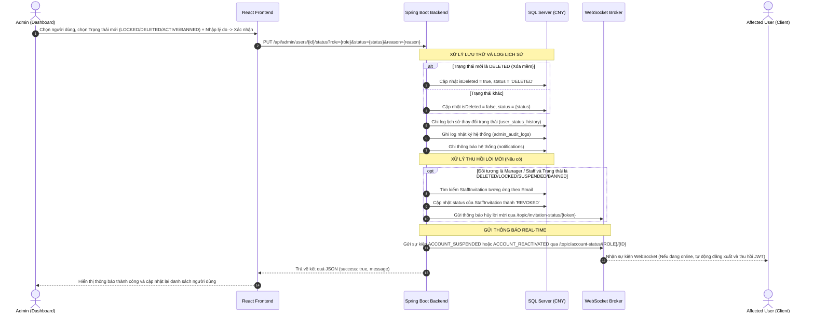
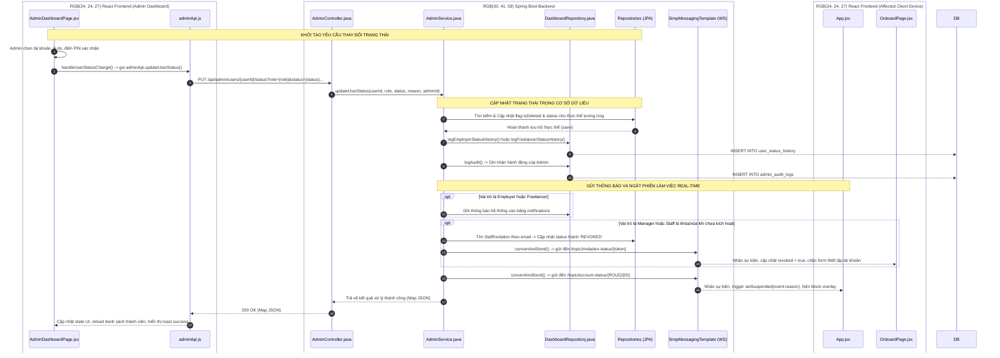

# TÀI LIỆU QUY TRÌNH ADMIN KHÓA HOẶC XÓA TÀI KHOẢN (SUSPEND / DELETE FLOW - ITERATION 2)

Tài liệu này tổng hợp toàn bộ sơ đồ luồng đi hệ thống, sơ đồ tuần tự các tệp mã nguồn (file-level flow), cùng chi tiết mã nguồn triển khai thực tế (cả Frontend và Backend) của chức năng quản trị viên thay đổi trạng thái người dùng (Kích hoạt lại, Khóa/Tạm ngưng, Cấm vĩnh viễn, hoặc Xóa mềm) trong hệ thống LancerPro.

---

## TỔNG QUAN LUỒNG ĐI (SEQUENCE WORKFLOW)



---

## SƠ ĐỒ TRÌNH TỰ CÁC FILE (FILE-LEVEL SEQUENCE FLOW)

Sơ đồ dưới đây thể hiện trình tự tương tác và truyền tải thông tin qua lại giữa các file mã nguồn cụ thể trong hệ thống LancerPro:



---

## PHẦN 1: FRONTEND IMPLEMENTATION

### 1.1 Trigger Cập Nhật Trạng Thái & Dialog Modal Xử Lý
* **File:** `frontend/src/features/admin/pages/AdminDashboardPage.jsx`
* **Mô tả:** Khi Admin thực hiện thay đổi trạng thái của người dùng (Khoá, Cấm hoặc Xoá mềm), hệ thống yêu cầu Admin chọn lý do vi phạm chi tiết và nhập mã PIN xác nhận bảo mật. Chức năng này được định nghĩa qua các hàm điều khiển trạng thái như sau:

```javascript
  const handleUserStatusChange = (userId, role, newStatus) => {
    if (newStatus !== 'ACTIVE') {
      if (banReasons.length === 0) {
        showToast('Vui lòng chọn ít nhất 1 lý do vi phạm.', 'error');
        return;
      }
      if (!adminPin || adminPin.trim() === '') {
        showToast('Vui lòng nhập mã PIN xác nhận.', 'error');
        return;
      }
    }

    const reasonStr = banReasons.length > 0 ? banReasons.join(', ') : 'Yêu cầu từ Admin';
    const reasonParam = encodeURIComponent(reasonStr);

    adminApi.updateUserStatus(userId, role, newStatus, reasonParam, adminPin, user?.id)
      .then(data => {
        if (data.success === false) {
          showToast(data.message || 'Hành động bị từ chối bởi hệ thống.', 'error');
        } else {
          showToast(data.message || 'Thao tác thành công!', 'success');
          adminApi.getUsers()
            .then(usersData => { if (Array.isArray(usersData)) setUsers(usersData); });
          loadDashboardData();
          setActiveUserForAction(null);
          setBanReasons([]);
          setAdminPin('');
        }
      })
      .catch(err => {
        console.error(err);
        showToast('Lỗi kết nối máy chủ.', 'error');
      });
  };
```

---

### 1.2 Gọi API từ Client Helper
* **File:** `frontend/src/features/admin/api/adminApi.js`
* **Mô tả:** Hàm thực hiện kết nối HTTP PUT đến Gateway API của máy chủ để truyền tải các tham số yêu cầu cập nhật trạng thái người dùng.

```javascript
  updateUserStatus: (userId, role, status, reasonParam, adminPin, adminId) => {
    const headers = {};
    if (adminId) headers['X-Admin-Id'] = adminId.toString();
    return fetch(`http://localhost:8080/api/admin/users/${userId}/status?role=${role}&status=${status}&reason=${reasonParam}&pin=${adminPin}`, {
      method: 'PUT',
      headers
    }).then(res => res.json());
  },
```

---

### 1.3 Lắng nghe Kênh WebSocket Real-time trên Client
* **File:** `frontend/src/App.jsx`
* **Mô tả:** Khi một người dùng bất kỳ đang hoạt động trên hệ thống, component gốc `App.jsx` sẽ duy trì một kết nối STOMP đến Server. Nếu Admin thực hiện khóa hoặc xóa tài khoản của họ, backend sẽ gửi một thông điệp real-time qua kênh WebSocket tương ứng. Client nhận thông điệp sẽ ngay lập tức kích hoạt màn hình chặn (Overlay), ngắt phiên làm việc và đăng xuất.

```javascript
  useEffect(() => {
    if (stompClientRef.current) {
      try { stompClientRef.current.deactivate(); } catch (_) {}
      stompClientRef.current = null;
    }

    if (!user) return;

    const roleUpper = user.role?.toUpperCase();
    const normalizedRole = roleUpper === 'CLIENT' ? 'EMPLOYER' : roleUpper;
    const topic = `/topic/account-status/${normalizedRole}/${user.id}`;

    const client = new Client({
      webSocketFactory: () => new SockJS('http://localhost:8080/api/ws'),
      reconnectDelay: 5000,
    });

    client.onConnect = () => {
      client.subscribe(topic, (message) => {
        try {
          const event = JSON.parse(message.body);
          if (event.type === 'ACCOUNT_SUSPENDED') {
            setSuspended({ reason: event.reason });
          } else if (event.type === 'ACCOUNT_REACTIVATED') {
            setSuspended(null);
          }
        } catch (_) {}
      });
    };

    client.onStompError = (frame) => {
      console.warn('[STOMP] error:', frame);
    };

    client.activate();
    stompClientRef.current = client;

    return () => {
      try { client.deactivate(); } catch (_) {}
    };
  }, [user]);

  const handleSuspendedGoHome = () => {
    setSuspended(null);
    setUser(null);
    setCurrentPage('home');
  };
```

---

### 1.4 Glassmorphic UI Overlay Chặn Thao Tác Khi Bị Khóa
* **File:** `frontend/src/App.jsx`
* **Mô tả:** Khi trạng thái `suspended` có giá trị, giao diện React sẽ bao phủ toàn bộ trang bằng một màn hình Brutalist/Glassmorphic không cho phép tắt hay bỏ qua trừ khi nhấp vào nút quay về trang chủ (đồng nghĩa với việc hủy token và đăng xuất).

```javascript
function SuspendedOverlay({ reason, onGoHome }) {
  return (
    <div
      style={{
        position: 'fixed', inset: 0,
        zIndex: 99999,
        background: 'rgba(15, 23, 42, 0.85)',
        backdropFilter: 'blur(8px)',
        display: 'flex', alignItems: 'center', justifyContent: 'center',
        padding: '1rem',
      }}
    >
      <div style={{
        background: 'white',
        borderRadius: '1.5rem',
        padding: '2.5rem 2rem',
        maxWidth: '420px',
        width: '100%',
        textAlign: 'center',
        boxShadow: '0 25px 60px rgba(0,0,0,0.4)',
        border: '1px solid #fee2e2',
        animation: 'suspendFadeIn 0.3s ease',
      }}>
        
        <div style={{
          width: '72px', height: '72px',
          background: '#fef2f2',
          borderRadius: '50%',
          display: 'flex', alignItems: 'center', justifyContent: 'center',
          margin: '0 auto 1.25rem',
          boxShadow: '0 8px 20px rgba(239,68,68,0.15)',
        }}>
          <svg width="36" height="36" fill="none" viewBox="0 0 24 24">
            <path stroke="#ef4444" strokeWidth="2" strokeLinecap="round" strokeLinejoin="round"
              d="M12 9v4m0 4h.01M10.29 3.86L1.82 18a2 2 0 001.71 3h16.94a2 2 0 001.71-3L13.71 3.86a2 2 0 00-3.42 0z"/>
          </svg>
        </div>

        <h2 style={{
          fontSize: '1.375rem', fontWeight: 800,
          color: '#0f172a', marginBottom: '0.5rem',
        }}>
          Tài khoản bị tạm ngưng
        </h2>

        <p style={{
          fontSize: '0.875rem', color: '#64748b',
          lineHeight: 1.7, marginBottom: '0.75rem',
        }}>
          Phiên đăng nhập của bạn đã bị dừng bởi Quản trị viên hệ thống.
        </p>

        {reason && (
          <div style={{
            background: '#fef2f2',
            border: '1px solid #fecaca',
            borderRadius: '0.75rem',
            padding: '0.75rem 1rem',
            marginBottom: '1.5rem',
            fontSize: '0.8125rem',
            color: '#b91c1c',
            fontWeight: 600,
          }}>
            Lý do: {reason}
          </div>
        )}

        <button
          onClick={onGoHome}
          style={{
            width: '100%',
            background: 'linear-gradient(135deg, #1e40af, #3b82f6)',
            color: 'white',
            border: 'none',
            borderRadius: '0.875rem',
            padding: '0.875rem',
            fontWeight: 700,
            fontSize: '0.9375rem',
            cursor: 'pointer',
            boxShadow: '0 4px 14px rgba(59,130,246,0.35)',
            transition: 'transform 0.15s, box-shadow 0.15s',
          }}
          onMouseEnter={e => { e.currentTarget.style.transform = 'scale(1.02)'; }}
          onMouseLeave={e => { e.currentTarget.style.transform = 'scale(1)'; }}
        >
          Quay về Trang chủ
        </button>

        <p style={{ fontSize: '0.75rem', color: '#94a3b8', marginTop: '1rem' }}>
          Liên hệ quản trị viên để được hỗ trợ khôi phục tài khoản.
        </p>
      </div>

      <style>{`
        @keyframes suspendFadeIn {
          from { opacity: 0; transform: scale(0.92); }
          to   { opacity: 1; transform: scale(1); }
        }
      `}</style>
    </div>
  );
}
```

---

### 1.5 Lắng nghe Kênh Hủy Lời Mời Real-time tại Trang Onboarding
* **File:** `frontend/src/features/auth/pages/OnboardPage.jsx`
* **Mô tả:** Nếu một Manager hoặc Staff đang truy cập link mời kích hoạt tài khoản (`/?token=...`) để thiết lập hồ sơ, mà cùng lúc đó Admin thực hiện Khóa hoặc Xóa tài khoản tạm thời này, Server sẽ cập nhật trạng thái thư mời thành `REVOKED` và phát đi tín hiệu WebSocket. Trang Onboard của người dùng đó sẽ tự động bắt lấy sự kiện để chặn biểu mẫu điền thông tin ngay lập tức.

```javascript
  useEffect(() => {
    if (!token) return;

    const topic = `/topic/invitation-status/${token}`;
    const client = new Client({
      webSocketFactory: () => new SockJS('http://localhost:8080/api/ws'),
      reconnectDelay: 5000,
    });

    client.onConnect = () => {
      client.subscribe(topic, (message) => {
        try {
          const event = JSON.parse(message.body);
          if (event.status === 'REVOKED') {
            setRevoked(true);
            setRevokedMsg(event.message || 'Thao tác thiết lập tài khoản đã bị hủy bỏ bởi Quản trị viên.');
          }
        } catch (_) {}
      });
    };

    client.onStompError = (frame) => {
      console.warn('[STOMP] error:', frame);
    };

    client.activate();

    return () => {
      try { client.deactivate(); } catch (_) {}
    };
  }, [token]);
```

---

## PHẦN 2: BACKEND IMPLEMENTATION

### 2.1 API Controller Tiếp Nhận Yêu Cầu Thay Đổi Trạng Thái
* **File:** `backend/src/main/java/com/cny/backend/admin/controller/AdminController.java`
* **Mô tả:** Tiếp nhận yêu cầu HTTP PUT thay đổi trạng thái, thực hiện chuyển tiếp xử lý sang Service. Ngoài ra, chặn trả về mã lỗi 403 Forbidden nếu phát hiện Admin cố gắng can thiệp bất hợp pháp vào các tài khoản được bảo vệ.

```java
    @PutMapping("/users/{id}/status")
    public ResponseEntity<Map<String, Object>> updateUserStatus(
            @PathVariable("id") int id,
            @RequestParam("role") String role,
            @RequestParam("status") String status,
            @RequestParam(value = "reason", required = false) String reason,
            @RequestHeader(value = "X-Admin-Id", required = false, defaultValue = "1") int adminId) {
        Map<String, Object> response = adminService.updateUserStatus(id, role, status, reason, adminId);
        if (response.containsKey("success") && !(Boolean) response.get("success") && response.get("message").toString().contains("bảo vệ")) {
            return ResponseEntity.status(403).body(response);
        }
        return ResponseEntity.ok(response);
    }
```

---

### 2.2 Nghiệp Vụ Xử Lý Trạng Thái Người Dùng Tại Service
* **File:** `backend/src/main/java/com/cny/backend/admin/service/AdminService.java`
* **Mô tả:** Hàm `updateUserStatus` chạy trong một môi trường Transactional kiểm soát đồng bộ dữ liệu. Nó thực hiện xác định vai trò người dùng (`EMPLOYER`, `MANAGER`, `STAFF`, `FREELANCER`), thực hiện cập nhật trường trạng thái, logic hóa quy trình xóa mềm (soft-delete), ghi nhận lịch sử vào database, tự động gửi thông báo hệ thống và phát tín hiệu ngắt kết nối WebSocket real-time.

```java
    @Transactional
    public Map<String, Object> updateUserStatus(int id, String role, String status, String reason, int adminId) {
        Map<String, Object> response = new HashMap<>();
        
        // 1. XỬ LÝ ĐỐI VỚI VAI TRÒ EMPLOYER
        if ("EMPLOYER".equalsIgnoreCase(role)) {
            Optional<Employer> employerOpt = employerRepository.findById(id);
            if (employerOpt.isPresent()) {
                Employer emp = employerOpt.get();
                String oldStatus = emp.getStatus();
                if ("DELETED".equalsIgnoreCase(status)) {
                    emp.setIsDeleted(true);
                    emp.setStatus("DELETED");
                } else {
                    emp.setIsDeleted(false);
                    emp.setStatus(status);
                }
                employerRepository.save(emp);
                
                dashboardRepository.logEmployerStatusHistory(id, oldStatus != null ? oldStatus : "ACTIVE", status, reason != null ? reason : "Lý do bảo mật");
                sendNotification(id, "EMPLOYER", status, reason);
                
                // WebSocket Broadcast cho việc ngắt kết nối phiên hoạt động real-time
                if ("LOCKED".equalsIgnoreCase(status) || "ACTIVE".equalsIgnoreCase(status) || "DELETED".equalsIgnoreCase(status) || "BANNED".equalsIgnoreCase(status)) {
                    Map<String, Object> event = new HashMap<>();
                    event.put("type", "DELETED".equalsIgnoreCase(status) || "LOCKED".equalsIgnoreCase(status) || "BANNED".equalsIgnoreCase(status) ? "ACCOUNT_SUSPENDED" : "ACCOUNT_REACTIVATED");
                    event.put("role", "EMPLOYER");
                    event.put("id", id);
                    event.put("reason", reason != null ? reason : "Tài khoản bị tạm ngưng bởi Admin");
                    messagingTemplate.convertAndSend("/topic/account-status/EMPLOYER/" + id, event);
                }

                writeAuditLog(adminId, "CHANGE_STATUS", "USER_MANAGEMENT", "Thay đổi trạng thái Employer #" + id + " (" + emp.getEmail() + ") từ " + oldStatus + " → " + status + " | Lý do: " + reason);
                
                response.put("success", true);
                response.put("message", "Đã cập nhật trạng thái Employer thành công.");
                return response;
            }
        } 
        
        // 2. XỬ LÝ ĐỐI VỚI VAI TRÒ MANAGER
        else if ("MANAGER".equalsIgnoreCase(role)) {
            Optional<com.cny.backend.admin.entity.Manager> managerOpt = managerRepository.findById(id);
            if (managerOpt.isPresent()) {
                com.cny.backend.admin.entity.Manager mgr = managerOpt.get();
                String oldStatus = mgr.getStatus();
                if ("DELETED".equalsIgnoreCase(status)) {
                    mgr.setIsDeleted(true);
                    mgr.setStatus("DELETED");
                } else {
                    mgr.setIsDeleted(false);
                    mgr.setStatus(status);
                }
                managerRepository.save(mgr);

                // WebSocket Broadcast ngắt phiên
                if ("LOCKED".equalsIgnoreCase(status) || "ACTIVE".equalsIgnoreCase(status) || "DELETED".equalsIgnoreCase(status) || "BANNED".equalsIgnoreCase(status)) {
                    Map<String, Object> event = new HashMap<>();
                    event.put("type", "DELETED".equalsIgnoreCase(status) || "LOCKED".equalsIgnoreCase(status) || "BANNED".equalsIgnoreCase(status) ? "ACCOUNT_SUSPENDED" : "ACCOUNT_REACTIVATED");
                    event.put("role", "MANAGER");
                    event.put("id", id);
                    event.put("reason", reason != null ? reason : "Tài khoản bị tạm ngưng bởi Admin");
                    messagingTemplate.convertAndSend("/topic/account-status/MANAGER/" + id, event);
                }

                // Thu hồi lời mời nếu tài khoản bị khóa/xóa khi chưa kích hoạt
                if ("DELETED".equalsIgnoreCase(status) || "LOCKED".equalsIgnoreCase(status) || "SUSPENDED".equalsIgnoreCase(status) || "BANNED".equalsIgnoreCase(status)) {
                    Optional<com.cny.backend.admin.entity.StaffInvitation> invOpt = staffInvitationRepository.findByEmail(mgr.getEmail());
                    if (invOpt.isPresent()) {
                        com.cny.backend.admin.entity.StaffInvitation invitation = invOpt.get();
                        invitation.setStatus("REVOKED");
                        staffInvitationRepository.save(invitation);

                        Map<String, Object> revokeEvent = new HashMap<>();
                        revokeEvent.put("status", "REVOKED");
                        revokeEvent.put("message", "Thao tác thiết lập tài khoản đã bị hủy bỏ bởi Quản trị viên.");
                        messagingTemplate.convertAndSend("/topic/invitation-status/" + invitation.getToken(), revokeEvent);
                    }
                }
                
                writeAuditLog(adminId, "CHANGE_STATUS", "USER_MANAGEMENT", "Thay đổi trạng thái Manager #" + id + " (" + mgr.getEmail() + ") từ " + oldStatus + " → " + status + " | Lý do: " + reason);
                
                response.put("success", true);
                response.put("message", "Đã cập nhật trạng thái Manager thành công.");
                return response;
            }
        } 
        
        // 3. XỬ LÝ ĐỐI VỚI VAI TRÒ STAFF
        else if ("STAFF".equalsIgnoreCase(role)) {
            Optional<com.cny.backend.admin.entity.Staff> staffOpt = staffRepository.findById(id);
            if (staffOpt.isPresent()) {
                com.cny.backend.admin.entity.Staff stf = staffOpt.get();
                String oldStatus = stf.getStatus();
                if ("DELETED".equalsIgnoreCase(status)) {
                    stf.setIsDeleted(true);
                    stf.setStatus("DELETED");
                } else {
                    stf.setIsDeleted(false);
                    stf.setStatus(status);
                }
                staffRepository.save(stf);

                // WebSocket Broadcast ngắt phiên
                if ("LOCKED".equalsIgnoreCase(status) || "ACTIVE".equalsIgnoreCase(status) || "DELETED".equalsIgnoreCase(status) || "BANNED".equalsIgnoreCase(status)) {
                    Map<String, Object> event = new HashMap<>();
                    event.put("type", "DELETED".equalsIgnoreCase(status) || "LOCKED".equalsIgnoreCase(status) || "BANNED".equalsIgnoreCase(status) ? "ACCOUNT_SUSPENDED" : "ACCOUNT_REACTIVATED");
                    event.put("role", "STAFF");
                    event.put("id", id);
                    event.put("reason", reason != null ? reason : "Tài khoản bị tạm ngưng bởi Admin");
                    messagingTemplate.convertAndSend("/topic/account-status/STAFF/" + id, event);
                }

                // Thu hồi lời mời nếu tài khoản bị khóa/xóa khi chưa kích hoạt
                if ("DELETED".equalsIgnoreCase(status) || "LOCKED".equalsIgnoreCase(status) || "SUSPENDED".equalsIgnoreCase(status) || "BANNED".equalsIgnoreCase(status)) {
                    Optional<com.cny.backend.admin.entity.StaffInvitation> invOpt = staffInvitationRepository.findByEmail(stf.getEmail());
                    if (invOpt.isPresent()) {
                        com.cny.backend.admin.entity.StaffInvitation invitation = invOpt.get();
                        invitation.setStatus("REVOKED");
                        staffInvitationRepository.save(invitation);

                        Map<String, Object> revokeEvent = new HashMap<>();
                        revokeEvent.put("status", "REVOKED");
                        revokeEvent.put("message", "Thao tác thiết lập tài khoản đã bị hủy bỏ bởi Quản trị viên.");
                        messagingTemplate.convertAndSend("/topic/invitation-status/" + invitation.getToken(), revokeEvent);
                    }
                }
                
                writeAuditLog(adminId, "CHANGE_STATUS", "USER_MANAGEMENT", "Thay đổi trạng thái Staff #" + id + " (" + stf.getEmail() + ") từ " + oldStatus + " → " + status + " | Lý do: " + reason);
                
                response.put("success", true);
                response.put("message", "Đã cập nhật trạng thái Staff thành công.");
                return response;
            }
        } 
        
        // 4. XỬ LÝ ĐỐI VỚI VAI TRÒ FREELANCER
        else if ("FREELANCER".equalsIgnoreCase(role)) {
            Optional<Freelancer> freelancerOpt = freelancerRepository.findById(id);
            if (freelancerOpt.isPresent()) {
                Freelancer f = freelancerOpt.get();
                String oldStatus = f.getStatus();
                if ("DELETED".equalsIgnoreCase(status)) {
                    f.setIsDeleted(true);
                    f.setStatus("DELETED");
                } else {
                    f.setIsDeleted(false);
                    f.setStatus(status);
                }
                freelancerRepository.save(f);
                
                dashboardRepository.logFreelancerStatusHistory(id, oldStatus != null ? oldStatus : "ACTIVE", status, reason != null ? reason : "Lý do bảo mật");
                sendNotification(id, "FREELANCER", status, reason);
                
                // WebSocket Broadcast ngắt phiên
                if ("LOCKED".equalsIgnoreCase(status) || "ACTIVE".equalsIgnoreCase(status) || "DELETED".equalsIgnoreCase(status) || "BANNED".equalsIgnoreCase(status)) {
                    Map<String, Object> event = new HashMap<>();
                    event.put("type", "DELETED".equalsIgnoreCase(status) || "LOCKED".equalsIgnoreCase(status) || "BANNED".equalsIgnoreCase(status) ? "ACCOUNT_SUSPENDED" : "ACCOUNT_REACTIVATED");
                    event.put("role", "FREELANCER");
                    event.put("id", id);
                    event.put("reason", reason != null ? reason : "Tài khoản bị tạm ngưng bởi Admin");
                    messagingTemplate.convertAndSend("/topic/account-status/FREELANCER/" + id, event);
                }

                writeAuditLog(adminId, "CHANGE_STATUS", "USER_MANAGEMENT", "Thay đổi trạng thái Freelancer #" + id + " (" + f.getEmail() + ") từ " + oldStatus + " → " + status + " | Lý do: " + reason);
                
                response.put("success", true);
                response.put("message", "Đã cập nhật trạng thái Freelancer thành công.");
                return response;
            }
        }

        response.put("success", false);
        response.put("message", "Không tìm thấy người dùng hoặc vai trò không khớp.");
        return response;
    }
```

---

### 2.3 Quản Lý và Tạo Mẫu Thông Báo Hệ Thống (Mục notifications)
* **File:** `backend/src/main/java/com/cny/backend/admin/service/AdminService.java`
* **Mô tả:** Hàm hỗ trợ `sendNotification` sinh nội dung thông báo động tùy vào hành vi thay đổi trạng thái và thực hiện cập nhật thông tin trực tiếp vào SQL Server cho Freelancer hoặc Employer xem lại sau này.

```java
    private void sendNotification(int id, String role, String status, String reason) {
        String notifTitle = "";
        String notifContent = "";
        String notifType = "SYSTEM";

        if ("LOCKED".equals(status)) {
            notifTitle = " Tài khoản của bạn đã bị tạm khóa";
            notifContent = "Tài khoản của bạn đã bị Admin tạm khóa với lý do: " + 
                (reason != null ? reason : "Vi phạm chính sách nền tảng") + 
                ". Trong thời gian bị khóa, bạn sẽ không thể đăng nhập hoặc sử dụng các dịch vụ trên hệ thống. " +
                "Vui lòng liên hệ bộ phận hỗ trợ qua email support@vlance.vn để được giải quyết.";
        } else if ("BANNED".equals(status)) {
            notifTitle = " Tài khoản của bạn đã bị cấm vĩnh viễn";
            notifContent = "Tài khoản của bạn đã bị Admin cấm vĩnh viễn với lý do: " + 
                (reason != null ? reason : "Vi phạm nghiêm trọng chính sách nền tảng") + 
                ". Quyết định này có hiệu lực ngay lập tức và không thể đảo ngược.";
        } else if ("ACTIVE".equals(status)) {
            notifTitle = " Tài khoản của bạn đã được mở khóa";
            notifContent = "Chúc mừng! Tài khoản của bạn đã được Admin mở khóa thành công.";
        }

        if (!notifTitle.isEmpty()) {
            if ("FREELANCER".equals(role)) {
                dashboardRepository.insertNotificationFreelancer(id, notifTitle, notifContent, notifType);
            } else {
                dashboardRepository.insertNotificationEmployer(id, notifTitle, notifContent, notifType);
            }
        }
    }
```

---

## PHẦN 3: CẤU TRÚC BẢNG DỮ LIỆU & LOGGING (DATABASE SCHEMA)

Dưới đây là cấu trúc chi tiết các bảng liên quan đến lưu trữ thông tin trạng thái, lịch sử thao tác của Admin và lịch sử khoá/xoá người dùng trong cơ sở dữ liệu SQL Server `CNY`. 

### 3.1 Bảng Người Dùng & Thuộc Tính Trạng Thái
Các bảng lưu thông tin tài khoản đều có chung các cột trạng thái để kiểm soát quyền đăng nhập của người dùng.

#### A. Bảng Freelancers (`freelancers`)
*   `freelancer_id` (INT, Primary Key, Identity): Định danh của Freelancer.
*   `email` (VARCHAR(255), Unique, Not Null): Email đăng nhập.
*   `status` (VARCHAR(50), Not Null): Trạng thái tài khoản (`ACTIVE`, `LOCKED`, `BANNED`, `DELETED`).
*   `is_deleted` (BIT, Default 0): Đánh dấu xóa mềm.
*   `created_at` (DATETIME): Ngày tạo tài khoản.
*   `updated_at` (DATETIME): Ngày cập nhật thông tin cuối cùng.

#### B. Bảng Employers (`employers`)
*   `employer_id` (INT, Primary Key, Identity): Định danh của Employer.
*   `email` (VARCHAR(255), Unique, Not Null): Email đăng nhập.
*   `status` (VARCHAR(50), Not Null): Trạng thái tài khoản (`ACTIVE`, `LOCKED`, `BANNED`, `DELETED`).
*   `is_deleted` (BIT, Default 0): Đánh dấu xóa mềm.
*   `created_at` (DATETIME): Ngày tạo tài khoản.
*   `updated_at` (DATETIME): Ngày cập nhật thông tin cuối cùng.

#### C. Bảng Managers (`managers`)
*   `manager_id` (INT, Primary Key, Identity): Định danh Manager.
*   `email` (VARCHAR(255), Unique, Not Null): Email đăng nhập.
*   `status` (VARCHAR(50), Not Null): Trạng thái (`ACTIVE`, `LOCKED`, `BANNED`, `DELETED`).
*   `is_deleted` (BIT, Default 0): Đánh dấu xóa mềm.
*   `created_at` (DATETIME): Ngày tạo.
*   `updated_at` (DATETIME): Ngày cập nhật.

#### D. Bảng Staff (`staff`)
*   `staff_id` (INT, Primary Key, Identity): Định danh Staff.
*   `email` (VARCHAR(255), Unique, Not Null): Email đăng nhập.
*   `status` (VARCHAR(50), Not Null): Trạng thái (`ACTIVE`, `LOCKED`, `BANNED`, `DELETED`).
*   `is_deleted` (BIT, Default 0): Đánh dấu xóa mềm.
*   `created_at` (DATETIME): Ngày tạo.
*   `updated_at` (DATETIME): Ngày cập nhật.

---

### 3.2 Bảng Lịch Sử Trạng Thái Người Dùng (`user_status_history`)
Bảng này ghi nhận chi tiết mỗi lần thay đổi trạng thái của Freelancer hoặc Employer, phục vụ mục đích kiểm duyệt và ghi chép lý do.

*   `history_id` (INT, Primary Key, Identity): Khóa chính tự sinh.
*   `freelancer_id` (INT, Nullable): Khóa ngoại liên kết tới bảng `freelancers`.
*   `employer_id` (INT, Nullable): Khóa ngoại liên kết tới bảng `employers`.
*   `old_status` (VARCHAR(50), Not Null): Trạng thái trước khi thay đổi (Ví dụ: `ACTIVE`).
*   `new_status` (VARCHAR(50), Not Null): Trạng thái sau khi thay đổi (Ví dụ: `LOCKED`).
*   `reason` (NVARCHAR(500), Not Null): Lý do thay đổi trạng thái (Ví dụ: "Spamming, Scam/Fraud").
*   `changed_at` (DATETIME, Default GETDATE()): Thời gian thực hiện thao tác.

---

### 3.3 Bảng Nhật Ký Hoạt Động Của Admin (`admin_audit_logs`)
Lưu giữ vết kiểm toán (Audit Trail) cho toàn bộ hành động có tầm ảnh hưởng lớn của quản trị viên hệ thống.

*   `log_id` (INT, Primary Key, Identity): Khóa chính tự sinh.
*   `admin_id` (INT, Not Null): ID của Admin thực hiện thao tác (Khóa ngoại liên kết tới bảng `admins`).
*   `action` (VARCHAR(100), Not Null): Hành động thực hiện (Ví dụ: `CHANGE_STATUS`).
*   `module` (VARCHAR(100), Not Null): Phân hệ chức năng bị tác động (Ví dụ: `USER_MANAGEMENT`).
*   `description` (NVARCHAR(1000), Not Null): Mô tả chi tiết hành động bao gồm ID đối tượng và thông tin email thay đổi.
*   `created_at` (DATETIME, Default GETDATE()): Thời điểm lưu nhật ký.

---

### 3.4 Bảng Nhận Thông Báo (`notifications`)
Lưu trữ thông báo được hiển thị trong trung tâm thông báo của người dùng khi trạng thái tài khoản của họ được thay đổi.

*   `notification_id` (INT, Primary Key, Identity): Định danh thông báo.
*   `freelancer_id` (INT, Nullable): Nhận bởi Freelancer nào (Khóa ngoại).
*   `employer_id` (INT, Nullable): Nhận bởi Employer nào (Khóa ngoại).
*   `title` (NVARCHAR(255), Not Null): Tiêu đề thông báo.
*   `message` (NVARCHAR(1000), Not Null): Chi tiết lý do và hướng dẫn hỗ trợ giải quyết khóa tài khoản.
*   `type` (VARCHAR(50), Default 'SYSTEM'): Phân loại thông báo.
*   `is_read` (BIT, Default 0): Trạng thái đã đọc (0 = Chưa đọc, 1 = Đã đọc).
*   `created_at` (DATETIME, Default GETDATE()): Thời điểm gửi thông báo.

---

### 3.5 Bảng Thư Mời Gia Nhập (`staff_invitations`)
Chứa trạng thái của lời mời Manager/Staff tham gia hệ thống, liên quan trực tiếp đến việc thu hồi quyền truy cập kích hoạt nếu tài khoản tương ứng bị khóa/xóa.

*   `invitation_id` (INT, Primary Key, Identity): Định danh lời mời.
*   `email` (VARCHAR(255), Not Null): Email người nhận.
*   `role` (VARCHAR(50), Not Null): Quyền hạn được mời (`MANAGER` hoặc `STAFF`).
*   `token` (VARCHAR(255), Not Null): Mã bảo mật UUID gửi kèm URL kích hoạt.
*   `expires_at` (DATETIME, Not Null): Hạn chót kích hoạt (24 giờ kể từ thời điểm gửi).
*   `status` (VARCHAR(50), Default 'PENDING'): Trạng thái lời mời (`PENDING`, `ACCEPTED`, `EXPIRED`, `REVOKED`).
*   `otp_code` (VARCHAR(10), Nullable): Mã OTP 6 chữ số gửi xác minh qua mail.
