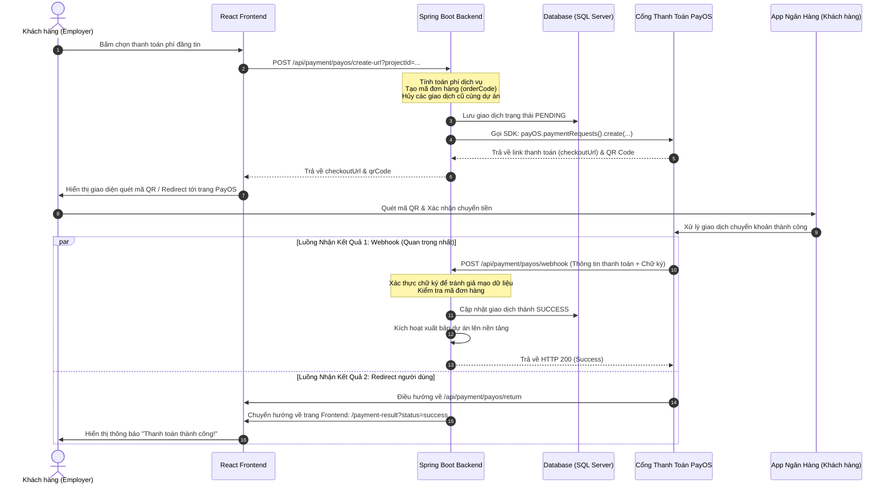

# Hướng Dẫn Tích Hợp & Vận Hành Cổng Thanh Toán PayOS

Tài liệu này giải thích chi tiết cơ chế hoạt động, các file mã nguồn liên quan và luồng dữ liệu (Data Flow) khi tích hợp cổng thanh toán ngân hàng **PayOS** (thanh toán qua quét mã VietQR tự động) trong dự án.

---

## 1. PayOS là gì?
**PayOS** là một cổng thanh toán trung gian tại Việt Nam. Khi tích hợp vào hệ thống, thay vì người dùng phải nhập tay số tài khoản và số tiền chuyển khoản (dễ sai sót), PayOS sẽ sinh ra một **mã VietQR động** chứa sẵn số tiền, tài khoản thụ hưởng và nội dung chuyển khoản đặc trưng của đơn hàng. 
Khách hàng chỉ cần mở app ngân hàng, quét mã QR và xác nhận chuyển tiền. Ngay khi tiền vào tài khoản ngân hàng của bạn, PayOS sẽ gửi thông tin tự động báo về máy chủ hệ thống của bạn để duyệt dịch vụ ngay lập tức.

---

## 2. Sơ Đồ Luồng Hoạt Động (Sequence Diagram)



---

## 3. Các File Mã Nguồn Xử Lý

Hệ thống PayOS được cấu trúc qua các file chính dưới đây:

### 3.1. File Cấu Hình Kết Nối (Configuration)
* **Đường dẫn:** [PayOSConfig.java](file:///c:/Users/admin/Downloads/Project_SWP391/Project_SWP391/Project/backend/src/main/java/com/cny/backend/config/PayOSConfig.java)
* **Vai trò:** Đọc các thông số tài khoản tích hợp từ file cấu hình `application.properties` và đăng ký bean `PayOS` vào Spring Context để sử dụng ở các lớp khác.
```java
@Configuration
public class PayOSConfig {
    @Value("${payos.client-id}")
    private String clientId;

    @Value("${payos.api-key}")
    private String apiKey;

    @Value("${payos.checksum-key}")
    private String checksumKey;

    @Bean
    public PayOS payOS() {
        return new PayOS(clientId, apiKey, checksumKey);
    }
}
```

### 3.2. File Xử Lý Logic API (Controller)
* **Đường dẫn:** [PayOSController.java](file:///c:/Users/admin/Downloads/Project_SWP391/Project_SWP391/Project/backend/src/main/java/com/cny/backend/admin/controller/PayOSController.java)
* **Vai trò:** Khai báo các Endpoint tiếp nhận yêu cầu từ Frontend và Webhook từ PayOS.

---

## 4. Chi Tiết Từng API Hoạt Động Như Thế Nào?

### API 1: Tạo Link Thanh Toán & Sinh Mã QR
* **Endpoint:** `POST /api/payment/payos/create-url?projectId=...`
* **Cách hoạt động:**
  1. Lấy thông tin dự án từ Database thông qua `projectId`.
  2. Tính toán số tiền phí đăng tin (ví dụ: lấy `%` cấu hình nhân với ngân sách dự án, tối thiểu là 50,000 VND).
  3. Tạo mã đơn hàng `orderCode` (PayOS yêu cầu `orderCode` bắt buộc phải là kiểu số nguyên dương - ví dụ: gộp ID tài khoản và thời gian giờ phút giây: `102143022`).
  4. Tìm và hủy tất cả các giao dịch trạng thái `PENDING` cũ của dự án này trong DB và gọi API PayOS hủy link cũ (`payOS.paymentRequests().cancel(oldOrderCode)`) để tránh người dùng quét lại mã cũ đã hết hạn hoặc thanh toán 2 lần cho 1 dự án.
  5. Tạo bản ghi giao dịch mới trong bảng `payment_transactions` với trạng thái `PENDING`.
  6. Thiết lập thời gian hết hạn cho QR Code (ở đây cấu hình là 30 phút).
  7. Gọi SDK PayOS gửi dữ liệu lên máy chủ PayOS:
     ```java
     CreatePaymentLinkResponse data = payOS.paymentRequests().create(paymentData);
     ```
  8. Trả về `checkoutUrl` và mã `qrCode` dạng Base64 cho Frontend hiển thị.

---

### API 2: Nhận Kết Quả Tự Động Từ PayOS (Webhook)
Đây là API **quan trọng nhất** để cập nhật trạng thái tự động mà không cần tác động thủ công của con người.
* **Endpoint:** `POST /api/payment/payos/webhook`
* **Cách hoạt động:**
  1. Khi tiền được chuyển vào tài khoản ngân hàng, máy chủ PayOS gửi một POST Request chứa dữ liệu mã hóa đến endpoint này.
  2. Backend nhận dữ liệu và bắt buộc phải **xác thực chữ ký** nhằm chống hack/giả mạo request:
     ```java
     WebhookData data = payOS.webhooks().verify(body);
     ```
  3. Nếu xác thực thành công và mã lỗi thanh toán là `"00"` (thành công):
     * Cập nhật trạng thái giao dịch trong Database thành `"SUCCESS"`.
     * Tự động duyệt và kích hoạt trạng thái dự án (gọi `projectService.publishProjectAfterPayment(...)`).
     * Ghi lại nhật ký hệ thống (Audit Log).

---

### API 3: Xử Lý Khi Khách Hàng Quay Lại Trang Web (Return Page)
* **Endpoint:** `GET /api/payment/payos/return`
* **Cách hoạt động:**
  1. Sau khi khách hàng thực hiện thanh toán xong (hoặc bấm Hủy) trên giao diện cổng PayOS, cổng sẽ chuyển hướng khách hàng về URL này.
  2. Backend kiểm tra tham số `cancel`:
     * Nếu người dùng bấm hủy (`cancel=true`): Cập nhật trạng thái giao dịch trong DB thành `FAILED`, gọi API PayOS hủy liên kết thanh toán.
  3. Chuyển hướng (Redirect) trình duyệt của khách hàng về giao diện React ở cổng 3000 kèm trạng thái để hiển thị thông báo trực quan:
     ```java
     String redirectUrl = "http://localhost:3000/payment-result?status=success&projectId=" + projectId;
     response.sendRedirect(redirectUrl);
     ```

---

### API 4: Truy Vấn Thủ Công (Reconciliation / Query)
* **Endpoint:** `POST /api/payment/payos/query?txnRef=...`
* **Cách hoạt động:**
  Phòng trường hợp mạng lỗi hoặc Webhook bị chậm, Admin hoặc hệ thống có thể bấm nút "Kiểm tra trạng thái giao dịch" để kiểm tra trực tiếp với cổng PayOS:
  ```java
  PaymentLink link = payOS.paymentRequests().get(orderCode);
  String payosStatus = link.getStatus().name(); // Trả về PENDING, CANCELLED, PAID
  ```
  Nếu trạng thái trên PayOS báo đã trả tiền (`PAID`) nhưng DB hệ thống vẫn đang `PENDING`, hệ thống sẽ lập tức đồng bộ cập nhật DB thành `SUCCESS` và mở khóa dự án cho khách hàng.

---

### API 5: Hủy Thanh Toán QR Chủ Động
* **Endpoint:** `POST /api/payment/payos/cancel?txnRef=...`
* **Cách hoạt động:**
  Khi người dùng hoặc Admin muốn hủy bỏ liên kết thanh toán và vô hiệu hóa mã QR code đó ngay lập tức (không cho phép quét thanh toán nữa):
  ```java
  payOS.paymentRequests().cancel(orderCode); // Hủy trên PayOS
  txn.setStatus("FAILED"); // Lưu DB là thất bại
  ```

---

## 5. Những Điểm Cần Lưu Ý Cực Kỳ Quan Trọng của PayOS
1. **Định dạng `orderCode`:** Phải là số nguyên (Integer/Long), không được chứa ký tự chữ.
2. **Độ dài mô tả (`description`):** Tối đa 25 ký tự không dấu. Nếu dài hơn, PayOS sẽ báo lỗi và không thể tạo link thanh toán.
3. **Môi trường Webhook:** API Webhook `/webhook` phải được cấu hình trên môi trường có internet công khai (Domain HTTPS hoặc ngrok) thì máy chủ PayOS mới có thể gửi dữ liệu về máy cá nhân của bạn được.
