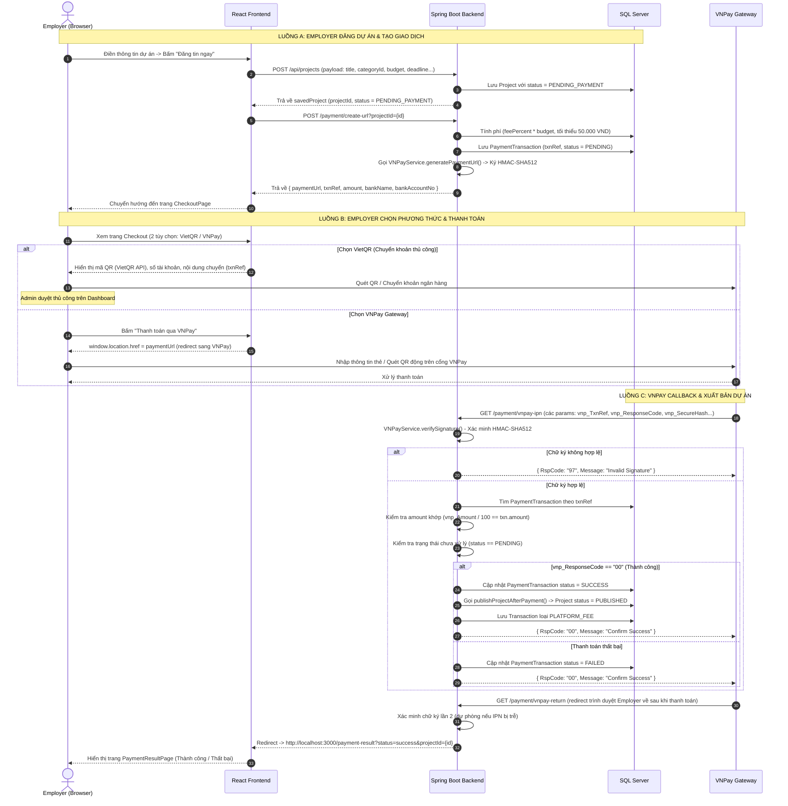

# TÀI LIỆU QUY TRÌNH THANH TOÁN VNPAY (FULL SOURCE CODE)

Tài liệu này mô tả **toàn bộ luồng thanh toán VNPay** được tích hợp trong hệ thống LancerPro, bao gồm 3 luồng chính:
1. **Luồng A:** Employer đăng dự án → Hệ thống tạo giao dịch và chuyển hướng đến trang Checkout.
2. **Luồng B:** Employer chọn phương thức và thực hiện thanh toán qua VNPay Gateway.
3. **Luồng C:** VNPay gửi IPN callback → Backend xác minh chữ ký → Dự án được xuất bản.

---

## TỔNG QUAN LUỒNG ĐI (SEQUENCE WORKFLOW)



---

# PHẦN 1: LUỒNG A - EMPLOYER ĐĂNG DỰ ÁN & TẠO GIAO DỊCH

## 1. FRONTEND: LOGIC ĐĂNG DỰ ÁN VÀ GỌI API THANH TOÁN

### 1.1 Hàm `handlePostProject` - Submit Form và Kích Hoạt VNPay
* **File:** `frontend/src/pages/PostJobPage.jsx`
* **Vị trí dòng:** Khoảng dòng **42 - 181**

```javascript
const handlePostProject = async (e) => {
  e.preventDefault();
  // ... (validate form)
  setPostingProject(true);

  const payload = {
    clientId: user.id,
    categoryId: parseInt(newProject.categoryId),
    title: newProject.title.trim(),
    description: newProject.description.trim(),
    projectType: newProject.projectType,
    budgetFixed: newProject.projectType === 'FIXED' && newProject.budgetFixed
      ? parseFloat(newProject.budgetFixed) : null,
    budgetMin: newProject.projectType === 'RANGE' && newProject.budgetMin
      ? parseFloat(newProject.budgetMin) : null,
    budgetMax: newProject.projectType === 'RANGE' && newProject.budgetMax
      ? parseFloat(newProject.budgetMax) : null,
    deadline: newProject.deadline || null
  };

  // Bước 1: Tạo dự án
  const response = await fetch('http://localhost:8080/api/projects', {
    method: 'POST',
    headers: { 'Content-Type': 'application/json' },
    body: JSON.stringify(payload)
  });
  const savedProject = await response.json();

  // Bước 2: Nếu dự án ở trạng thái PENDING_PAYMENT -> gọi API tạo URL thanh toán
  if (savedProject.status === 'PENDING_PAYMENT') {
    const payResponse = await fetch(
      `http://localhost:8080/payment/create-url?projectId=${savedProject.projectId}`,
      { method: 'POST' }
    );
    const payData = await payResponse.json();

    // Bước 3: Chuyển hướng sang CheckoutPage kèm thông tin thanh toán
    if (payData.paymentUrl) {
      onNavigate('checkout', {
        projectId: savedProject.projectId,
        paymentUrl: payData.paymentUrl,
        amount: payData.amount,
        txnRef: payData.txnRef,
        bankName: payData.bankName,
        bankAccountNo: payData.bankAccountNo,
        bankAccountName: payData.bankAccountName,
        projectTitle: savedProject.title
      });
    }
  }
};
```

---

## 2. BACKEND: TẠO GIAO DỊCH VÀ SINH URL THANH TOÁN

### 2.1 API Endpoint Tạo URL VNPay
* **File:** `backend/.../admin/controller/PaymentController.java`
* **Vị trí dòng:** Khoảng dòng **47 - 106**

```java
@PostMapping("/create-url")
public ResponseEntity<?> createPaymentUrl(@RequestParam Integer projectId,
                                          HttpServletRequest request) {
    Project project = projectRepository.findById(projectId)
            .orElseThrow(() -> new IllegalArgumentException("Không tìm thấy dự án ID: " + projectId));

    // Tính phí đăng tin = budget * feePercent%, tối thiểu 50.000 VND
    double feePercent = adminService.getFeeConfig().getFee();
    BigDecimal budget = project.getBudgetFixed();
    if (budget == null) {
        budget = project.getBudgetMin().add(project.getBudgetMax()).divide(new BigDecimal("2"));
    }
    BigDecimal feeAmount = budget.multiply(BigDecimal.valueOf(feePercent))
                                 .divide(BigDecimal.valueOf(100));
    if (feeAmount.compareTo(new BigDecimal("50000")) < 0) {
        feeAmount = new BigDecimal("50000");
    }

    // Tạo mã tham chiếu giao dịch duy nhất
    String txnRef = "CNY_" + System.currentTimeMillis() + "_"
                  + UUID.randomUUID().toString().substring(0, 8);

    // Lưu giao dịch vào DB với status = PENDING
    PaymentTransaction txn = PaymentTransaction.builder()
            .txnRef(txnRef)
            .employerId(project.getClient().getEmployerId())
            .projectId(projectId)
            .amount(feeAmount)
            .status("PENDING")
            .build();
    paymentTransactionRepository.save(txn);

    // Sinh URL thanh toán VNPay (có chữ ký HMAC-SHA512)
    String ipAddress = request.getHeader("X-Forwarded-For");
    if (ipAddress == null) ipAddress = request.getRemoteAddr();
    String paymentUrl = vnpayService.generatePaymentUrl(txn, ipAddress);

    VnpayConfig vnpayConfig = adminService.getVnpayConfig();
    Map<String, String> response = new HashMap<>();
    response.put("paymentUrl", paymentUrl);
    response.put("txnRef", txnRef);
    response.put("amount", feeAmount.toString());
    response.put("bankName", vnpayConfig.getBankName());
    response.put("bankAccountNo", vnpayConfig.getBankAccountNo());
    response.put("bankAccountName", vnpayConfig.getBankAccountName());
    return ResponseEntity.ok(response);
}
```

### 2.2 Logic Sinh URL VNPay (HMAC-SHA512)
* **File:** `backend/.../admin/service/VNPayService.java`
* **Vị trí dòng:** Khoảng dòng **44 - 102**

```java
public String generatePaymentUrl(PaymentTransaction txn, String ipAddress) {
    VnpayConfig config = vnpayConfigRepository
            .findFirstByIsActiveTrueOrderByIdDesc().orElse(null);

    String tmnCode   = config != null ? config.getTmnCode()   : "DEMO2019";
    String secretKey = config != null ? config.getHashSecret(): "9A7F11E55E1C3806E0528B65355AA05C";
    String vnpUrl    = config != null ? config.getVnpUrl()    : "https://sandbox.vnpayment.vn/paymentv2/vpcpay.html";
    String returnUrl = config != null ? config.getReturnUrl() : "http://localhost:3000/payment-result";

    Map<String, String> vnp_Params = new HashMap<>();
    vnp_Params.put("vnp_Version",   "2.1.0");
    vnp_Params.put("vnp_Command",   "pay");
    vnp_Params.put("vnp_TmnCode",   tmnCode);
    vnp_Params.put("vnp_Amount",    String.valueOf(txn.getAmount()
                                        .multiply(new BigDecimal("100")).longValue()));
    vnp_Params.put("vnp_CurrCode",  "VND");
    vnp_Params.put("vnp_TxnRef",    txn.getTxnRef());
    vnp_Params.put("vnp_OrderInfo", "Thanh toan phi dang tin du an ID " + txn.getProjectId());
    vnp_Params.put("vnp_OrderType", "other");
    vnp_Params.put("vnp_Locale",    "vn");
    vnp_Params.put("vnp_ReturnUrl", returnUrl);
    vnp_Params.put("vnp_IpAddr",    ipAddress != null ? ipAddress : "127.0.0.1");
    vnp_Params.put("vnp_CreateDate",
        LocalDateTime.now().format(DateTimeFormatter.ofPattern("yyyyMMddHHmmss")));

    // Sắp xếp tham số theo thứ tự alphabet -> build hashData và queryString
    List<String> fieldNames = new ArrayList<>(vnp_Params.keySet());
    Collections.sort(fieldNames);
    StringBuilder query = new StringBuilder();
    StringBuilder hashData = new StringBuilder();
    // ... (vòng lặp build query & hashData)

    String vnp_SecureHash = hmacSHA512(secretKey, hashData.toString());
    return vnpUrl + "?" + query + "&vnp_SecureHash=" + vnp_SecureHash;
}
```

---

# PHẦN 2: LUỒNG B - TRANG CHECKOUT (2 PHƯƠNG THỨC)

## 1. FRONTEND: GIAO DIỆN CHECKOUT

### 1.1 CheckoutPage - Chọn Phương Thức & Hiển Thị QR
* **File:** `frontend/src/pages/CheckoutPage.jsx`
* **Vị trí dòng:** Khoảng dòng **1 - 245**

```jsx
export default function CheckoutPage({ pageParams, onNavigate }) {
  const { projectId, paymentUrl, amount, txnRef,
          bankName, bankAccountNo, bankAccountName } = pageParams || {};
  const [paymentMethod, setPaymentMethod] = useState('vietqr');

  // Sinh URL mã QR VietQR động
  const vietQrUrl = `https://img.vietqr.io/image/${bankName}-${bankAccountNo}-compact2.png`
    + `?amount=${amount}&addInfo=${encodeURIComponent(txnRef)}`
    + `&accountName=${encodeURIComponent(bankAccountName)}`;

  const handleRedirectVnpay = () => {
    if (paymentUrl) window.location.href = paymentUrl; // Redirect sang cổng VNPay
  };

  return (
    // Layout 2 cột: Trái = Chọn phương thức | Phải = QR / Info VNPay
    <div>
      {/* Tùy chọn 1: VietQR - Chuyển khoản ngân hàng */}
      <div onClick={() => setPaymentMethod('vietqr')}>
        Chuyển khoản Ngân hàng (VietQR)
      </div>

      {/* Tùy chọn 2: VNPay Gateway */}
      <div onClick={() => setPaymentMethod('vnpay')}>
        Cổng thanh toán điện tử VNPay
      </div>

      {paymentMethod === 'vnpay' && (
        <button onClick={handleRedirectVnpay}>
          Thanh toán qua VNPay
        </button>
      )}

      {paymentMethod === 'vietqr' && (
        // Hiển thị mã QR + thông tin chuyển khoản (bankName, bankAccountNo, txnRef)
        
      )}
    </div>
  );
}
```

---

# PHẦN 3: LUỒNG C - VNPAY CALLBACK & XUẤT BẢN DỰ ÁN

## 1. BACKEND: XỬ LÝ IPN VÀ RETURN URL

### 1.1 IPN Endpoint (VNPay chủ động gọi vào backend)
* **File:** `backend/.../admin/controller/PaymentController.java`
* **Vị trí dòng:** Khoảng dòng **108 - 171**

```java
@GetMapping("/vnpay-ipn")
public ResponseEntity<?> vnpayIpn(@RequestParam Map<String, String> allParams) {
    // Bước 1: Xác minh chữ ký HMAC-SHA512
    if (!vnpayService.verifySignature(allParams)) {
        return ResponseEntity.ok(Map.of("RspCode", "97", "Message", "Invalid Signature"));
    }

    String txnRef = allParams.get("vnp_TxnRef");
    PaymentTransaction txn = paymentTransactionRepository.findByTxnRef(txnRef)
            .orElse(null);
    if (txn == null) {
        return ResponseEntity.ok(Map.of("RspCode", "01", "Message", "Order not found"));
    }

    // Bước 2: Kiểm tra số tiền khớp (vnp_Amount tính bằng cent -> chia 100)
    long vnpAmountLong = Long.parseLong(allParams.get("vnp_Amount"));
    BigDecimal vnpAmount = BigDecimal.valueOf(vnpAmountLong).divide(BigDecimal.valueOf(100));
    if (txn.getAmount().compareTo(vnpAmount) != 0) {
        return ResponseEntity.ok(Map.of("RspCode", "04", "Message", "Invalid Amount"));
    }

    // Bước 3: Kiểm tra trạng thái chưa xử lý
    if (!"PENDING".equals(txn.getStatus())) {
        return ResponseEntity.ok(Map.of("RspCode", "02", "Message", "Order already confirmed"));
    }

    // Bước 4: Xử lý kết quả thanh toán
    String responseCode = allParams.get("vnp_ResponseCode");
    if ("00".equals(responseCode)) {
        txn.setStatus("SUCCESS");
        txn.setVnpTransactionNo(allParams.get("vnp_TransactionNo"));
        paymentTransactionRepository.save(txn);
        // Xuất bản dự án + ghi nhận phí nền tảng
        projectService.publishProjectAfterPayment(txn.getProjectId(), txn.getAmount());
    } else {
        txn.setStatus("FAILED");
        txn.setVnpTransactionNo(allParams.get("vnp_TransactionNo"));
        paymentTransactionRepository.save(txn);
    }

    return ResponseEntity.ok(Map.of("RspCode", "00", "Message", "Confirm Success"));
}
```

### 1.2 Return URL Endpoint (Redirect trình duyệt Employer về sau khi thanh toán)
* **File:** `backend/.../admin/controller/PaymentController.java`
* **Vị trí dòng:** Khoảng dòng **173 - 217**

```java
@GetMapping("/vnpay-return")
public void vnpayReturn(@RequestParam Map<String, String> allParams,
                        HttpServletResponse response) throws IOException {
    String status = "failed";
    Integer projectId = null;
    String txnRef = allParams.get("vnp_TxnRef");

    if (vnpayService.verifySignature(allParams)) {
        PaymentTransaction txn = paymentTransactionRepository
                .findByTxnRef(txnRef).orElse(null);
        if (txn != null) {
            projectId = txn.getProjectId();
            String responseCode = allParams.get("vnp_ResponseCode");
            if ("00".equals(responseCode)) {
                status = "success";
                // Dự phòng: Xử lý nếu IPN bị trễ
                if ("PENDING".equals(txn.getStatus())) {
                    txn.setStatus("SUCCESS");
                    txn.setVnpTransactionNo(allParams.get("vnp_TransactionNo"));
                    paymentTransactionRepository.save(txn);
                    projectService.publishProjectAfterPayment(txn.getProjectId(), txn.getAmount());
                }
            } else {
                status = "failed";
                if ("PENDING".equals(txn.getStatus())) {
                    txn.setStatus("FAILED");
                    paymentTransactionRepository.save(txn);
                }
            }
        }
    }

    // Redirect về trang kết quả thanh toán trên Frontend
    String redirectUrl = "http://localhost:3000/payment-result?status=" + status;
    if (projectId != null) redirectUrl += "&projectId=" + projectId;
    response.sendRedirect(redirectUrl);
}
```

### 1.3 Logic Xác Minh Chữ Ký VNPay
* **File:** `backend/.../admin/service/VNPayService.java`
* **Vị trí dòng:** Khoảng dòng **104 - 137**

```java
public boolean verifySignature(Map<String, String> fields) {
    String secureHashReceived = fields.get("vnp_SecureHash");
    if (secureHashReceived == null) return false;

    // Loại bỏ các tham số hash trước khi tính toán lại
    Map<String, String> signFields = new HashMap<>(fields);
    signFields.remove("vnp_SecureHash");
    signFields.remove("vnp_SecureHashType");

    // Lấy secretKey từ DB (VnpayConfig đang active)
    VnpayConfig config = vnpayConfigRepository
            .findFirstByIsActiveTrueOrderByIdDesc().orElse(null);
    String secretKey = config != null ? config.getHashSecret()
                                      : "9A7F11E55E1C3806E0528B65355AA05C";

    // Sắp xếp và build chuỗi hash
    List<String> fieldNames = new ArrayList<>(signFields.keySet());
    Collections.sort(fieldNames);
    StringBuilder sb = new StringBuilder();
    // ... (vòng lặp build chuỗi)

    String secureHashCalculated = hmacSHA512(secretKey, sb.toString());
    return secureHashCalculated.equalsIgnoreCase(secureHashReceived);
}
```

### 1.4 Logic Xuất Bản Dự Án Sau Khi Thanh Toán
* **File:** `backend/.../project/service/ProjectService.java`
* **Vị trí dòng:** Khoảng dòng **111 - 124**

```java
@Transactional
public void publishProjectAfterPayment(Integer projectId, BigDecimal amount) {
    // Cập nhật trạng thái dự án từ PENDING_PAYMENT -> PUBLISHED
    Project project = projectRepository.findById(projectId)
            .orElseThrow(() -> new IllegalArgumentException("Không tìm thấy dự án ID: " + projectId));
    project.setStatus("PUBLISHED");
    projectRepository.save(project);

    // Ghi nhận doanh thu phí nền tảng vào bảng transactions
    Transaction transaction = Transaction.builder()
            .type("PLATFORM_FEE")
            .amount(amount)
            .createdAt(LocalDateTime.now())
            .build();
    transactionRepository.save(transaction);
}
```

---

## 2. FRONTEND: TRANG KẾT QUẢ THANH TOÁN

### 2.1 PaymentResultPage - Hiển Thị Kết Quả
* **File:** `frontend/src/pages/PaymentResultPage.jsx`
* **Vị trí dòng:** Khoảng dòng **1 - 108**

```jsx
export default function PaymentResultPage({ pageParams, onNavigate }) {
  // Lấy status và projectId từ URL query params (do Backend redirect)
  const status = pageParams?.status || 'failed';
  const projectId = pageParams?.projectId || 'N/A';
  const isSuccess = status === 'success';

  return (
    <div>
      {/* Icon thành công (xanh) hoặc thất bại (đỏ) */}
      {isSuccess ? <CheckCircle2 /> : <XCircle />}

      <h1>{isSuccess ? 'Thanh toán thành công!' : 'Thanh toán không thành công'}</h1>

      {/* Chi tiết giao dịch: Mã dự án, Loại, Phương thức */}
      <div>Mã dự án: #{projectId}</div>
      <div>Loại: Phí xuất bản dự án</div>
      <div>Phương thức: Cổng VNPay</div>

      {/* Nút hành động */}
      {isSuccess
        ? <button onClick={() => onNavigate('your_jobs')}>Xem dự án của tôi</button>
        : <button onClick={() => onNavigate('your_jobs')}>Thử lại / Xem dự án</button>
      }
    </div>
  );
}
```

---

# PHẦN 4: CẤU HÌNH HỆ THỐNG

## 1. DATABASE: CÁC BẢNG LIÊN QUAN

### 4.1 Bảng `payment_transactions`
| Cột | Kiểu | Mô tả |
|-----|------|-------|
| `id` | INT (PK, AUTO) | ID tự tăng |
| `txn_ref` | VARCHAR(100) UNIQUE | Mã giao dịch `CNY_{timestamp}_{uuid}` |
| `employer_id` | INT | ID Employer tạo giao dịch |
| `project_id` | INT | ID Dự án cần thanh toán |
| `amount` | DECIMAL(15,2) | Số tiền phí (VND) |
| `status` | VARCHAR(30) | `PENDING` / `SUCCESS` / `FAILED` |
| `vnp_transaction_no` | VARCHAR(100) | Mã giao dịch VNPay trả về |
| `created_at` | DATETIME | Thời điểm tạo |
| `updated_at` | DATETIME | Thời điểm cập nhật cuối |

### 4.2 Bảng `vnpay_configs`
| Cột | Kiểu | Mô tả |
|-----|------|-------|
| `id` | INT (PK, AUTO) | ID cấu hình |
| `tmn_code` | VARCHAR | Mã TmnCode từ VNPay |
| `hash_secret` | VARCHAR | Khóa bí mật HMAC-SHA512 |
| `vnp_url` | VARCHAR | URL cổng thanh toán VNPay |
| `return_url` | VARCHAR | URL nhận kết quả trả về |
| `bank_name` | VARCHAR | Tên ngân hàng (VietQR) |
| `bank_account_no` | VARCHAR | Số tài khoản ngân hàng |
| `bank_account_name` | VARCHAR | Tên chủ tài khoản |
| `is_active` | BIT | Cấu hình đang được sử dụng |
| `updated_at` | DATETIME | Thời điểm cập nhật |

## 2. TRẠNG THÁI VÒNG ĐỜI DỰ ÁN

```
[Employer tạo] -> PENDING_PAYMENT
    -> [VNPay IPN / Return thành công] -> PUBLISHED (visible on homepage)
    -> [Thanh toán thất bại]           -> PENDING_PAYMENT (giữ nguyên)
    -> [Admin đóng]                    -> CLOSED
    -> [Admin xóa]                     -> isDeleted = true
```

## 3. TRẠNG THÁI VÒNG ĐỜI GIAO DỊCH

```
[Tạo giao dịch] -> PENDING
    -> [vnp_ResponseCode = "00"] -> SUCCESS
    -> [vnp_ResponseCode != "00"] -> FAILED
```
